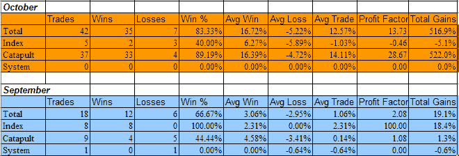

<!--yml

类别：未分类

日期：2024-05-18 13:34:51

-->

# 可量化的边缘：十月订阅者信件记分卡

> 来源：[`quantifiableedges.blogspot.com/2008/11/subscriber-letter-scorecard-for-october.html#0001-01-01`](http://quantifiableedges.blogspot.com/2008/11/subscriber-letter-scorecard-for-october.html#0001-01-01)

十月份可能是股市最近很长时间以来最糟糕的一个月，但对于

[订阅者信件](http://www.quantifiableedges.com/letter.html)

. 导致交易利润异常巨大的主要策略是 Catapult 交易，它们结合起来构成了 CBI。它们在一月和三月的抛售中也表现良好，但在六七月的大幅抛售期间遇到了异常艰难的时期。

在揭示结果之前，有一些重要的说明：

我不建议仓位大小。主要原因是，我不是一名财务顾问。我认为在没有了解某人的财务状况和风险承受能力的情况下，建议分配大小是不合适的。即使是我自己的交易，我也运行着不同激进程度的不同的投资组合。例如，我最激进的投资组合是我的退休账户(IRA)。在这里，有时我会使用期权来获得 400-500%的杠杆。而其他投资组合通常采取更加保守的立场，有些很少达到或超过 100%的暴露。

由于我不建议仓位大小，这不应该被视为一个绩效报告，而是一个交易想法的记分卡。因此，不管我试图多么客观，结果的报告总是取决于你如何处理交易而有所偏差。例如，我总是建议分三个部分进入 Catapult 位置，而“系统”交易（除了 Catapult 之外的任何我揭示的系统）通常是一次性进入。我通常也建议分批进入“QE 指数”交易。对于我自己的交易，我交易的指数仓位要比任何个体的都要大。我还通过限制每天总投资额来控制我的风险。正如我提到的，这取决于我交易的账户。我最具进攻性的账户可能每天投入多达 100%，并使用期权获得高度杠杆。一个更为保守的账户可能每天最多达到 15%-20%。

没有人会平等地采取所有的交易，因此个人结果将因交易者的方法而有很大差异。尽管如此，十月份利用 Quantifiable Edges 交易想法的机会还是相当充足的。考虑到所有的告诫，最近的结果如下列出，并按类别分解。由于十月份非常不寻常，我在下面也展示了九月份的结果。

（[链接](https://blogger.googleusercontent.com/img/b/R29vZ2xl/AVvXsEgg9hlFr2FBm5Yom4MfD0L3jHUnsDAGeQWVSmhAa2Gqhp6m3_-_nT6BtFL-1hauXhkdb84rDNnFtFA6_f-d1Y94KG8rhIkgjRPO6qWnHcNOyhbow2f7HHHft6sTL0q4_K8cBORpMoTuxUg/s1600-h/2008-11-2+Subscriber+Letter+results.png)

如果您想要体验 Quantifiable Edges 订阅信件的免费 3 天试用期，只需发送一封电子邮件到

**QuantEdges@HannaCapital.com**

请在邮件中包含您的姓名和电子邮件地址。
