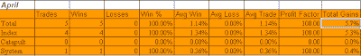
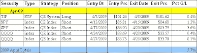

<!--yml

分类：未分类

date: 2024-05-18 13:22:09

-->

# Quantifiable Edges: 订阅者信件四月份交易想法结果

> 来源：[`quantifiableedges.blogspot.com/2009/05/subscriber-letter-trade-idea-results.html#0001-01-01`](http://quantifiableedges.blogspot.com/2009/05/subscriber-letter-trade-idea-results.html#0001-01-01)

四月份就跟踪的交易想法而言，对 Quantifiable Edges 订阅者信件来说是一个非常安静的月份。事实上，它是最安静的。只有 5 个交易想法得到了满足。其中四个是指数交易，另一个是从我们每晚的“系统触发”表中挑选出来的系统交易。有一个 Catapult 被触发，但由于第二天早上的跳空高开而没有得到满足。四月份市场如此安静的一个很大原因就是市场有几个未填补的跳空缺口，这些缺口与我们的交易想法方向一致。所以，尽管在信件中只有 5 个交易想法得到满足并进行了跟踪，但至少有 8 个其他想法没有得到满足。虽然偶尔会发生这种情况，但在四月份发生的程度是不寻常的。更加活跃或激进的交易者也可以从系统触发表中挑选出想法，该表通常每晚都会列出几个触发器。由于只有 5 个交易想法得到了满足，所以我把它们都列在下面，并附上了摘要统计数据。（我通常只在博客上发布摘要统计数据，并保留完整的列表供信件使用。）首先，当然是惯常的警告和解释。

*我不建议持仓大小。主要原因是我不是财务顾问。我认为在没有了解某人的财务状况和风险承受能力的情况下，建议分配大小是不合适的。即使是我自己的交易，我也运行着不同激进程度的不同的投资组合。例如，我最激进的投资组合是我的退休账户（IRA）。在这里，我有时会使用期权来达到 400-500%的杠杆。而其他投资组合通常采取更加保守的立场，有些很少达到或超过 100%的暴露。

既然我不建议持仓大小，这不应该被视为一份业绩报告，而应该是一个交易想法的记分卡。因此，无论我如何努力保持客观，结果的汇报总是取决于你如何处理这些交易。例如，我总是建议分三次进入 Catapult 头寸，而“系统”交易（除了 Catapult 之外的任何我公布的系统）通常是一次性进入。我通常也建议对“指数”交易进行分批进入。对于我自己的交易，我交易的指数头寸要比任何个别的头寸都要大。我还通过限制每天总投资额来控制我的风险。正如我提到的，这会根据我交易的账户而有所不同。我最激进的账户我可能会投入高达 100%/天的资金，并使用期权获得高度杠杆。一个更加保守的账户可能每天最多达到 15%-20%的资金。

很可能没有人会平均分配所有交易，因此个人结果会根据交易者的方法而大相径庭。仅仅像我下面这样做把各个触发器的成果加起来，是一种公认的拙劣的回报表现。净正或净负并不一定意味着遵循这些想法的人在衡量期间会赚钱或亏钱。而且总和当然也不代表一个投资组合的回报。话虽如此，下面是四月份的结果（点击表格以放大）：*

[链接](https://blogger.googleusercontent.com/img/b/R29vZ2xl/AVvXsEgyqZdox5j2q6XqRMx7ZmJaY1hiN8NpxUS2WOpEd496zU8lwtryNuiw2VctqJn17JLzITGbyLHY_hbsGH9FIwt824DCAW13xu7l1KHb8939XKigpeJ6PVZ_g2W4Ry5ABFtOnRtRSzBKxzg/s1600-h/2009-5-5+results1.png)

以下是各个交易的详细情况（*点击表格以放大*）：

[链接](https://blogger.googleusercontent.com/img/b/R29vZ2xl/AVvXsEiR_KIcwsY1UEKQFRmEnR63_VGievg2OE8ng6t7AMijUyxpGN-VCbTz-VjOKnR9eUGZKf3RA63ws4hgbvx4JWkAnKWhdj_sck8f9PbgGQDtuTgKdN2Tr_AP6cOSuFGeNBsZva2CMRVPipY/s1600-h/2009-5-5+results2.png)

如果你还没有查看过黄金会员区，那么

[点击此处注册免费试用](http://www.quantifiableedges.com/members/register.php)

（只需提供姓名和电子邮件地址）。

*这不仅仅是交易想法。它包含的研究远超博客内容，还包括会员专享图表、系统（含代码）和自定义指标*

。
