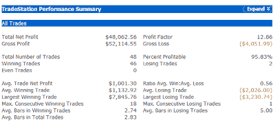

<!--yml

category: 未分类

date: 2024-05-18 13:34:42

-->

# Quantifiable Edges: Tests Of Strength

> 来源：[`quantifiableedges.blogspot.com/2008/11/tests-of-strength.html#0001-01-01`](http://quantifiableedges.blogspot.com/2008/11/tests-of-strength.html#0001-01-01)

A few weeks ago I wrote about

[the propensity of upside gaps of 2% or more to pull back](http://quantifiableedges.blogspot.com/2008/10/2-gaps-and-their-tendency-to-pull-back.html)

在接下来的几天内的某个时候。目前还有两个 2%或以上幅度的向上跳空缺口尚未 closing below the opening gap price. They are the 10/28 and the 10/30 gaps. It appears unlikely that the 10/28 level of $87.34 will be threatened in the next day or so. Should the 10/30 opening gap also hold that could be viewed as a significant sign of strength for this early attempt at a rally.

Another possible sign of strength will also be challenged in the next few days. In my

[August 28th post](http://quantifiableedges.blogspot.com/2008/08/short-system-for-handling-chop_28.html)

I showed a system that took advantage of the choppy, downward trading that had existed over the last year plus up to that point. Below are updated statistics of this simple system:

**如果标普 500 连续两天收盘走高，则做空。如果收盘价低于入场价——最多 4 天后平仓。如果第 4 天仍然没有盈利，无论如何都要平仓。每笔交易 10 万美元。2007 年 6 月 1 日至今。**  (https://blogger.googleusercontent.com/img/b/R29vZ2xl/AVvXsEhjBF8EMCmnhm7f_fdKsKXra7-akvhNrFB873-MmMZot_FsyLPr5w3loFwQPCbh8ALJUR_-Yt82XzIeacmG4Rzr1H4pfB5dpNq5eYRtEP08NsPAtmcRBHDZAtAQz4ot4vElewUfsExbsbQ/s1600-h/2008-11-3+short+2+up+days.png)

令人惊讶的是，自 2008 年 9 月 26 日以来，该系统从未被触发过。因此，产生的 48%利润都是在 10 月份的大幅下跌之前实现的。自 4 月份以来，该系统已经连续 18 笔交易盈利。

市场正达到短期超买状态，过去一年半时间里，这种状态至少导致了短期回调。市场是否能在这种状态下反弹，或者是否在接下来的几天内大幅回调，可能是衡量其强度或弱点的一个显著标志，也可能是需要改变策略的一个转折点。
