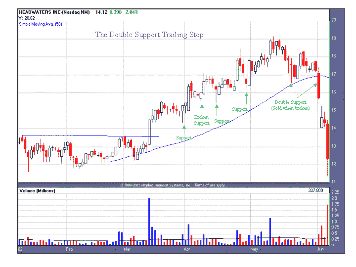

<!--yml

类别：未分类

日期：2024-05-18 08:34:34

-->

# 量化边缘：双支撑跟踪止损

> 来源：[`quantifiableedges.blogspot.com/2008/02/double-support-trailing-stop.html#0001-01-01`](http://quantifiableedges.blogspot.com/2008/02/double-support-trailing-stop.html#0001-01-01)

今天看到了一些大的波动，但并没有对我的适度看涨立场造成太大改变。今晚我不想发布研究，我想换个方式。

在 1 月 23 日的某些评论中，“Tim”提到他记得我写过一篇很早的文章，讨论了“双支撑止损”。（实际上那是我所发表的第一篇文章）。从那时起，我注意到有很多读者进行了关于“双支撑止损 Rob Hanna”或类似主题的搜索。不管怎样，那篇文章已经无处可寻。但你想看，就有。从 2002 年（附带 2002 年的图表和股票代码 - 股票代码后来改为 HW，如果你想在自己的软件上拉取），我给你“双支撑跟踪止损”。

******双支撑跟踪止损**

*概念* 像大多数交易员一样，我有一整张符合购买股票的标准清单。我在研究潜在候选股票上花费了大量时间，这样我可能找到几只符合我的标准的股票。对我来说最沮丧和困难的事情之一是找到一只伟大的股票，在正确的时间购买它，然后在我被止损出仓，就在它反转并取得巨大收益之前。在多年的交易中，我经历了这种在日线、摆动线和中期交易中的挫折。为了让我在盈利的交易中待得更久，避免过早被震荡出仓，我开发了我的“双支撑跟踪止损技术”。我将在一个中期交易示例中展示这种技术，但在许多不同的时间框架中成功应用了它，最初是为我的日交易而创建的。

这个想法很简单。如果我在进入交易时需要很多理由，那么如果我想尽可能抓住行情，我需要不止一个理由来退出交易。因此，在永久性和完全性地退出交易之前，我将需要两个支撑水平被打破。你如何定义支撑并不重要。你可以使用回调、整理低点（或高点）、斐波那契数列、移动平均线、趋势线，或者任何适合你交易风格的工具。

*示例* 由于下面的示例是一个中期交易，我只是简单地使用了整理和回调，再加上 50 天移动平均线（显示为上升的蓝色线条）作为我的支撑水平。我将回调定义为任何一根（或一系列）柱子，在股票创新高之后，低点更低，高点也更低。这里显示的股票是 Headwaters Inc（股票代码：HDWR）。我在三月中旬股票从横盘突破时买入这只股票。我的初始止损在突破时将是购买价格的 8%，或横盘的低点。在突破后，它急剧上涨了 5 天，然后开始回调。它在回调了七天之后开始反转并上涨。这次回调的低点靠近第一个标记为“支撑”的绿色箭头。在我将其视为支撑之后，股票从这个位置上涨，在下一根柱子创下了更高的高点和更高的低点。当这种情况发生时，我能够将我的初始止损点上调至突破点。（我认为横盘的高点或高紧旗的高点也是一个支撑水平。）

接下来，股票在再次下跌至带有“破位支撑”标记的绿色箭头之前，又上涨了几天。这个“破位支撑”的柱子最初只是股票回调后再次上涨的下一个支撑区域。当这种情况发生时，我能够将我的止损点设置在第一个绿色支撑箭头之下。5 天后，当下一根标记为“支撑”的柱子低于“破位支撑”的低点时，它变成了“破位”。如果我在这里按“破位支撑”的水平出场，我就被震出了股票，错过了后续的行情。相反，股票继续上涨，创造了越来越高 的支撑水平。

到了我在标记为“双支撑（破位时卖出）”的区域卖出这只股票的时候了。这时，股票跌破了两个支撑水平。第一个是 50 天移动平均线，第二个是位于“双支撑”绿色箭头稍上的回调低点。正如你所看到的，这最终证明是一个很好的获利了结和结束这笔交易的时间。三天后，它的交易价格几乎下跌了 30%。

](https://blogger.googleusercontent.com/img/b/R29vZ2xl/AVvXsEg5BwZ3oXQrcx5-FIQK4KGI0UrqMb-jdkqQxM-SqY-V1fT0bU__ZX7JuMIdLwGhyphenhyphenVlIxocCGMh6KJeHXuW9b0wp3iYdUGSVDDKAlBhC4Tvfr0velPQvzO_wR_MHysW1B4Qjt0jG4b_kcZs/s1600-h/2008-2-12+Double+Support+Stop.PNG)

****额外考虑因素* 我之前使用了“永久且完全退出”这个术语。由于在某些情况下第一和第二支撑位可能相距甚远，我可能会考虑部分平仓，或者平仓后寻找重新进入的机会，当价格突破第一支撑位时。我这样做的主要原因是为了不要回吐过多的利润。一旦支撑位被突破两个层次，我希望完全退出该仓位，并且不会考虑在没有全新基础形成的情况下重新进入。

由于“双重支撑跟踪止损”会让你持仓时间更长，因此它在与市场整体趋势交易时最为有效。换句话说，在上升趋势市场中持有多头仓位，在下降趋势市场中持有空头仓位。****
