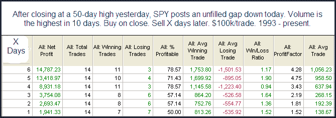

<!--yml

分类：未分类

日期：2024-05-18 13:07:03

-->

# 可量化边缘：显示看涨倾向的研究

> 来源：[`quantifiableedges.blogspot.com/2010/01/one-study-i-saw-with-bullish.html#0001-01-01`](http://quantifiableedges.blogspot.com/2010/01/one-study-i-saw-with-bullish.html#0001-01-01)

昨晚我所看的大部分内容都暗示在未来几天内可能会有进一步的下跌。下面是其中一个显示短期看涨倾向的研究副本。

(https://blogger.googleusercontent.com/img/b/R29vZ2xl/AVvXsEhTRr20p93_aBTyXPN_VaqOsiBN_WECXcBMpUGdcBDfFupnTRh-JHAq-NenQBPiSG5OZqnBWZboQpSKfvtogGXiPuuf7bo5DHLHToDgZbuXHIyzQSobMhEtcdoyhz2MGj1xfm4rKjrqaM2l/s1600-h/2010-1-10+png.png)

{编辑 - 应该读作最高成交量

***在 5 天内***

}
