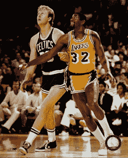

<!--yml

分类：未分类

日期：2024-05-18 08:15:44

-->

# 可量化的边缘：自上次他们在决赛中相遇以来，这个设置一直有利。

> 来源：[`quantifiableedges.blogspot.com/2008/06/this-setups-been-favorable-since-last.html#0001-01-01`](http://quantifiableedges.blogspot.com/2008/06/this-setups-been-favorable-since-last.html#0001-01-01)

市场在周一大幅下跌，跌幅超过两倍于涨幅。成交量虽然不多。

我进行了一项测试，看看标普 500 指数在下跌至少 1%，跌幅宽度为 2:1 或更高时，接下来的几周内是如何反应的。这项测试最有趣的结果是在过去的 21 年里，与那之前的结果显著不同。从 1960 年到 1987 年的大崩溃，结果如下：

从 1987 年的大崩溃至今，他们的表现是这样的。

在这样的一天后持股一周将会是一个自 1987 年以来每年的赢利策略，除了 2006 年。在那之前——持续的输家。顺便说一下，使用低成交量作为过滤器略微改善了结果。

我不确定变化的原因。或许大崩溃改变了市场的心理。交易员可能决定如果它能从那次反弹回来，它能从任何事情中反弹回来——所以买入跌幅成为了时尚且有利可图。

无论是什么原因，自 1987 年以来，像周一这样的日子相当一致地在过去几周内提供了向上的边缘。

说到 1987 年……他们又回来了！

