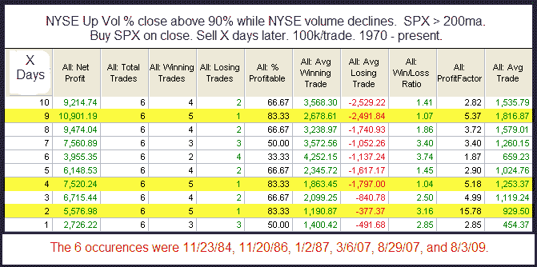

<!--yml

category: 未分类

date: 2024-05-18 13:04:43

-->

# Quantifiable Edges: Tuesday's Extremely Strong Breadth & Weak Volume

> 来源：[`quantifiableedges.blogspot.com/2010/02/tuesdays-extremely-strong-breadth-weak.html#0001-01-01`](http://quantifiableedges.blogspot.com/2010/02/tuesdays-extremely-strong-breadth-weak.html#0001-01-01)

周二纽约证券交易所的成交量上升了 90%，但与周五相比有所下降，并且低于正常水平。在市场长期上升趋势中，当日宽度指标如此明显地正面时，成交量下降是很少见的——尤其是当我回溯到 1970 年，也只有 6 个其他类似的情况。

我多次发现，极端的宽度指标经常会超过成交量。在这里的实例太少，无法得出任何确切的结论，但毫无疑问，弱势成交量并不意味着上涨行情即将结束。
