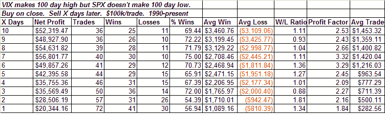

<!--yml

分类：未分类

日期：2024-05-18 13:36:04

-->

# 可量化的边缘：VIX 创新高而不伴随 SPX 新低

> 来源：[`quantifiableedges.blogspot.com/2008/10/vix-new-highs-without-spx-new-lows.html#0001-01-01`](http://quantifiableedges.blogspot.com/2008/10/vix-new-highs-without-spx-new-lows.html#0001-01-01)

昨天 VIX 再次大幅飙升，达到了新的高点。SPX 在反弹前设法守住了近期低点。下面我分析了长期 VIX 飙升并未伴随长期 SPX 低点的表现情况：

过去这种特定的设置曾经为交易者提供了向上的优势。
