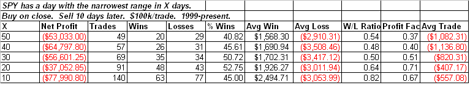

<!--yml

类别：未分类

日期：2024-05-18 13:22:00

-->

# 可量化的边缘：非常狭窄的区间

> 来源：[`quantifiableedges.blogspot.com/2009/05/very-narrow-range.html#0001-01-01`](http://quantifiableedges.blogspot.com/2009/05/very-narrow-range.html#0001-01-01)

星期二的 SPY 区间是过去 3 个月中最低的。自 1999 年以来，在狭窄的区间之后总有一点向下倾斜的倾向。与近期区间相比，区间越窄，倾向越熊市。以下是显示在 X 天内最狭窄区间的 10 天回报的表格：

（[链接](https://blogger.googleusercontent.com/img/b/R29vZ2xl/AVvXsEjNrRKR07Djs2oDfoIvbZdqtOYRKv53zwL0uaqUMBE3k5NodG1CPzU6vgLsIuwe5-I2VopOKoDfqirRDRsPc6ncL-tXKxF3Q2hGSCLoSDMjr1h7plVQiTtEdNmrEK1re39s_uE-QPYxkYg/s1600-h/2009-5-6+png1.PNG)

当然，今天早上就业报告的兴奋似乎正在超越任何狭窄区间的倾向。
