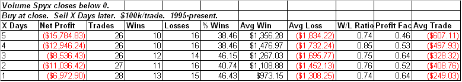

<!--yml

分类：未分类

date: 2024-05-18 13:23:47

-->

# 可量化的边缘：成交量 Spyx 触及极端低点 - 这意味着什么

> 来源：[`quantifiableedges.blogspot.com/2009/04/volume-spyx-hits-extreme-low-what-thats.html#0001-01-01`](http://quantifiableedges.blogspot.com/2009/04/volume-spyx-hits-extreme-low-what-thats.html#0001-01-01)

虽然周四整体成交量上升，但

[Quantifiable Edges Volume Spyx](http://quantifiableedges.blogspot.com/2008/11/introducing-volume-spyx.html)

指标再次大幅下降。它降至-12，这是一个非常低的数字。我回顾了其他时候 S&P 500 成交量的 Spyx 指标降到这么低的情况。追溯到 1995 年，只有 4 次读数在-10 或更低。它们发生在 6/10/04、4/28/08、5/30/08 和 11/3/08。在每一次情况下，两天后市场都在交易更低。这两天的平均跌幅超过了 1%。

放宽对跌幅低于 0 的实例的要求，产生了以下结果：

（链接：[点击这里](https://blogger.googleusercontent.com/img/b/R29vZ2xl/AVvXsEhXac_z6vAUFYADSkQdRAoept444tyImVJp2Hnexft5gT8rhC5VsvWEGeVzDhbt_idURbhJh4LWseEXvyunoFLDWMmQ4TfDQboTKQNSR-enZs-hGcVJVUQrPMCapVNthp2ehStTWr1v9To/s1600-h/2009-4-13+png1.PNG)）

如你所料，我们这里看到了熊市倾向。正如我过去讨论过的，当你也考虑当天的方向时，成交量的 Spyx 可以特别有效。在上涨的日子里低读数往往特别熊市，而在下跌的日子里高读数往往特别牛市，当展望未来几天时。下面你可以看到当市场当天收盘上涨时，跟随低于 0 的读数的结果。
