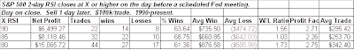

<!--yml

分类：未分类

日期：2024-05-18 13:25:24

-->

# 量化边缘：当标普指数在美联储日过度买入时

> 来源：[`quantifiableedges.blogspot.com/2009/03/when-s-is-overbought-going-in-to-fed.html#0001-01-01`](http://quantifiableedges.blogspot.com/2009/03/when-s-is-overbought-going-in-to-fed.html#0001-01-01)

周三举行美联储会议。在过去

我制作了许多研究，探讨市场在这些会议周围的表现：[Fed 研究](http://quantifiableedges.blogspot.com/search/label/Fed%20Study)

。我还没有展示的一个场景是市场在进入会议时短期过度买入的表现。为此测试，我使用 2 日 RSI 来衡量不同水平的过度买入。

（点击放大）

在过去的 19 年中，当市场在会议前拥有积极势头时，它通常能够在宣布当天维持那种势头。
