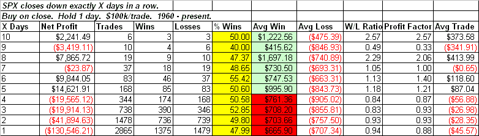
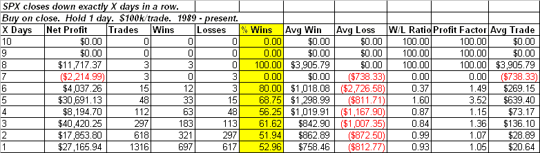
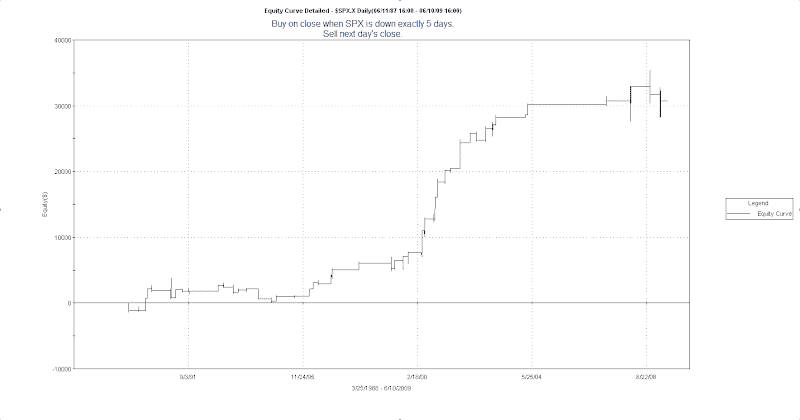

<!--yml

分类：未分类

日期：2024-05-18 13:19:37

-->

# 量化边缘：当市场连续下跌 X 天时，边缘在哪里

> 来源：[`quantifiableedges.blogspot.com/2009/06/where-edge-lies-when-market-drops-x.html#0001-01-01`](http://quantifiableedges.blogspot.com/2009/06/where-edge-lies-when-market-drops-x.html#0001-01-01)

几周前我写了

[一篇说明边缘购买 3 个交易日下跌的帖子](http://quantifiableedges.blogspot.com/2009/05/3-lower-closes-largely-misunderstood.html)

随着时间的推移，有许多方法可以扩展那篇文章中的研究。今天我将简要看看在接下来的交易日内，“X”个交易日的下跌意味着什么边缘。

下面的表格查看了在 SPX 连续下跌 X 天后，下一天的表现。

（[点击查看](https://blogger.googleusercontent.com/img/b/R29vZ2xl/AVvXsEiulNBo8cqNYh2oDL6EkQacGLmWilS5m3j-P2M650O9FSeJ4QBcPtAITgABU3B4KaLrMUSbAs91puesf5hxf90rM_4IZn9wzCdr-VCPEDRIZ9tvYNt9qr_eLI-uTc9yuP67xuVsEzXLruSd/s1600-h/2009-6-11+png+60.PNG)）

这里有几件事情引起了我的注意。首先是%胜率这一列。不管你有几个交易日下跌，它都保持在 50%左右。基本上是硬币的两面。第二列引起我注意的是平均胜率。当进一步深入时，这一列提供了边缘（edge）。一般来说，市场越紧张，反弹越强烈。

正如我在关注 3 个交易日下跌的那篇文章中所展示的，边缘（edge）随年份发生了变化。最近市场更有倾向于反转而不是趋势。以下是 1989 年至今的时间框架的相同表格。

（[点击查看](https://blogger.googleusercontent.com/img/b/R29vZ2xl/AVvXsEgXJK4hHnSIWEZNeriTDZgEQtkUQFqYqv146hKJwGE8W434BZYHMo9X2Lb5PFhatQTX_kHjeb7bj9jKhKwFR8MPJp3FDciOWsYoKo0dOw_eV1YGmmPhLNf9YfzByaAmYLX6exyfvBiRoCeB/s1600-h/2009-6-11+png+89.PNG)）

这里%胜率这一列显示，在过去 20 年中，连续几天下跌后逆转的趋势变得更加强烈。与第一张表一样，随着 SPX 变得更加紧张，平均胜率增加。

我用“3 天下跌”交易展示了边缘的许多方面都是最近才出现的。下面是下跌 5 天的股票曲线。

（[点击查看](https://blogger.googleusercontent.com/img/b/R29vZ2xl/AVvXsEi3zbNe3HE9N4npWpOVAMhPHWv9BxK36yRiD13UmnTgrFS9vjIejeXUDerjV

很大程度上，边缘可以归因于最近几年。

我的心得是，市场连续几天回调之后，存在一个较长边际。这个边际的大部分并不来自于市场第二天上涨的概率，而是来自于如果市场确实上涨，你将会获得充分的回报。如果你理解这一点，或许结合市场连续多日下跌与其他可能预示市场反转的迹象，那么你很可能会识别出一个强烈的上涨边际。
