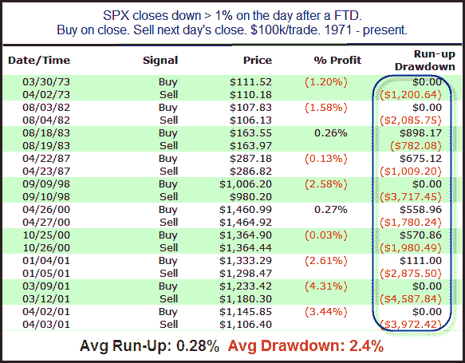

<!--yml

分类：未分类

日期：2024-05-18 08:54:46

-->

# 量化边缘：为什么我仍然关注 FTD 以及当 1%的下跌跟随一个 FTD 时会发生什么

> 来源：[`quantifiableedges.blogspot.com/2011/10/why-i-still-look-at-ftds-what-happens.html#0001-01-01`](http://quantifiableedges.blogspot.com/2011/10/why-i-still-look-at-ftds-what-happens.html#0001-01-01)

我最近收到了一位读者的来信，他问我为什么博客上有这么多与跟随交易日（FTD）相关的研宄。读者提到，FTD 提供的优势并不像我的其他研宄那样有说服力。但是，一个人的垃圾是另一个人的宝藏。尽管 FTD 可能没有如广告中所说那样准确地预测新的股市反弹，但它们在定义市场环境方面做得非常好。FTD 告诉我们市场已经经历了调整。它告诉我们市场已经从底部连续多日反弹。它告诉我们强劲的成交量和价格行动已经进入市场。热情正在升温。

我们知道根据 FTD，反弹成功的几率大约只有 40%-50%，但我们不需要立即知道它是否会成功，就可以充分利用这些信息。尽管博客上和订阅信件中的许多过去 FTD 研宄主要关注 FTD 及其周围的动作，以及这对中期可能意味着什么，但将当前日的动作置于适当的背景中也可能很有用，这样我们才能更好地理解这些动作可能在接下来的几天和几周内暗示什么。我在其他许多方面也使用背景，人们几乎不再注意到。研宄总是以市场所处的位置为框架。它是否高于或低于 200 日均线？是否位于 20 日高点？是否位于 20 日低点？这些都是有帮助的，但最近的研究使我相信 FTD 在定义背景方面可能同样有用，甚至更有用。所以我将继续融入它们，并且乐观地认为这样做可能揭示一些真正的宝藏。不管怎样……周二我们有一个 FTD，然后周三市场强劲下跌。强烈的热情迅速转变。让我们看看其他实例和随后发生的情况。

交易数量有点少，但早期的迹象强烈表明还会有一天的卖出。这里有两件事情给我留下了深刻的印象。1) 十多年来还没有出现过这种情况。2) 上涨/下跌的斜率严重偏向于空头。总的来说，这些结果足够有说服力，值得考虑。
