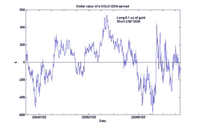

<!--yml

分类：未分类

日期：2024-05-12 19:27:20

-->

# 量化交易：黄金与黄金矿工之间套利的一个更新分析

> 来源：[`epchan.blogspot.com/2006/11/updated-analysis-of-arbitrage-between.html#0001-01-01`](http://epchan.blogspot.com/2006/11/updated-analysis-of-arbitrage-between.html#0001-01-01)

在我的

[文章](http://epchan.blogspot.com/2006/11/gold-vs-gold-miners-another-arbitrage.html)

关于黄金与黄金矿工之间的套利机会，我警告说我们应该对这个分析持保留态度，因为 GDX（一个黄金矿工 ETF）的历史太短。范艾克全球公司的菲利普斯先生，这家创造了 GDX 的公司，友好地指出了 GDX 旨在跟踪美国黄金矿工指数 GDM，它有更长的历史。因此我用过去 3 年的黄金现货价格与 GDM 进行了重复分析。结果证实了我的早期分析，具有更高的统计显著性：GDM 与黄金价格的协整概率超过 99%。在这里，我绘制了 6.1 盎司黄金现货价格与 GDM 指数乘以 3.68（为了与我的早期图表进行比较，我将黄金价格和 GDM 指数标准化，使得 Gold-GDM 价差在任何时间产生的美元价值与 GLD-GDX 价差大致相同）：

这个 spread 的均值回归甚至比我在早期文章中的图表还要明显。此外，拥有更长的时间线，我们更能感受到波动的范围。截至 11 月 9 日收盘，这个 spread 的价值约为 -$213，但根据过去 3 年的高低点，它肯定会更低才会回归。

脚注

我早期文章的一位读者对做空 ETF 如 GDX 和 GLD 发表了一个有趣的评论。他认为，由于 ETF 份额可以不断被创建，做空时不应该需要借入现有份额。我就这个问题询问了范艾克全球公司的菲利普斯先生，他向我证实了像 GDX 这样的新 ETF 实际上确实难以借入。他接着说，ETF 的借入与发行人无关。发行人确实可以创建无限量的股份，但交易员仍然需要从他的或她的经纪人那里借入股份进行做空。他还告诉我，他目前正在努力消除 GDX 中可能存在的任何借入问题。
