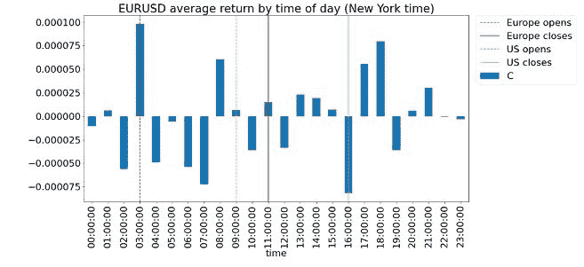
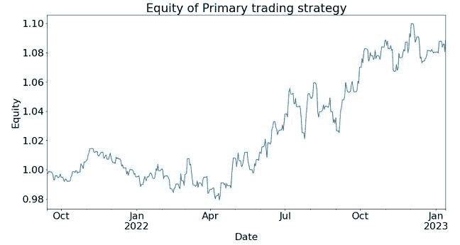
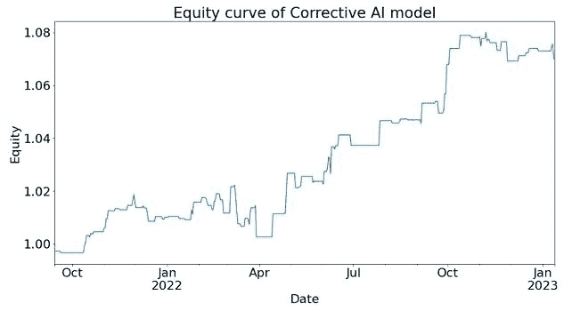

<!--yml

分类：未分类

日期：2024-05-12 18:53:44

-->

# 量化交易：将纠正性 AI 应用于每日季节性外汇交易

> 来源：[`epchan.blogspot.com/2023/03/applying-corrective-ai-to-daily.html#0001-01-01`](http://epchan.blogspot.com/2023/03/applying-corrective-ai-to-daily.html#0001-01-01)

作者：谢尔盖·别洛夫，欧内斯特·陈，纳希德·杰塔，阿克沙伊·纳蒂亚尔

摘要

我们将[纠正性 AI](https://predictnow.ai/what-is-corrective-ai/)（陈，2022）应用于一个利用外汇回报日周期性的交易模型。布雷登和拉纳尔多（2012）观察到，在外汇的当地工作时间，外币相对于美元贬值，而在美元的当地工作时间则升值。我们首先用 2021 年 9 月到 2023 年 1 月的最近 EURUSD 数据回测布雷登和拉纳尔多的结果，然后将纠正性 AI 应用于这个交易策略，以显著提高性能。

布雷登和拉纳尔多（2012）描述了一种交易策略，在欧洲工作时间（东部时间早上 3 点到晚上 9 点，其中 ET 表示纽约当地时间，考虑夏令时）做空 EURUSD，而在美国工作时间（东部时间下午 11 点到晚上 3 点）买入 EURUSD。这种策略的依据是，大规模的机构在美国工作时间购买美元以支付全球发票，而在欧洲工作时间则相反。因此，这种效应也被称为“发票效应"。

有一些支持证据表明，外汇市场的各种指标，如波动性（参见 Baille 和 Bollerslev（1991），或 Andersen 和 Bollerslev（1998））、成交量（参见 Hartman（1999），或 Ito 和 Hashimoto（2006））和回报率（参见 Cornett（1995），或 Ranaldo（2009）），在这些指标中，当地货币在每个指标的当地工作期间相对于美元贬值，而在美国工作期间升值。

图 1 描述了从 2019 年 10 月 1 日 17:00 ET 到 2021 年 9 月 1 日 16:00 ET 期间，每天每个小时的平均回报。它揭示了 EURUSD 的回报模式。上述描述的“工作时间”的回报模式与广泛存在的“发票效应”假设相一致。在欧洲工作期间回报下降，在美国工作期间回报上升。

图 1：按日间时间计算的 EURSUD 平均回报（纽约时间）

由于这个策略在 2012 年发表，它提供了充足的真样本外测试时间。我们从电子经纪服务（EBS）收集了 EURUSD 的 1 分钟 K 线数据，并在 2021 年 10 月至 2023 年 1 月的样本外期间进行了回测。该策略在这一期间的夏普比率是 0.88，平均年回报率为 3.5%，最大回撤为-3.5%。策略的 alpha 显然持续存在。（出于本文的目的，回测中没有包含交易成本，因为我们唯一的目标是比较带有和没有纠正 AI 的表现，而不是确定这个交易策略在实际生产中是否可行。）

图 2 展示了上述样本外期间该策略的权益曲线（“1 美元的增长”）。在此期间，累计回报率略低于 8%。我们称这为“主”交易策略，原因将在下面解释清楚。

图 2：样本外期间主交易策略的权益曲线

### 什么是纠正 AI？

假设我们有一个交易模型（如上述主交易策略），用于设置投注的侧（多头或空头）。我们只需要学习这个投注的大小，包括根本不下注（零大小）的可能性。这是实践者经常面临的情况。一个机器学习算法（ML）可以被训练来确定这一点。需要强调的是，我们不想让 ML 算法学习或预测哪一侧，只是告诉我们适当的大小。

我们称这个问题为元标签问题（Lopez de Prado，2018）或纠正 AI（Chan，2022），因为我们希望建立一个次级机器学习模型，学习如何使用主要交易模型。

我们训练了一个机器学习算法来计算下一分钟 K 线的“盈利概率”（PoP）。如果 PoP 大于 0.5，我们将下注大小设置为 1；否则，我们将其设置为 0。换句话说，我们将采用步进函数作为下注大小函数，它接受 PoP 作为输入，给出下注大小作为输出，阈值设置为 0.5。这个下注大小函数决定是否下注或放弃，这是一个纯粹的二进制预测。

训练期是从 2019 年 1 月 1 日至 2021 年 9 月 30 日，而样本外测试期是从 2021 年 10 月 1 日至 2023 年 1 月 15 日，这与我们报告的主交易策略的样本外期间一致。用于训练机器学习算法的模型是使用 predictnow.ai 纠正 AI（CAI）API 完成的，该 API 具有超过一百个预先工程化的输入特征（预测因子）。底层学习算法是一种梯度提升决策树。

在应用纠正 AI 之后，该策略在此期间夏普比率达到了 1.29（增加了 0.41），平均年回报率为 4.1%（增加了 0.6%），最大回撤为-1.9%（减少了 1.6%）。策略的 alpha 显著改善。

下面图表中可见 Corrective AI 过滤后的次要模型信号权益曲线。

图 3：Corrective AI 模型在样本外期间的权益曲线

用于训练 Corrective AI 模型的特征包括来自指数、股票、期货和期权市场的技术指标。其中许多特征是使用[Algoseek](https://www.algoseek.com/)的高频期货和股票数据创建的。关于这些特征的更多讨论可以在（纳蒂亚尔&陈，2021）中找到。

### 结论：

通过将 Corrective AI 应用于时间段的初级策略，我们能够在样本外回测期间提高夏普比率并减少回撤。这与我们对初级策略的元标签观察相一致。Corrective AI 模型的信号过滤能力在特定场景中确实能提高性能。

### 致谢

我们感谢 Algoseek 的 Chris Bartlett，他慷慨提供了我们 Corrective AI 系统特征工程所需的高频数据。我们也感谢 Pavan Dutt 在特征工程方面的协助，以及 Jai Sukumar 帮助我们使用 Predictnow.ai CAI API。最后，我们感谢 Erik MacDonald 和 Jessica Watson 向 Predictnow.ai 的客户解释这项技术。

**参考文献**

布雷登，F.，&拉纳尔多，A.（2012 年 4 月 3 日）《外汇回报率与订单流日内模式》。https://ssrn.com/abstract=2099321

陈，E.（2022 年 6 月 9 日）《什么是纠正性 AI？》。PredictNow.ai。2023 年 2 月 23 日检索自 https://predictnow.ai/what-is-corrective-ai/

洛佩兹·德·普拉多，M.（2018）。《金融机器学习进展》。威利出版社。

纳蒂亚尔，A.，&陈，E.（2021）。《PredictNow.ai 因子动物园的新增内容》。PredictNow.ai。2023 年 2 月 28 日检索自 https://predictnow.ai/new-additions-to-the-predictnow-ai-factor-zoo/
