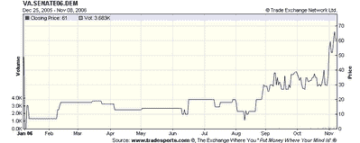
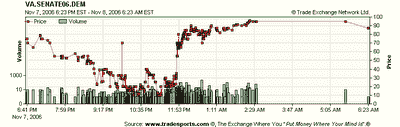

<!--yml

分类：未分类

日期：2024-05-12 19:27:46

-->

# 量化交易：政治期货市场真的具有预测性吗？

> 来源：[`epchan.blogspot.com/2006/11/is-political-futures-markets-really.html#0001-01-01`](http://epchan.blogspot.com/2006/11/is-political-futures-markets-really.html#0001-01-01)

今天，我将暂时离开金融市场的量化交易。相反，我将批判性地看待

[政治期货市场](http://msnbc.msn.com/id/15594121/site/newsweek/)

。最近对这类市场（例如

[www.tradesports.com](http://www.tradesports.com)

（总部位于爱尔兰的）是最受欢迎的一个。）媒体评论家和学者们经常说，这些市场提供的选举结果预测比民意调查更好，有时声称它们有四分之三的时间胜过民意调查。我一直积极参与这些市场，但我想要提供一个相反的观点：我相信这些市场往往是跟随事件而不是预测事件。这些市场所谓的“可预测性”往往是定义不清的。预测随着时间的推移而不断变化，所以当你对市场进行快照时，你总能找到一个时刻，回顾起来，预测与实际的选举结果非常接近。

例如，我饶有兴趣地观察了 tradesports.com 对弗吉尼亚州参议员选举的期货市场预测，这场选举是民主党人吉姆·韦伯和共和党人乔治·艾伦之间的竞争。这是将决定参议院控制权的两场接近的选举之一。几个月来，市场一直预测民主党将失败（获胜的概率，与价格除以 100 相同，始终低于 50%，直到 11 月初）。然后，在 11 月，市场开始看到曙光，并开始预测民主党将获胜。请看下面的图表。

但看看选举之夜发生了什么：

当计票开始公布时，市场最初认为共和党将会赢，导致价格跌至十几美元。这是由于来自保守的南部弗吉尼亚的选票最早公布。然后，在大约晚上 11:30，当来自更自由的北部弗吉尼亚的选票公布时，价格飙升超过 60 美元，并继续升至 80 美元以上。显然，市场并不比普通的新闻主播知道更多关于未来的信息。

作为一名对基于期货市场的选举结果可预测性感兴趣的人，这引发了一个严重的问题。什么是获取市场快照的正确时间？是在选举前 1 个月（在这种情况下市场预测失败，假设重新计票后民主党获胜）？还是应该在选举前 1 周，在这种情况下市场预测成功？如果没有答案，那么如何声称预测是准确还是不准确呢？
