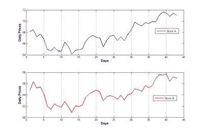
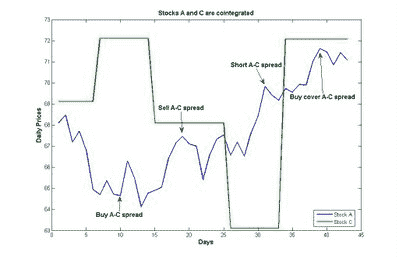

<!--yml

类别：未分类

日期：2024-05-12 19:27:59

-->

# 量化交易：协整不等于相关

> 来源：[`epchan.blogspot.com/2006/11/cointegration-is-not-same-as.html#0001-01-01`](http://epchan.blogspot.com/2006/11/cointegration-is-not-same-as.html#0001-01-01)

最近有读者问我为什么我相信能源股价格（例如 XLE）与原油期货近月合约（QM）是相关的。实际上，我不认为它们一定是相关的——我只是认为它们是“协整”的。

相关性和协整之间的区别是什么？如果 XLE 和 QM 真的相关，那么当 XLE 有一天上涨时，QM 很可能在同一天也上涨，反之亦然。它们的日（或周、月）回报率会同时上升或下降。但这不是我的[分析](http://epchan.blogspot.com/2006/10/arbitrage-trade-between-energy-stocks.html)的内容。我声称 XLE 和 QM 是协整的，这意味着这两个价格序列不能长时间地向相反方向游离，最终回归到一个平均距离。但这并不意味着在日度基础上两个价格必须同步移动。

两个假设的图表说明了它们之间的差异。在第一个图表中，股票 A 和股票 B 是相关的。你可以看到，它们的价格几乎每天都朝着同一个方向移动。

现在考虑股票 A 和股票 C。

股票 C 显然不是以任何相关方式与股票 A 一起移动：有时它们朝同一个方向移动，有时则相反。大多数日子股票 C 根本不移动！但请注意，C 和 A 之间的股价价差经过一段时间后总是回归到大约 1 美元左右。这是 A 和 C 之间协整的体现。在这个实例中，一个盈利的交易是在大约第 10 天买入 A 并做空 C，然后在大约第 19 天退出两个头寸。另一个盈利的交易是在大约第 31 天买入 C 并做空 A，然后在大约第 40 天关闭所有头寸。

协整是构建配对交易（“统计套利”）的基础。如果两只股票仅仅是相关联地移动，那么价差可能永远不会扩大。如果没有暂时性地扩大价差，无论是向哪个方向，都没有机会做空（或买入）价差，也没有理由期望价差会回归平均值。

进一步阅读：

Alexander, Carol (2001). [市场模型：金融数据分析指南](http://www.amazon.com/gp/product/0471899755?ie=UTF8&tag=quantitativet-20&linkCode=as2&camp=1789&creative=9325&creativeASIN=0471899755). 约翰威利父子公司。
