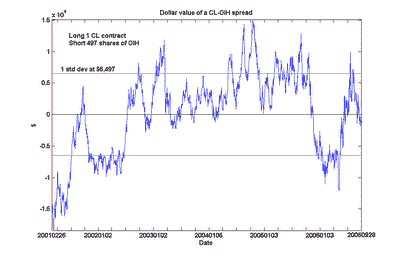

<!--yml

分类：未分类

日期：2024-05-12 19:26:40

-->

# 量化交易：OIH 与现货油价的协整

> 来源：[`epchan.blogspot.com/2006/11/cointegration-of-oih-with-spot-oil.html#0001-01-01`](http://epchan.blogspot.com/2006/11/cointegration-of-oih-with-spot-oil.html#0001-01-01)

我的朋友 Yaser Anwar 在

[投资想法博客](http://equityinvestmentideas.blogspot.com/)

以及我的读者

[吉姆](http://epchan.blogspot.com/2006/11/update-on-energy-stocks-vs-futures.html#comments)

他们敦促我测试与原油价格协整的石油服务 ETF OIH，而不是 XLE。他们的论点是 OIH 由像 Schlumberger 和 Baker Huhges 这样的石油钻探公司组成，而不是 XLE，后者由像 Exxon 这样的石油生产公司组成。石油钻探公司更具周期性，更多地对现货油价而不是远期合约价格做出反应。希望因此 OIH 将比 XLE 更好地与现货油价协整。OIH 因此具有更高的波动性，但这对于套利者（而不是对冲者）来说并不是一个担忧，因为套利者是从高波动性中获利的。不管怎样，它的波动性应该“抵消”现货油价的波动性，从而产生实际上可能更稳定的利差。我遵循他们的建议，并执行 CL 与 OIH 的分析。

该图表是 1 份 Cl 合约的价值和 497 股 OIH 的短仓。它们有超过 90%的概率进行协整。（我也绘制了利差的 1 个标准差线，以便那些想要寻找大致入场点的人。）协整概率不如 CL 与 XLE 之间的协整概率好。然而，截至 11 月 20 日收盘的当前利差低估了仅$9,617（或 1.48 个标准差），而 CL-XLE 利差低估了$10,508（或 1.74 个标准差）。（我确定了 CL-XLE 利差的标准差约为$6,040）。所以最近几个月，确实可以说 OIH 与现货油价的走势比 XLE 更一致。但作为认为利差越大，盈利机会越大的套利者，这并不是推荐购买 CL-OIH 利差的理由。相反，我会考虑将这种利差作为多元化的一种手段。

谢谢，Yaser 和吉姆，对这个建议！
