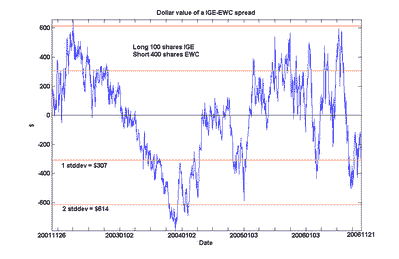
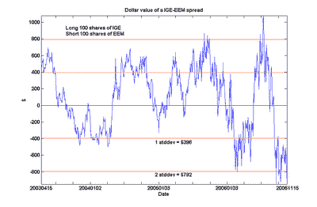

<!--yml

分类：未分类

日期：2024-05-12 19:26:24

-->

# 量化交易：加拿大属于新兴市场吗？

> 来源：[`epchan.blogspot.com/2006/11/does-canada-belong-to-emerging-markets.html#0001-01-01`](http://epchan.blogspot.com/2006/11/does-canada-belong-to-emerging-markets.html#0001-01-01)

许多加拿大人喜欢把我们国家的经济看作是发达的后工业世界的一员，我们的土地上遍布着像北电网络、黑莓公司、四季酒店这样的知名企业。当然，在我们的潜意识里，我们知道我们也是一个资源丰富的国家。但是，当我们发现，在所有可以比较 MSCI 加拿大指数基金 EWC 的板块指数基金中，它只与自然资源指数基金 IGE 共整，这可能会让我们感到有些尴尬。尽管加拿大指数中有很多金融服务公司，但金融板块指数并没有接近共整关系，甚至在图表中，我还绘制了 IGE 的 100 股与 EWC 的 400 股之间的价差，我们可以亲自看到这个价差是如何顽固地接近零的。

人们可能会注意到 IGE 也与新兴市场指数基金 EEM 共整。（下面图表是 100 股 IGE 与 100 股 EEM 之间的价差。）

这并不令人惊讶。但这是否意味着加拿大经济与其他新兴市场经济存在共整关系呢？答案是不是。我不会用另一张图表来烦扰你们：只需确信共整关系并不是一种传递关系。
