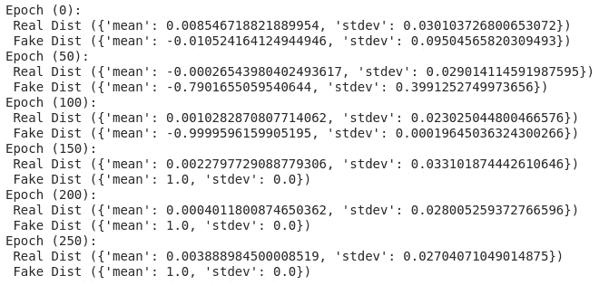
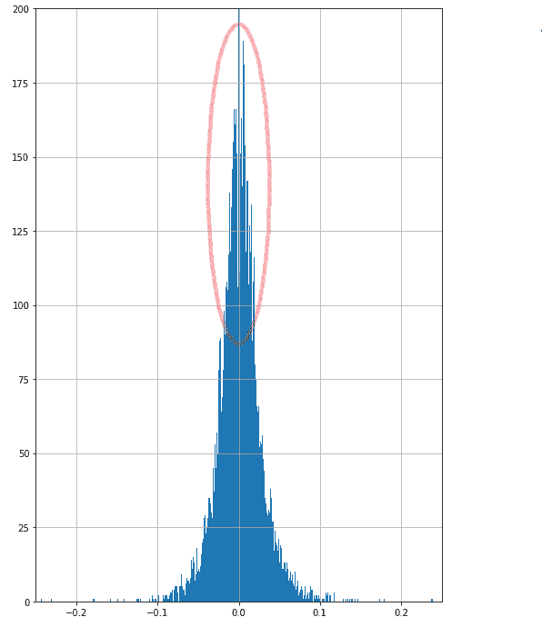
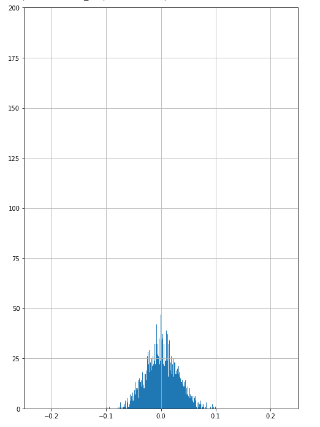

<!--yml

类别：未分类

date: 2024-05-12 18:54:55

-->

# 量化交易：使用 GANs 模拟回报的实验（嘉宾文章）

> 来源：[`epchan.blogspot.com/2019/12/experiments-with-gans-for-simulating.html#0001-01-01`](http://epchan.blogspot.com/2019/12/experiments-with-gans-for-simulating.html#0001-01-01)

2) 判别器能够区分真实数据和生成的数据

这次训练的数学目标是为了最大化：

a) log(D(x)) + log(1 - D(G(z))) - 由判别器完成 - 增加判别器 D 识别真实和假样本 x 的期望对数概率。同时，增加判别器 D 正确识别由生成器 G 使用噪声 z 生成的所有样本的期望对数概率。

b) log(D(G(z))) - 由生成器完成 - 因此，如在训练 GANs 时观察到的，在训练的开始阶段，G 是一个非常差的“真实”生成器，而 D 很快就能很好地识别真实数据。因此，组件 log(1 - D(G(z)))饱和或保持较低。生成器 G 的任务是最大化 log(1 - D(G(z)))。这意味着 G 正在创造 D 无法“指出”的真实数据。但是因为 log(1 - D(G(z)))饱和，我们训练 G 以最大化 log(D(G(z)))，而不是最小化 log(1 - D(G(z)))。

两个网络之间进行的 min-max 游戏正式描述为：

minGmaxDV (D, G) =Epdata(x)[log D(x)]  +E p(z) [log(1 − D(G(z)))]

真实数据样本 x 从经验回报分布 pdata(x) 中采样，而 z 是从多元高斯分布 p(z) 中采样出的随机噪声变量。期望值是对这两个分布进行计算的。这个过程会在多次迭代中进行。

假设是各种尝试的 GAN 将能够生成一个回报分布，这个分布比使用[几何布朗运动](https://blog.quantinsti.com/random-walk-geometric-brownian-motion/)的蒙特卡洛方法等普遍基线更接近于经验回报分布。

实验

我们试图从所有特性的时间窗口以及调整收盘价的百分比变化学习一个联合概率分布。这样，它们可以有机地结合所有自然的细微差别进行模拟。在所有 GAN 训练过程中，都使用了贝叶斯优化进行超参数调整。

在这个练习中，起初，我们首先收集了一些属于趋势、动量、波动性等类别的特征，如[RSI](https://blog.quantinsti.com/rsi-indicator/)、MACD、[帕 abolic SAR](https://blog.quantinsti.com/parabolic-sar/)、[布林带](https://blog.quantinsti.com/bollinger-bands/)等，以创建 AAPL 数据的特征集，该数据集从 20 世纪 80 年代至今。序列训练样本的窗口大小是基于超参数调优设定的。除了这些指标外，调整后的 OLHCV 数据的百分比变化也被采取并连接到特征列表中。生成器和判别器都是递归神经网络（按顺序输入多变量窗口），由 LSTM 提供动力，并将输出传递给密集层。我尝试学习 14 个特征和 8 个特征的联合分布。结果并不理想，可能是因为所使用的架构，也可能是因为 GAN 架构训练起来非常困难。不理想之处在于生成器的误差完全没有减少（log(1 - D(G(z)))在训练初期上升后非常早地达到饱和），而且生成器产生的随机回报分布没有任何特定的形式。

在尝试了训练效果不佳的条件循环 GAN 之后，我尝试使用更简单的多层感知机作为生成器和判别器，我将 AAPL 调整后的收盘价的全部窗口返回值传递给生成器。最优窗口大小是通过使用贝叶斯优化进行超参数调优得到的。前馈 GAN 生成的分布如图 1 所示。

图 1。简单前馈 GAN 的回报

我遇到的一些常见问题要么是部分[模式坍缩](https://aiden.nibali.org/blog/2017-01-18-mode-collapse-gans/)，要么是完全模式坍缩。在这两种情况下，分布要么没有与经验分布类似的尖锐峰值（部分），要么无论噪声样本输入生成器产生的是一个有限的输出样本集（完全）。

上面的图表显示了训练过程中的模式坍缩。每次训练的后续周期都会打印出放入判别器进行训练的经验子集（“真实数据”）和生成器生成的子集（“假数据”）的平均值和标准差。正如我们在第 150 个周期所看到的，生成的“假数据”的分布完全坍缩。均值变为 1.0，标准差变为 0。这意味着生成器中放入的所有噪声样本都产生了相同的输出！这种现象称为模式坍缩，因为其他局部模式的频率与真实分布不一致。正如您在下面的图表中看到的，这是上面训练迭代中生成的最终分布：

                                        对生成器和判别器的错误进行了少量调整，1) 为两个神经网络使用了不同的学习率。非正式地说，判别器的学习率应该是生成器学习率的一个数量级更高。2) 训练判别器时，不是使用固定的标签 1 或 0（其中 1 表示“真实数据”，0 表示“假数据”），而是从标签 1 中减去一小部分噪声，并从标签 0 中添加类似的一小部分噪声。这使得从分类转变为回归模型，使用均方误差损失而不是二元交叉熵作为目标函数。尽管如此，这些调整并没有完全消除与循环网络相关的次优性和模式崩溃问题。

基线比较

我们将生成的分布与经验回报分布和通过几何布朗运动生成的分布进行了比较- 对 AAPL 的 Monte Carlo 模拟使用 python 完成的。用于比较 GBM-MC 生成的经验回报和 GAN 生成的回报的度量是 Kullback-Leibler 散度来比较回报分布之间的“距离”和 VAR 测量来了解每种模拟的风险。GBM-MC 生成的链可以在图 4 中看到。基于 AAPL 股票数据的方差和均值从 20 世纪 80 年代到 2019 年，在未来的 1000 天内模拟了 10 个路径。GBM 的初始价格输入是第一天的 AAPL 价格。

  

图 2 显示了从 20 世纪 80 年代至今的 AAPL 的经验分布。图 3 显示了 AAPL 上几何布朗运动的生成回报。

为了比较练习中生成的各种分布，我将回报值分为 10,000 个桶，然后使用每个桶的非标准化频率值计算散度。代码是：

背后使用的 scipy 的熵公式是：

S = sum(pk * log(pk / qk)) 其中 pk,qk 是二进制频率

| 比较 | KL 散度 |
| --- | --- |
| 经验值与 GAN | 7.155841564194154 |
| GAN 与经验值 | 10.180867728820251 |
| 经验值与 GBM | 1.9944835997277586 |
| GBM 与经验值 | 2.990622397328334 |

与使用多感知机 GANs 生成的回报相比，几何布朗运动生成更好地与经验数据相匹配，尽管需要注意的是两者都非常糟糕。

在这里计算的 VAR 值（跨越 8 个样本）告诉我们，在置信水平以上，我们可能获得的回报（或损失）的类型- 在这个案例中，是给出回报分布的百分比损失，5%和 1%的机会：

| 比较 | VAR 值的均值和标准差（对于 95%置信水平） | VAR 值的均值和标准差（对于 99%置信水平） |
| --- | --- | --- |
| GANs | Mean = -0.1965352900Stdev =  0.007326252 | Mean = -0.27456501573Stdev =  0.0093324205 |
| GBM with Monte Carlo  | Mean = -0.0457949236Stdev =  0.0003046359 | Mean = -0.0628570539Stdev = 0.0008578205 |
| 经验数据 | -0.0416606773394755 (one ground truth value)  | -0.0711425634927405 (one ground truth value)  |

GBM 生成器的 VAR 似乎比经验分布的 VAR 更接近。

图 4. 显示使用蒙特卡洛的 Geometric Brownian motion 模型生成的各种路径。

**结论**

两种方法生成的分布都没有生成经验分布（图 2）中所显示的尖锐峰。与我所尝试的各种 GANs 相比，使用 GBM with Monte Carlo 生成的回报分布更加接近现实，如 VAR 值所示，其与经验分布的距离也远小于经验分布，如 Kullback-Leibler 散度所示。这次练习强化了这样一个观点：尽管 GANs 很有吸引力，但它们很难训练。在这个过程中，我发现了几个可能在 GAN 训练中有帮助的小技巧。我所面临的一些常见问题包括上面讨论过的 1)模式坍塌 2)生成器的过饱和和“过度强化”判别器。这种过饱和导致 GAN 学习概率分布的最优性降低。尽管这次练习并不特别成功，但它为探索各种新的 GAN 架构以及我尝试的条件递归和多层感知器架构提供了可能，并利用它们传说中的能力学习最微妙的分布，并将它们应用于金融时间序列建模。我们的代码可以在 Github 上找到[这里](https://github.com/QuantInsti/EPAT/tree/master/Blogs/GAN%20Simulation)。任何能帮助提高性能的代码修改都是最受欢迎的！

**关于作者**：

**Akshay Nautiyal** 是 Quantinsti 的定量分析师，致力于机器学习和金融的交汇处。QuantInsti 是一个高端的算法和定量交易学院，提供[教师引导](https://www.quantinsti.com/epat)和[自学](https://quantra.quantinsti.com/courses)的学习项目。例如，有一个互动的[课程](https://quantra.quantinsti.com/learning-track/machine-learning-deep-learning-in-financial-markets)使用机器学习在金融市场，提供 LSTM，RNN，交叉验证和超参数调整等复杂概念的实践培训。

#### **行业更新**
