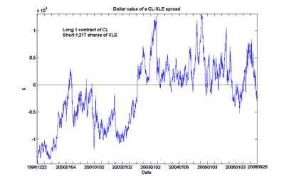

<!--yml

分类：未分类

日期：2024-05-12 19:26:50

-->

# 量化交易：能源期货与股票套利扩展分析

> 来源：[`epchan.blogspot.com/2006/11/extended-analysis-of-energy-futures-and.html#0001-01-01`](http://epchan.blogspot.com/2006/11/extended-analysis-of-energy-futures-and.html#0001-01-01)

我的文章“

[能源股票与期货之间的套利交易](http://epchan.blogspot.com/2006/10/arbitrage-trade-between-energy-stocks.html)

”建议我应该查看原油价格与 XLE 更长时间的历史对比。因此，我针对 1998 年 12 月以来的前端原油期货合约 CL 与 XLE 进行了同样的协整分析。（我使用 CL 而不是 QM，迷你原油合约，因为 CL 的历史更长。）以下是 CL 多头 1 份合约和 XLE 空头 1,217 股的美元价值走势图。（我之前的分析建议是 1 份 QM 合约对 640 股 XLE。股数差异是由于 QM 相对于 CL 的一半大小，以及这里更大的数据集。）

这种扩展分析中出现了一个有趣的特点。CL 和 XLE 在这段时间内仍然被发现是协整的，尽管概率略有降低（90%）。然而，我们可以看到，大约在 2002 年中，CL 相对于 XLE 从普遍低估变为高估，出现了一种体制转变。（即使在我的计算中包括了这种相对原油价格较低的体制，我发现截至 2024 年 11 月 17 日收盘，当前的价差仍被低估约 10,521 美元，接近 6 年低点。）

那么，2002 年中明显的转变原因是什么？我们现在是否正处于相反方向上的类似体制转变之中？也许我们读者中对能源市场经济基本面有更深入了解的人可以解答这个问题。
