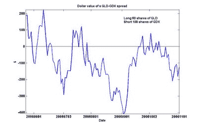

<!--yml

分类：未分类

日期：2024 年 05 月 12 日 19:28:06

-->

# 量化交易：黄金 vs. 黄金矿工：另一个套利机会？

> 来源：[`epchan.blogspot.com/2006/11/gold-vs-gold-miners-another-arbitrage.html#0001-01-01`](http://epchan.blogspot.com/2006/11/gold-vs-gold-miners-another-arbitrage.html#0001-01-01)

最近，购买黄金的兴趣日益增加（例如，请参见这篇文章

[报告](http://www.thestreet.com/_yahoo/markets/commodities/10319196.html)

在 TheStreet.com）。我并不是一个很擅长基本分析的分析师，所以我不会深入探讨现在是不是要拥有或不拥有黄金的经济原因。相反，我想看看在所有这些激动中是否存在套利机会。

我谈到了

[之前](http://epchan.blogspot.com/2006/10/arbitrage-trade-between-energy-stocks.html)

我为什么相信能源期货和能源公司 ETF 是“共整合”的，即当它们的价差偏离平均值时，它们会重新回归到平均值的概率很高。同样的分析也可以用于其他商品期货和 ETF 的配对。因此，我将这个理论应用到了黄金上。

在寻找持有黄金矿工的 ETF 时，我找到了 GDX。它于 2006 年 5 月 23 日开始交易，因此对于我们来说有一个相对较短的历史可以分析。我们本可以将其与前月黄金期货合约 GC 配对，但这可能会不方便，因为每月都必须滚动合约。所以，我们将其与持有黄金作为商品的 ETF 配对。GLD 就是其中之一。（IAU 也是如此，但 GLD 更具流动性。）使用我在之前文章中提到的相同的 Matlab 共整合软件包，我确定即使有短期历史，GLD 与 GDX 具有 90%的共整合概率。此外，该软件包告诉我们，正确的组合是 60 股 GLD 对 100 股 GDX。因此，如果我们通过购买 60 股 GLD 并空头 100 股 GDX 来形成一对，我们可以随时间推移绘制价值如下：

确实有许多回归到平均值的情况。我能够利用 7 月中旬的高点有利地做空这个价差，并且我还在 9 月初的低点买入了这个价差，并在 9 月中旬有利地退出了我的仓位。截至 11 月 1 日，这个价差再次处于足够负面的领域，值得关注。

在交易这个价差时有一些注意事项。首先，借 GDX 或 GLD 空头并不总是容易的。这取决于你的经纪人是否有一个良好的证券借贷台。其次，GDX 的历史较短。因此，任何分析都必须持保留态度。为了克服这个短期历史，我本可以构建自己的一篮子金矿股票，并将这个篮子的价格与黄金期货 GC 相比较。如果你打算大量投资于这个价差，我绝对建议你做这项繁重的工作。
