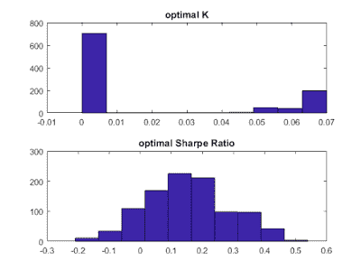

<!--yml

类别：未分类

日期：2024-05-12 18:55:43

-->

# 量化交易：避免过拟合优化交易策略

> 来源：[`epchan.blogspot.com/2017/11/optimizing-trading-strategies-without.html#0001-01-01`](http://epchan.blogspot.com/2017/11/optimizing-trading-strategies-without.html#0001-01-01)

由 Ernest Chan 和 Ray Ng 撰写

===

通过回测优化交易策略的参数存在一个主要问题：通常历史交易数据不足以达到统计显著性。无论找到何种最优参数，都可能受到数据窥视偏误的影响，且在样本外期间可能并无最优性。这就是为什么交易策略的参数优化通常不会增加任何价值。另一方面，优化时间序列模型（如自回归或 GARCH 模型的最大似然拟合）更为稳健，因为输入数据是价格而非交易数据，而且我们有大量的价格数据。幸运的是，结果表明，存在一些巧妙的方法可以利用优化时间序列模型的便捷性来优化交易策略的参数。

优化交易策略的一种优雅方法是利用随机最优控制理论的方法——如果你在数学上足够 sophisticated 并能解析求解哈密顿-雅可比-贝尔曼（HJB）方程，那么这就是一种优雅的方法（参见

[Cartea 等人](https://www.amazon.com/Algorithmic-High-Frequency-Trading-Mathematics-Finance/dp/1107091144/ref=as_sl_pc_qf_sp_asin_til?tag=quantitativet-20&linkCode=w00&linkId=F3CCPNPZVPYO6H5M&creativeASIN=1107091144)

。即使这样，这也只会在底层时间序列是众所周知的情况下工作，比如所有均值回归价格序列背后的连续奥恩斯坦-乌伦贝克（OU）过程。这个 OU 过程 neatly 由一个随机微分方程表示。此外，通常只有当目标函数具有简单形式时，才能精确求解 HJB 方程，例如线性函数。如果你的价格序列恰好由一个 OU 过程 neatly 表示，而你的目标是利润最大化，这恰好是价格序列的线性函数，那么随机最优控制理论将给出解析最优交易策略：精确的入场和出场阈值给出为 OU 过程参数的函数。不再需要通过繁琐的回测过程尝试和错误地寻找这些最优阈值，这个过程容易导致对稀疏交易数据过拟合。正如我们上面所指出的，OU 过程的参数可以相当稳健地拟合到价格上，实际上，对于这种拟合有一个解析最大似然解，见于

[Leung 等人](https://arxiv.org/abs/1411.5062)。

但是，如果你想用比 OU 过程更复杂的模型来拟合你的价格序列，或者需要一个更复杂的的目标函数呢？例如，如果你想包含一个 GARCH 模型来处理时间变化的波动性并优化夏普比率，那怎么办？在许多这样的案例中，没有表示为连续随机微分方程的形式，因此也没有 HJB 方程可解。幸运的是，仍然有一种可以在不过度拟合的情况下进行优化的方法。

在许多优化问题中，当不存在分析最优解时，通常会转向模拟。此类方法包括模拟退火和马尔可夫链蒙特卡洛（MCMC）等。在这里，我们也将采取同样的做法：如果我们不能为最优交易策略找到分析解，但能很好地将我们的基础价格序列拟合到标准的离散时间序列模型如 ARMA，那么我们可以简单地模拟许多基础价格序列的实例。我们将在每个模拟价格序列的实例上回测我们的交易策略，并找到最经常产生最高夏普比率的最佳交易参数。这个过程比将回测应用于实际时间序列要稳健得多，因为只有一个真实的价格序列，但我们可以

我们可以模拟尽可能多的价格序列（所有遵循相同的 ARMA 过程）。这意味着我们可以模拟尽可能多的交易，并获得尽可能高的精度的最佳交易参数。这几乎和分析解一样好。（下面是说明这个过程的流程图 - 点击以放大。）

|  |
| --- |
| 使用模拟时间序列优化交易策略 |

下面是一个有点琐碎的例子，说明这个过程。我们想要找到一个每小时交易 AUDCAD 的最佳策略。首先，我们使用*对数*中价数据，将 AR(1)+GARCH(1,1)模型拟合到数据中。最大似然拟合是使用一年历史价格的移动窗口完成的，并且每个月都会重新拟合模型。我们使用 MATLAB 的经济计量学工具箱进行这个拟合。一旦找到一系列的月模型，我们就可以使用它们来预测每小时条形末端的对数中价，以及对数回报的预期方差。因此，可以测试一个简单的交易策略：如果下一个条形中的预期对数回报高于 K 倍的预期对数回报的波动性（方差的平方根），则买入 AUDCAD 并持有一个条形，反之亦然用于空头。但最优的 K 是多少？

按照上述流程，每次我们拟合一个新的 AR(1)+GARCH(1, 1)模型后，我们用这个模型*模拟*下一个月每小时的价格对数。实际上，我们进行了 1,000 次模拟，生成了 1,000 个时间序列，每个时间序列都有一个月的每小时条形图。然后我们简单地遍历所有合理的 K 值，并记住每个模拟时间序列中产生最高夏普比率的 K 值。我们从 1,000 个模拟的时间序列中选择最常产生最佳夏普比率的 K 值（即我们选择模拟序列中最佳 K 值的*众数*）。这是我们用于最终回测的 K 值序列（每个月一个）。下面是一个特定月份最优 K 值的分位数分布，以及相应的夏普比率分布：

|  |
| --- |
| 最优 K 值及其对应夏普比率的历史柱状图，适用于 1,000 个模拟的价格序列 |

有趣的是，对于任何月份，最优 K 的众数都是 0。这当然形成了一个简单的交易策略：只要预期对数回报为正，就买入，反之亦然。假设交易成本为零且以中价执行，年复合增长率约为 4.5%。以下是累计回报曲线：

你可能会惊叹：“这不可能是最优的，因为我能够用更好的回报和夏普比率交易 AUDCAD 每小时条形图！”当然，在这种情况下，“最优”只意味着在一定策略范围内最优，假设一个基础的 AR(1)+GARCH(1, 1)价格序列模型。我们的策略范围相当简单：只是根据预期回报是否超过预期波动性的倍数来买入或卖出。但这个过程可以扩展到您假设的任何价格序列模型，以及您能想到的任何策略范围。在每种情况下，它都能大大降低过拟合的风险。

P.S. 我们几个月前为自家使用发明了这个过程，借鉴了 Ng 博士在凝聚态物理系统计算研究中的类似想法（见 Ng

*et al* [在这里](https://journals.aps.org/prb/abstract/10.1103/PhysRevB.88.144304)

或者

[在这里](http://iopscience.iop.org/article/10.1088/1751-8113/44/6/065305/meta)

)。但后来，我们发现已经有一篇论文描述了类似的过程

[Carr *et al*](https://arxiv.org/abs/1408.1159)

。

===

关于作者：

Ernest Chan 是

[QTS Capital Management, LLC.](http://www.qtscm.com/)

Ray Ng 是 QTS 的量化策略师。他在麦克马斯特大学获得了理论凝聚态物理学博士学位。

===

**由 Dr. Ernie Chan 主讲的即将举行的工作坊**

我将主持这场线上研讨会，主讲人是知名加密货币交易员和基金经理 Nick Kirk，他曾在伦敦的 CQF 教授过这门广受好评的课程。

这门在线课程专注于回测*日内*和*组合*期权策略。*不会*讨论让人烦恼的期权定价理论，因为重点是套利交易。
