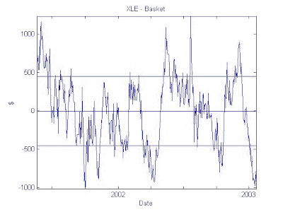

<!--yml

分类：未分类

日期：2024-05-12 19:24:12

-->

# 量化交易：股票协整篮子样本外的测试

> 来源：[`epchan.blogspot.com/2007/04/anonymous-reader-l-posted-some.html#0001-01-01`](http://epchan.blogspot.com/2007/04/anonymous-reader-l-posted-some.html#0001-01-01)

一位匿名读者“L”对我构建的方法提出了一些深思熟虑的反对意见

[应该与 XLE 协整的股票篮子](http://epchan.blogspot.com/2007/02/in-looking-for-pairs-of-financial.html "应该与 XLE 协整的股票篮子")

. 他的主要反对意见是，尽管我的篮子在样本期间与 XLE 协整，这很可能在样本外失败。实际上，我同意他的观点，样本期间发现的强统计关系很可能会在样本外减弱，通常是因为组成股票的性质总是变化，由于各种公司事件（管理层变动、重组、战略方向变化等）。然而，从实际交易的角度来看，我相信这种关系不应该减弱到交易信号变得虚假的程度，至少在交易时间尺度上几个月到半年以内不应该如此。

为了证明这一点，让我们将数据集分为两个时期：20010522 - 20030123 和 20030124 - 20070403。在第一个样本期间（有 1,000 个数据点），我们选择我们的 10 只股票组成篮子，在第二个样本外期间我们看看它与 XLE 的协整性如何，并观察扩散行为。我发现，在第一个时期，协整的 t 统计量为-3.61934140，表明篮子与超过 95%的概率协整。不出所料。以下是这个时期扩散的图表：

（[篮子股票与 XLE 的协整性测试](https://blogger.googleusercontent.com/img/b/R29vZ2xl/AVvXsEghE2NGGidjCxNWTtJB8_pijMDXWaGR7nD5I69KLLfeGDLi4_BNfAULrrG0IS3jHGKVRGeMMw94tmTWipVQSDAmhOEV-vSHK25ptiEzbwOPeA2sGSC4CpdqMDXEx8ugQMgM7Zu0jA/s1600-h/XLEbasket_insample.jpg)）

现在，让我们来看看样本外期间会发生什么。这里 t 统计量为-2.72，而 90%置信水平下的协整临界值为-3.03。所以篮子确实在 90%的置信水平下未能协整。这意味着我们的交易因此会在样本外亏损吗？不一定。看看样本外的扩散行为：

再次看到，这个扩散值是有限的，并没有无限地偏离到无穷大。所以总结来说，我认为构建这个篮子的方法对于实际交易是有好处的，尽管它并不能保证像样本内期间所显示的那样高的统计置信度。
