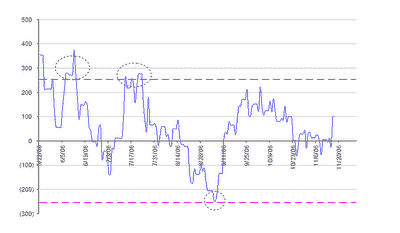

<!--yml

分类：未分类

日期：2024-05-12 19:27:08

-->

# 量化交易：读者建议可能的 GLD - GDX 价差交易策略

> 来源：[`epchan.blogspot.com/2006/11/reader-suggested-possible-trading.html#0001-01-01`](http://epchan.blogspot.com/2006/11/reader-suggested-possible-trading.html#0001-01-01)

史蒂夫·汉森（Steve Hansen），加拿大不列颠哥伦比亚省温哥华雷蒙德詹姆斯有限公司（Raymond James Ltd.）

[建议](https://beta.blogger.com/comment.g?blogID=35364652&postID=2755485307492755002)

对我来说，GLD - GDX 价差的好交易信号是当它从其平均值超出 2 个标准差时。他观察到这些大致在±250 美元左右，基于我的

[定义](http://epchan.blogspot.com/2006/11/gold-vs-gold-miners-another-arbitrage.html)

价差，并且自 GDX 成立以来有 3 个这样的（极具利润）信号。以下是汉森先生的图表：

这无疑看起来像是一个相当安全的策略。当然，如果一个人希望更频繁的信号，他总是可以进入较小仓位，在小价差值时买入。

顺便说一下，就在我们今天早上庆祝 GLD - GDX 价差回归时，

[QM - XLE](http://epchan.blogspot.com/2006/11/update-on-energy-stocks-vs-futures.html)

油价暴跌至多年低点。由于原油价格较历史高点下跌约 30%，能源股 ETF XLE 仍比其历史高点低 5%左右。这有意义吗？我们拭目以待，看看在石油公司公布本季度财报后会发生什么...
