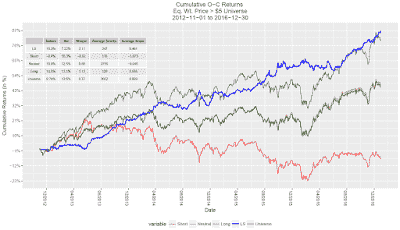
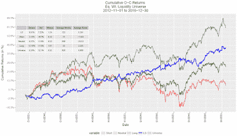

<!--yml

类别：未分类

日期：2024-05-12 18:55:59

-->

# 量化交易：StockTwits 情绪分析

> 来源：[`epchan.blogspot.com/2017/09/stocktwits-sentiment-analysis_7.html#0001-01-01`](http://epchan.blogspot.com/2017/09/stocktwits-sentiment-analysis_7.html#0001-01-01)

由 Colton Smith 撰写

===

探索替代数据集以增强金融交易模型是目前量化社区的热门趋势。有如此多的社会媒体数据，其在金融模型中的地位已成为一个热门的研究话题。股票市场的表现无疑会影响公众的反应，但如果反过来说，社会媒体情绪可以用来预测股票市场的波动，那么这对于各种金融公司和机构来说将是一个非常有价值的 dataset。

当我在 QTS 资本管理公司担任顾问时，我开始进行这个项目，我做了一次广泛的

[文献综述](https://quantoisseur.wordpress.com/2017/01/04/social-media-sentiment-analysis-and-trading-strategies/)

社会媒体情绪提供商和学术研究的现状。主要方法是获取社会媒体“消防栓”数据，通过来源可信度进行筛选，应用自然语言处理（NLP），并创建各种指标来捕捉情绪、成交量、分散度等。目前最好的结果是使用 Twitter 或 StockTwits 作为数据源。StockTwits 的一个特色是，2012 年下半年增加了将推文标记为看涨或看跌的选项。如果这些标签能准确捕捉情绪并且使用频率足够高，那么就可以避免使用 NLP。正如图 1 所示，大多数推文并没有标记，但标记的百分比正在增加。

|  |
| --- |
| 图 1：按年份划分的标记 StockTwits 推文的百分比 |

本文将比较仅使用标记推文与使用所有推文和 NLP 的效果。首先，我进行了一些基本的数据分析，以更好地了解数据的性质。在图 2 中，展示了每小时标记推文的数量。如预期的那样，市场开盘和收盘时推文数量出现高峰。

|  |
| --- |
| 图 2：每小时推文数量 |

总体市场情绪可以通过每天汇总看涨和看跌标记推文的数量来估计。根据之前的文献，我预计会有一个显著的看涨偏见。这在图 3 中得到确认，每日平均看涨推文百分比为 79%。

|  |
| --- |
| 图 3：每天看涨推文的百分比 |

当用户在 StockTwits 上发布推文时，用户可以标记多个符号，因此情绪标签可能适用于多个符号。标记多个符号可能会表明情绪不够具体，预测潜力也较低，因此我期望发现大多数推文只标记一个符号。查看下面的图 4，超过 90%的推文标记了一个符号，而标记 5 个以上的推文比例非常小。

|  |
| --- |
| 图 4：每条推文中提到的符号数量相对频率直方图 |

我的分析中使用的数据时间范围是从 2012 年 11 月 1 日至 2016 年 12 月 31 日。在下面的图 5 中，按总标签推文数量排序的顶部符号、行业和部门显示出来。到目前为止，被提及最多的行业是生物技术和 ETF。这是有道理的，因为这些行业的波动性很大，希望这意味着它们将根据社交媒体情绪数据进行交易。

|  |
| --- |
| 图 5：按总推文数量排序的顶部符号、行业和部门 |

现在我需要确定如何创建一个情绪得分，以最好地涵盖数据的预测潜力。尽管存在包括滑点、流动性和交易成本在内的开放至收盘策略交易障碍，分析市场开盘前立即的情绪得分预测开盘至收盘回报的能力是一个有价值的理智检查，以查看它是否在更大的因子模型中有用。每天的情绪得分是使用前一个交易日开盘至当前交易日开盘的推文计算的：

S-Score =  (#看涨 - #看跌)/(#看涨+#看跌)

然后需要将 S-Score 标准化，以检测特定日的情绪与符号的历史情绪趋势之间的显著性。为此，对系列应用了滚动 z-score。通过改变回顾窗口的长度，可以调整敏感性。另外，由于数据相当稀疏，对于没有为符号发布任何推文的日期，赋予 S-Score 0。在每天市场开盘时，S-Score 超过正面阈值的符号进入多头，S-Score 低于负面阈值的符号进入空头。对多头和空头腿应用相等的美元权重。假设这些头寸在当天的市场收盘时清算。第一个测试是在前一日收盘价大于$5 的股票宇宙中进行的。在一个相对较小的多空组合~250 只股票上，其表现可以在下面的图 6 中看到（点击图表以放大）。

|  | [点击这里](https://blogger.googleusercontent.com/img/b/R29vZ2xl/AVvXsEinEGmr3i2FmVbsWVUwb2EOlfcMLvp0GO2E6pSqcWin7cdJD8FNXsTHLCACsmNNTqgvG6b2OONY6-68EZmn4ELpV9YXRHYYnLfYN-nMRfX2aAcTQhqtHmIZIj3_v_S__51jZjTCdQ/s1600/Colton+Figure+6+new.png) |
| --- | --- |
| 图 6：$5 以上宇宙开盘至收盘累计回报 |

阈值被挑选出来显示 2.11 夏普比率的可能性，但结果取决于所使用的阈值而变化。这种敏感性可能源于大多数符号上的推文量不足。另外，多头和空头阈值并不相等，以尝试保持每腿大约相等的股票数量。中立篮子包含宇宙中所有没有足够极端的 S-Score 来生成多头或空头信号的股票。使用上述相同的阈值，在定义为 50 天平均美元成交量最高四分之一的流动性宇宙上进行了测试。如图 7 所示，夏普比率下降到 1.24，但仍非常令人鼓舞。

|  | [点击这里](https://blogger.googleusercontent.com/img/b/R29vZ2xl/AVvXsEhNhJ8CrcEgw_OLN686c1IA681rljDo0KjrxZqq7yX7d6oAaSgl57v1Y9Thb9mhEJbIMW-JtjiNPZJ7s7XXx5TVgOSghY7FZlCWFvlck1ZKYK6hCH7f-n9j53kAJH1wNCQKIo0tBw/s1600/Colton+Figure+7+new.png) |
| --- | --- |
| 图 7：流动性宇宙开盘至收盘累计回报 |

这些结果的敏感性需要通过在单独的训练集和测试集上进行分析来进一步检查，但我对仅从标记的 StockTwits 数据中可能产生的回报非常满意。

在七月，我开始为

[社会市场分析](https://socialmarketanalytics.com/)

，领先的社交媒体情绪提供商。在这里，SMA 会将所有 StockTwits 的推文通过我们专有的 NLP 引擎来确定它们的情绪分数。使用从东部时间上午 9:10 开始的情绪数据，该数据查看过去 24 小时内的指数加权情绪聚合，开盘到收盘模拟可以在价格> $5 的宇宙中运行。每只股票都会根据其当天的 S-Score 与宇宙的分位数分别分为相应的五分位数。与之前类似，构建多空组合，长期持仓在顶端五分位数股票，短期持仓在底端五分位数股票。在下面的图 8 中，你可以看到，结果比仅使用情绪标记数据时要好得多。

|  |
| --- |
|  |

预测能力确实存在，因为多空组合拥有令人印象深刻的 4.5 夏普比率。由于拥有更多数据，结果对多空组合构建的敏感性大大降低。为了避免开盘到收盘策略的高换手率，我们一直在探索可能的长远策略。德意志银行的定量研究团队最近发布了一篇关于仅使用我们的 SMA 数据的策略的论文，其中包括一个更长期的策略。此外，我最近开发了一个强烈的每周再平衡策略，试图捕捉周度情绪动量。

虽然这只是一个开始，但我在为 QTS 咨询期间深入研究社交媒体情绪数据及其在金融中的应用非常有洞察力。可以说，仅使用标记的 StockTwits 推文，我们可能能够产生预测信号，但通过包括所有推文进行情绪分析，发现的信号要强得多。如果您有任何问题，请联系我，我的邮箱是 coltonsmith321@gmail.com。

科尔顿·史密斯是华盛顿大学的工业与系统工程专业的最新毕业生，辅修应用数学。他现在住在芝加哥，为 Social Market Analytics 工作。他对数据科学充满热情，对他的发展中的量化金融职业感到兴奋。领英：[`www.<wbr>linkedin.com/in/coltonfsmith/`](https://www.linkedin.com/in/coltonfsmith/)
