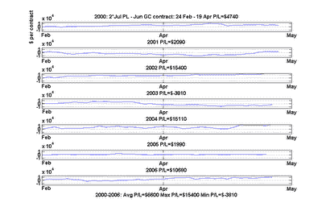

<!--yml

类别：未分类

日期：2024-05-12 19:26:32

-->

# 量化交易：交易铂金-黄金季节价差

> 来源：[`epchan.blogspot.com/2006/11/trading-platinum-gold-seasonal-spread.html#0001-01-01`](http://epchan.blogspot.com/2006/11/trading-platinum-gold-seasonal-spread.html#0001-01-01)

量化交易者有时会忽略这样一个事实，即许多盈利的交易策略非常简单，根本不需要任何数学。铂金和黄金之间的季节价差交易就是这样的例子，在过去的 7 年中，除了 1 年以外，这个策略都是盈利的。这比摧毁阿玛兰特（Amaranth）的季节价差交易要稳定得多（请参阅我之前的

[文章](http://epchan.blogspot.com/2006/10/highly-improbable-event.html)

)。

这个策略非常简单：在 2 月底左右购买 2 份 7 月份的铂金合约（PL）并空仓 1 份 6 月份的黄金合约（GC），然后在 4 月中旬左右平仓。 (黄金期货合约规定 100 盎司，而铂金只有 50 盎司，因此我们需要购买 2 份 PL 合约相对于 1 份 GC 合约。) 我第一次了解到这个策略是在 2006 年初杰里·托普克在 SFO 杂志上发表的一篇文章中，我决定不仅要回测这个策略，而且在 2006 年还要进行模拟交易，看看它是否再次发挥神奇作用。尽管杂志广泛宣传，回测和模拟交易还是像宣传的那样运作，这个策略在 2006 年取得了成功。我在图表中绘制了盈亏情况：

自 1995 年以来，这个价差每年平均赚取了 6600 美元。在最好的一年中，我们赚取了 15400 美元，而在最差的一年中，我们只亏损了 3810 美元。由于在 NYMEX 交易这个价差只需缴纳 743 美元的保证金，每笔交易的回报率并不低！

这个季节价差的根本原因是什么？有趣的是，这与春节的结束有关。托普克先生表示，黄金的需求是由对珠宝的需求驱动的。印度和中国等亚洲国家是黄金最大的消费者。这些国家年底的一系列节日和庆典一直持续到 2 月底的中国春节结束，此后黄金的交货需求季节性耗尽。另一方面，铂金主要用于汽车催化转化器，季节性要弱得多。因此，它作为黄金价格的对冲非常方便。

更多信息阅读：杰里·托普克，《给季节性价差一些尊重》，《股票、期货和期权杂志》，2006 年 1 月号。
