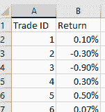
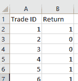
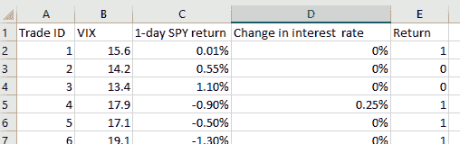
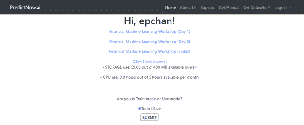
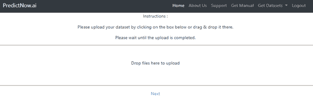
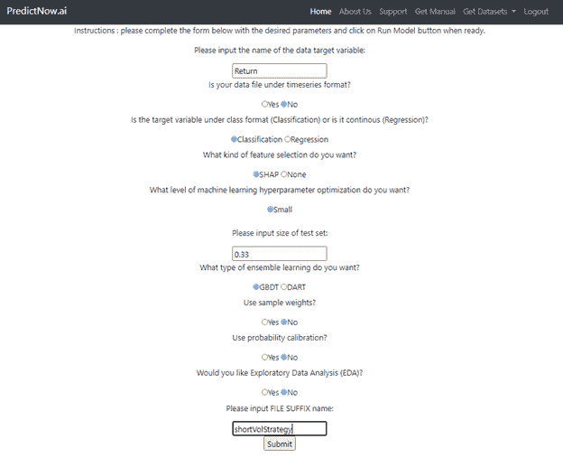
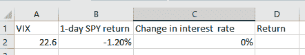
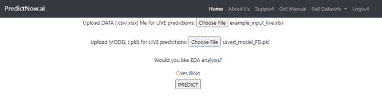
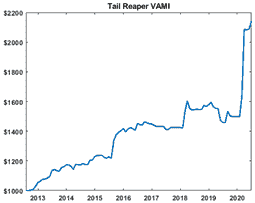

```yml

分类：未分类

日期：2024-05-12 18:54:31

-->

# 量化交易：你下一笔交易的盈利率是多少？（介绍 PredictNow.Ai）

> 来源：[`epchan.blogspot.com/2020/07/what-is-probability-of-profit-of-your.html#0001-01-01`](http://epchan.blogspot.com/2020/07/what-is-probability-of-profit-of-your.html#0001-01-01)

您下一笔交易的盈利率是多少？你可能会认为每个交易员都能回答这个问题。比如说，你查看你的历史交易（实时或回测），统计赢家和输家，得出赢的交易百分比，比如 60%。你下一笔交易的盈利率就是 0.6 吗？这可能是一个不错的初步估计，但也是一个完全无用的数字。让我解释一下。

这个 0.6 可能被称为*无条件概率*盈利率。对您将进行的每一笔交易（除非您的胜率在未来有显著变化），所以它作为指导您是否应该进行下一笔特定交易的指南是无效的。当然，它可以告诉您是否应该通常交易这个策略（例如，您可能不想交易一个无条件盈利率，即胜率，低于 0.51 的策略）。但它不能逐笔交易地进行判断。后者是*条件概率*盈利率。正如形容词所暗示的，这个概率是基于您预期交易时的具体市场环境。

假设你正在交易一个短期波动策略。它可能是一个算法策略，或者甚至是主观策略。如果你在一个非常平静的市场中交易，你的条件盈利率可能相当高。如果你在金融危机期间交易，它可能非常低。可以决定盈利率的条件甚至可能是可量化的。VIX 的水平？最近 SPY 的回报？利率变化如何？[非农就业人数](https://epchan.blogspot.com/2019/12/us-nonfarm-employment-prediction-using.html)刚刚宣布的数据？或者甚至是前一天 Covid-19 病例的百分比变化？当你建立你的简单交易策略时，或者当你决定进行主观交易时，你可能没有考虑所有这些林林总总的数字，但你不可以否认它们*可能*会影响盈利的条件概率。那么我们如何计算这个概率呢？

**提示**：计算这种条件概率帮助我们截至 2020 年 6 月实现了 64%的年回报率。你可以通过[predictnow.ai](https://predictnow.ai)了解如何做到这一点。但关于这个话题，我们稍后再谈。

计算这种条件概率的唯一已知方法是机器学习。让我们回到上面提到的您的短期波动策略示例。假设你准备了一个历史交易回报的电子表格，就像这样：



图 1：带有短期波动交易历史回报的电子表格

再次，这些交易可能是由算法产生的，也可能是主观的（可能基于基本面分析与直觉的某种组合，如沃伦·巴菲特所做的那样）。

现在假设我们只关心这些交易是盈利还是亏损，因此我们忽略了回报的大小，将盈利的交易标记为 1，否则为 0。（这些被称为“元标签”[Marcos Lopez de Prado](https://www.amazon.com/dp/1119482089/ref=as_sl_pc_tf_til?tag=quantitativet-20&linkCode=w00&linkId=d7381a1bc4fd7adf25c210b2967e15be&creativeASIN=1119482089)发明的，他开创了这种金融机器学习技术。之所以称为“元”，是因为他假设原始简单策略用于预测市场本身的涨跌——这些是基础预测，或标签。元标签是关于这些基础预测是否正确的问题。）结果的电子表格看起来像这样。



图 2：带有标签的电子表格：短期波动策略的历史回报是否盈利？

简单，对吧？现在来到难点部分。你的直觉告诉你，在你的原始简单交易策略中，有些变量你没有考虑进去。这些变量实在太多了，你不知道如何将它们融入交易策略中以进行改进。你甚至不知道其中一些是否有用。但对于机器学习来说，这不是问题。你可以添加尽可能多的变量，称为特征/预测器/自变量，无论是否有用。机器学习算法将通过一个称为[特征选择](https://arxiv.org/abs/2005.12483)的过程去除无用的特征。但关于这一点稍后再说。

所以假设对于电子表格中的每一笔历史交易（由一行表示），你收集了一些特征，如 VIX、1 日 SPY 回报、前一天利率的变化等。我们当然必须确保这些特征的值在每笔交易的进入时间之前是已知的，否则会有向前看偏差，你将无法将这个系统用于实盘交易。所以你的电子表格增强特征后可能看起来是这样的：



图 3：带有增强特征的电子表格

好的，现在您已经准备好了所有这些历史数据，那么您如何基于这些数据构建（或者在机器学习术语中说是“训练”）一个预测模型呢？您可能不知道，但您可能已经在大学统计课上使用过最简单的机器学习模型了。它叫做线性回归，或者对于我们的二元（盈利或非盈利）分类问题，它的紧密兄弟叫逻辑回归。您上面创建的特征只是自变量，通常称为 X（多个变量的向量），而标签只是因变量，通常称为 Y（值为 0 或 1）。但是，将线性或逻辑回归应用于大量不相关的特征来预测标签通常会失败，因为许多关系无法通过线性模型捕捉。这些预测器之间的非线性相互依赖需要被发现并利用。例如，也许当 VIX <= 15 时，1-日 SPY 回报对于预测您交易的盈利概率并不有用。但是当 VIX >= 15 时，1-日 SPY 回报非常有用。这种关系最好使用名为随机森林的“监督”层次学习算法来发现，这正是我们在[predictnow.ai](https://predictnow.ai/)上实施的。

随机森林算法可能会发现 VIX、1-日 SPY 回报、…以及您的空头波动交易是否盈利之间的假设关系，如图示图所示：

图 4：predictnow.ai 内部生成的分类树示例。

要构建这个树以及所有其同族成员，组成一个“随机森林”，您需要做的只是将您的电子表格上传到[predictnow.ai](https://predictnow.ai/)，点击一个按钮，它可能在 15 分钟内完成，通常会更快。（当然比披萨送餐快。）



图 5：在 predictnow.ai 上选择训练模式。



图 6：上传训练数据。



图 7：选择构建随机森林的超参数。

一旦这个随机森林通过历史数据构建（训练）完成，它就准备好用于您的实时交易了。您只需将 VIX、1-日 SPY 的最新值和任何其他特征值输入到一个新的电子表格中，就像这样：



图 8：实时交易输入。

注意，这个电子表格的格式与训练数据相同，只是当然没有已知的回报——我们希望预测到它！你可以将这个上传到[predictnow.ai](https://predictnow.ai/)，与你刚刚训练好的模型一起，点击 PREDICT，



图 9：实时预测。

就这样！现在你可以下载随机森林预测该交易是否盈利，以及**条件概率**。

图 10：带概率的实时预测。

输出文件之一（如图 10 左侧）告诉你交易的最可能结果：盈利或亏损。另一个文件（图 10 右侧）告诉你那个结果的概率。**你可以用那个概率来调整你的交易规模。**例如，你可能决定，如果盈利的概率高于 0.6，你会购买$10K 的 TSLA。但如果概率在 0.51 到 0.6 之间，你只会购买$5K，而如果概率低于 0.51，你根本不会购买。

通常，实时预测将在 1 秒或更短的时间内完成，而训练（可能一个季度只需重新进行一次）即使是对具有 100 个特征的历史数据数千行来说，通常也不会超过 15 分钟。你可以随时进行实时预测(*即*你的输入发生变化时)，但如果你是一个高频交易员，你可能希望使用我们的 API，以便我们的预测可以与你的交易系统无缝集成。

但预测你下一笔交易的盈利条件概率并不是我们所能做的一切。我们还可以告诉你哪些特征在做出该预测时很重要。事实上，你可能会对这个特征列表更感兴趣，因为这个按重要性递减顺序排列的特征列表，可能会帮助你改进你的简单交易策略。换句话说，它可以帮助提高你关于策略有效性的直觉，所以你可以改变你的交易规则。

回到我们的例子，[predictnow.ai](https://predictnow.ai/) 能为你生成这样的图表：

图 11：重要性递减的特征。

你可以看到，VIX 被认为是最重要的特征，其次是 1 日 SPY 回报，最新的利率变化等。我们内部的预测算法将实际上移除所有“低于平均水平”的特征，并重新训练模型，但当你生成交易信号时，只包含 VIX 和 1 日 SPY 回报可能会对你的简单策略有所帮助。记住，你的简单策略不需要是算法策略。它可以是主观的。

（对于我们中的机器学习专家，我们使用 SHAP 进行特征选择，如我们[论文](https://arxiv.org/abs/2005.12483)中所讨论的。）

您可能想知道为什么我们的预测服务仅限于将您的策略的历史或实时交易作为输入，并预测它们盈利的概率。为什么它不能直接用来预测市场的回报呢？当然可以：您只需要假装您的策略是在持有市场。它甚至可以预测回报的大小，而不仅仅是符号。但是众所周知，预测市场运动是非常困难的，因为信号-噪声比太低。然而，您自己的策略假设已经找到了过滤这些噪声的方法，而机器学习预测更有可能成功告诉您什么“政权”对您的策略有利/不利，以及概率是多少。我们服务的另一种用途是用来预测不受套利影响的数据，比如公司的盈利惊喜、信用评级变化，或者美国非农就业惊喜（我们已经成功[做到](https://epchan.blogspot.com/2019/12/us-nonfarm-employment-prediction-using.html)了）。在这些应用中，没有对手（您的同行交易者）在努力套利掉您的交易阿尔法，所以这些预测更有可能在未来很长一段时间内生效。

（对于机器学习领域的专家来说，您可能想知道为什么我们只实现了随机森林学习算法。随机森林的优点在于它简单，但并不过于简单。像 LSTM 这样的复杂深度学习算法确实能更轻易地考虑特征和标签的时间序列依赖性，但由于需要拟合的参数众多，它们存在严重的数据窥探风险。例如，自然语言处理领域最新最热门的深度学习算法 GPT-3，需要拟合的参数超过 1750 亿个。想象一下，要将这个模型拟合到 1000 个历史交易数据中！）

那么，这东西真的管用吗？我们在 2019 年 8 月左右为我们的[尾随收割者策略](http://www.qtscm.com/accounts)在我们的基金中实现了这个机器学习系统。是的，截至 2020 年 6 月，64%的年至今回报（扣除 25%的激励费用后）很不错，但更令人惊讶的是，机器学习程序告诉我们从 2019 年 11 月至 2020 年 1 月不要进行任何交易（因为盈利的条件概率太低）。回顾起来，这是有道理的，因为尾随收割者是一种危机阿尔法，尾随对冲策略。在那几个月的平静市场中，没有危机，也没有尾部运动，因此无法获利。但突然之间，从 2020 年 2 月 1 日开始，这个机器学习程序告诉我们预计将出现危机。我们认为这个机器学习程序疯了——当时美国的新冠病毒病例还很少！尽管如此，我们还是遵循了它的建议并重新启动了尾随收割者策略。它在当月后来捕捉到了超过 12%的回报，余下的就是历史了。*（过去的表现并不一定预示未来的结果。有关此策略的详细披露，请访问 qtscm.com。）*



图 12：尾部收割者资金曲线。

**对于希望免费试用或参加有关如何使用**[predictnow.ai](http://predictnow.ai)**预测交易利润的条件的概率的实时网络研讨会的读者，请在此处注册**[*here*](https://predictnow.ai/register)*.**
