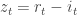
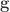

<!--yml

类别：未分类

日期：2024 年 05 月 18 日 13:56:49

-->

# Quantivity | 通过量化和算法交易实现非凡回报

> 来源：[`quantivity.wordpress.com#0001-01-01`](https://quantivity.wordpress.com#0001-01-01)

一个敏锐的读者建议根据 Kritzman 等人最近在 FAJ（2012 年 5 月/6 月）上发表的有关体制分析的文章，[体制转变：对动态策略的影响](http://www.cfapubs.org/doi/abs/10.2469/faj.v68.n3.3)来重现结果。通过一系列文章进行此项有趣的练习，因为这样做可以说明几个重要的经济原理和一些优雅的数学。

本文首先确定了*多资产经济活动引发的宏观经济市场体制*。

[阅读更多…](https://quantivity.wordpress.com/2012/11/09/multi-asset-market-regimes/#more-10079)

Tadas 在他最近的文章中提出了一个有趣的问题：[金融博客作者都去哪了？](http://abnormalreturns.com/where-did-all-the-finance-bloggers-go/) 各种人给出了深思熟虑的回答：[Josh Brown](http://www.thereformedbroker.com/2012/10/23/where-did-all-the-finance-bloggers-go-my-theories/)、[Flex Salmon](http://blogs.reuters.com/felix-salmon/2012/10/23/did-the-financial-blogosphere-go-away/)、[David Merkel](http://alephblog.com/2012/10/24/why-i-love-blogging/)、[Scott Bell](http://iheartwallstreet.com/2012/10/24/why-i-stopped-blogging/)、[Macro Men](http://macro-man.blogspot.com/2012/10/introspection-day.html)，以及一群[匿名专业交易员](http://www.rmdfx.com/2012/10/24/prominent-market-players-talk-about-this-market-enviroment/)。毫无疑问，所有这些观察都是有道理的。

然而，也许还有一个尚未被提及的共同根本原因在起作用：*隐性动量偏见*。

[阅读更多…](https://quantivity.wordpress.com/2012/10/25/implicit-momentum-bias/#more-9948)

上周，GOOG 意外披露了他们的 Q3 收益，即 10 月 18 日。尽管收益略有趣味，但更有趣的是日内交易中的相应小插曲。这一事件为深入研究 TAQ 数据、通过 HFT 视角查看并从 Mendelbrot、Clark 和 Ané的一些优雅思想中建立直觉提供了机会。

[阅读更多…](https://quantivity.wordpress.com/2012/10/23/volume-clock-gaps-and-goog/#more-9778)

Quantivity 不喜欢本科[宏观经济学](http://en.wikipedia.org/wiki/Macroeconomics)，因为它在很大程度上是浪费时间：缺乏令人信服的证据的花哨理论，再加上该领域内缺乏共识，如[盐水经济学与淡水经济学](http://en.wikipedia.org/wiki/Saltwater_and_freshwater_economics)之争。

对于此类轻率之举，很少有人会受到责备，因为在[大宽松](http://en.wikipedia.org/wiki/Great_Moderation)时期，它基本上是无害的。事实上，交易员对宏观经济的无知似乎感到自豪，除了[全球宏观](http://en.wikipedia.org/wiki/Global_macro)的家伙们，显然是例外。然后，信用危机来了。

有了这只天鹅，量化投资认为制定一个*系统性的*宏观视角的时候已经到了：一个自上而下的补充，用以校准“自下而上”的量化模型。由于宏观方面的内在复杂性以及相对较弱的背景，量化投资在进行这项工作时表现得非常谦逊。

这篇文章引发了几点从这个努力中得到的想法；希望它是微分析之外的受欢迎的补充。有两个注意事项值得注意。首先，在宏观方面，确认偏差尤其危险，因此强调要广泛考虑不同的观点。其次，由于强烈的愿望避免政治和政策制定，这些想法是带着一点犹豫发布的。

[阅读更多…](https://quantivity.wordpress.com/2012/05/09/macro-matters-and-orthodoxy/#more-9384)

[指数回报分解](https://quantivity.wordpress.com/2011/12/14/index-return-decomposition/)促使一些读者询问关于*预测回报的符号*，正如由  分解变量所暗示的那样。这是一个值得回顾的有趣话题，快速浏览文献中的直觉，以及一些用于探索性分析的 R 代码。

这个话题在文献中被称为*变化方向*预测。不言而喻，成功预测未来回报的符号对交易来说是非常有趣的。传统上，只考虑单变量回报系列；[阿纳托利夫（2008）](http://www.nes.ru/~sanatoly/Papers/DepRatio.pdf)是一个例外，通过依赖比率模型两个或更多相互关联的市场。这方面的文献往往有点晦涩，因为通常没有明确陈述的条件回报动态的 stylistic assumptions。

[阅读更多…](https://quantivity.wordpress.com/2012/01/16/sign-direction-of-change-forecasting/#more-7655)

量化投资很幸运，认识了许多人在多个十年里持续获得回报而没有显著回撤的人。尽管他们有着不同的交易策略，但有一个统一的主题将他们联系在一起：对市场参与者*社会学的*自上而下的系统性关注。

这种关注点*不是*行为金融学，它不是在寻找由认知偏差驱动的、与均衡相偏离的异常（尽管大多数人也在做同样的事情）。*而是*提出推论社会学的问题，例如：在 2000 年之前的战后几十年里，市场是否在[法玛](http://en.wikipedia.org/wiki/Efficient-market_hypothesis)的意义上“有效”，是因为人们认为它应该是这样（ blissfully ignoring a few [hiccups](http://en.wikipedia.org/wiki/Black_Monday_%281987%29)）；与它通常被理解和形式化的方式相反，这种方式具有逆向因果关系：市场被假设为有效，因此人们认为它就是这样的。

同样地，过去 15 年是否在泡沫和异常意义上“低效”，*是因为*投资者对这种“效率”的文化信仰丧失；或者，他们失去信仰是因为市场变得低效？有很大的区别。

换句话说：*金融是被物理学、生物学还是 Peltzman 所统治*？

[阅读更多…](https://quantivity.wordpress.com/2012/01/03/physics-biology-peltzman-finance/#more-9021)

存在多种技术用于估计回报分解模型的参数，该模型在前文中[指数回报分解](https://quantivity.wordpress.com/2011/12/14/index-return-decomposition/)中已经介绍过。本文考虑通过最大似然估计（MLE）来估计一个*独立混合模型*，这是频率派统计学的一个工作马，始终是一个很好的起点。

回想  是*未观察到的*，因此模型不能直接通过 MLE 估计。因此，需要决定如何对待这个潜在变量的估计。一种方法是天真，简单地假设  是股票回报与指数回报之间的确定性差异（技术上，这生成了一个[轮廓似然](http://en.wikipedia.org/wiki/Likelihood_function#Profile_likelihood)如 [Severini 和 Wong [1992]](http://people.csail.mit.edu/~jrennie/trg/papers/severini-conditionally-92.pdf) 正式化的， [Murphy 和 Van Der Vaart [2000]](http://www.jstor.org/pss/2669386) 验证它与确切似然一致良好）：

这个假设允许我们专注于估计 ，从而深入了解被分解回报的*混合行为*：如果股票回报行为与其指数相似，那么混合度低，  小（在极限情况下，  当股票行为与其指数完全相同时，无需混合）；相比之下，股票回报经常与其指数独立行为，那么混合度高，  大。

[阅读更多…](https://quantivity.wordpress.com/2011/12/28/estimating-mixture-index-return-decomposition-via-maximum-likelihood/#more-8887)

 风险被*严重*低估了。

此外，它甚至被误解——即使许多人都亲身经历过通过对冲头寸遭受巨大交易损失。Aaron Brown 最近的书 [Red-Blooded Risk](http://books.google.com/books?id=X3sGahpmkQ0C) 解释了原因。

这样做的同时，它既是*天才又是缺陷*。对于前者，Brown 值得赞扬；对于后者，出版商 presumably 应该承担大部分责任。

[阅读更多](https://quantivity.wordpress.com/2011/12/17/risk-pragmatics/#more-8737)

将现象分解为其组成部分，通过*函数分解*，是数学中的一大美景：

这项技术在量化模型中惊人地经常被使用。

基于代理对冲的持续分析和交易，例如从[代理/交叉对冲](https://quantivity.wordpress.com/2011/10/02/proxy-cross-hedging/)系列开始，表明基于股票与其相应指数之间关系构建的股票分解模型具有潜力：

![r_t = s_t \left[ \alpha_t | z_t | + (1 - \alpha_t) \beta | i_t | \right] + \epsilon_t ](img/031d799b8df5320f04bc3fef04370113.png)

为了解释这个模型，让我们从直觉出发建立它。

[阅读更多](https://quantivity.wordpress.com/2011/12/14/index-return-decomposition/#more-8678)

量化维奥很高兴地发现，越来越多的人从[精选量化研究订阅](https://quantivity.wordpress.com/2011/07/28/curated-research-feed/)中获益。[@Quantivity](http://twitter.com/quantivity)上的日常精选订阅与*单源*回顾性搜索组合已成为个人研究不可或缺的工具。为了了解原因，Kedrosky 在他的[策展是新的搜索是新的策展](http://paul.kedrosky.com/archives/2011/01/curation_is_the.html)一文中提供了很好的解释：

> 回到策展，再次观察下一代策展之上新算法的出现。把 Twitter 看作是对策展的新尝试。精选网站将重新播种新一代的算法搜索网站。总之，策展就是新的搜索。

事实上，这里的策展意图是为了保持*高信噪比*的混合预印本和经典文献(*即*零售和自营)，在其他地方存在强烈的动机去混淆；并且对流进行搜索提供了回溯时间和整合*概念连通性*跨越时间的能力。

[阅读更多](https://quantivity.wordpress.com/2011/11/04/update-curated-quant-research-feed/#more-8559)
