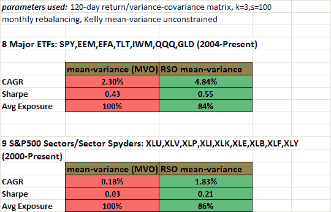

<!--yml

分类：未分类

日期：2024-05-12 17:57:22

-->

# RSO MVO 与标准 MVO 回测比较 | CSSA

> 来源：[`cssanalytics.wordpress.com/2013/10/10/rso-mvo-vs-standard-mvo-backtest-comparison/#0001-01-01`](https://cssanalytics.wordpress.com/2013/10/10/rso-mvo-vs-standard-mvo-backtest-comparison/#0001-01-01)

在上一篇文章中，我介绍了[随机子空间优化](https://cssanalytics.wordpress.com/2013/10/06/random-subspace-optimization-rso/ "Random Subspace Optimization (RSO)")作为一种降低维度并提高性能的方法，与标准优化方法相比。这个概念在理论上是有根据的，并且传统上应用于机器学习以提高分类准确性。它对于投资组合优化也应该是有用的。为了测试这种方法，我使用了一个非常简单/简化的 RSO 模型，其中从一个宇宙中选择“k”个子空间，并对所有样本运行经典的“[均值-方差](https://cssanalytics.wordpress.com/2013/10/03/mean-variance-optimization-and-statistical-theory/ "Mean-Variance Optimization and Statistical Theory")”优化（MVO），使用“s”个样本，并平均所有样本中找到的投资组合权重，以产生最终的投资组合。MVO 是在无约束条件下运行的（允许多头和空头），以减少计算时间，因为有一个封闭形式的解。使用了两个数据集：第一个是之前研究中用于[最小相关性](https://cssanalytics.wordpress.com/2012/09/21/minimum-correlation-algorithm-paper-release/ "Minimum Correlation ")和[最小方差](https://cssanalytics.wordpress.com/2013/04/04/minimum-variance-algorithm-mva-test-drive/ "Minimum Variance Algorithm (MVA) Test Drive")算法的 8 个 ETF 宇宙，第二个是使用标普 sector spyder ETFs。以下是参数和结果：

在这两个宇宙中，对于这一组参数，RSO 均值-方差策略在回报和风险调整后的回报方面都是明显的赢家——当你考虑到平均暴露更低的平均值时，结果更具说服力，这是通过对 100 个投资组合进行平均得出的。换手率也更加稳定，这可以归因于平均值的过程。当 k<=3 时，在这两种情况下结果最佳，但几乎所有 k 都超越了基线。k 的选择确实有点笨拙（类似于在最近邻域分析中），并且需要优化或与宇宙中资产的数量相关联来考虑。跨投资组合的平均过程也很天真，它不关心给定投资组合的目标函数是高还是低。有许多方法可以改进这个基线 RSO 版本。我目前还没有进行广泛的测试，但理论和初步结果表明，与基线 MVO（和其他类型）的优化相比，有适度的改进。RSO 本身并不是一个万无一失的解决方案，但在这种情况下，它至少能够更好地处理噪声较大的数据集——在典型的无约束 MVO 中使用的矩阵求逆可能会不稳定。
