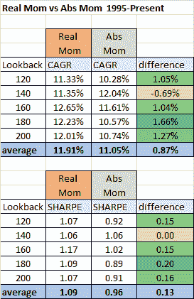

<!--yml

类别：未分类

日期：2024-05-12 17:46:32

-->

# 真实动量：更长期的回测 | CSSA

> 来源：[`cssanalytics.wordpress.com/2015/05/09/real-momentum-a-longer-term-backtest/#0001-01-01`](https://cssanalytics.wordpress.com/2015/05/09/real-momentum-a-longer-term-backtest/#0001-01-01)

在上一次[文章](https://cssanalytics.wordpress.com/2015/05/07/real-momentum-a-time-seriesabsolute-momentum-strategy-including-inflation-expectations/ "真实动量：包括通胀预期的时间序列/绝对动量策略")中，我介绍了“真实动量”的概念，它是一种基于真实回报的趋势跟踪信号。在文章中，我使用了预期的通胀率和无风险回报来从标普 500 中扣除，以创建一个真实超额回报。这样做是为了使得买入位置的门槛高于标准方法。几位读者的评论表明这是“重复计算”，从经济角度来看，这是正确的：真实回报应该只扣除通胀（或预期通胀）的回报。理论指导我们应该采用这种方法而不是真实超额回报。由于这是一个简化，这是可取的，因为它更好地避免了“数据窥探”的主张。此外，由于这是一个初步研究，在上篇文章中，我用了只有 10 年的数据进行了快速测试，可用的 ETF。显然，这并不是评估概念是否有价值或是否健壮的理想方法。为了获得更多数据，我使用了 TIP 和 IEF 的互换基金代理。我能够将结果追溯到 1995 年（对于 TIP，我使用了 Loomis Sayles 通胀保护证券互换基金（LSGSX），对于 IEF，我使用了 T Rowe Price 美国国债中期基金）。遵循读者的建议，我仅减去预期通胀率——这是 TIP 和 IEF 之间的差异回报（使用可选的回溯 smooth，3-10 天之间类似的结果，我选择了 5 天进行这些测试）——从标普 500（SPY）的每日回报中，然后取这些回报的平均值。如果回报为正，则做多，如果为负，则持现金。在这里不假设现金回报。与使用无风险利率或代理的传统绝对/时间序列动量策略（如短期国债（SHY））相比，以下是结果。注意，再平衡是每月进行一次。

结果显示，真实动量（Real Momentum）似乎明显占优，考虑到我们简化了计算，并将回溯期扩展到了 10 年（“样本外”），这令人印象深刻。平均而言，真实动量信号使得年化复合增长率（CAGR）提高了近 1%，夏普比率（Sharpe Ratio）提高了约 15%。表面上看，对于能够影响市场的较大投资者来说，真实股票风险溢价可能更为重要。但正如我的同事 Corey Rittenhouse 指出的，如果你不打算投资那些实际回报率为负的资产，那么你需要一个替代方案。我同意这个观点，一个逻辑上的选择是在真实动量为负时持有 TIP（或通货膨胀保护国债）。使用上述策略参数和 120 天的真实动量，基准策略是在真实动量大于 0 时买入 SPY/标普 500，而在动量小于 0 时持有 TIP。以下是这种情况的样子：

作为对比，这里是用 SPY 和 SHY 相同的 120 天参数的绝对动量策略：

正如你所见，真实动量策略在胜率、每笔交易的收益以及回报率和夏普比率上都优于绝对动量策略，且最大回撤相似。一些读者可能会指出，这种比较可能不公平，因为 TIP 作为现金资产的回报超过了 SHY。但正如第一张表格所示，时机信号本身更优越，这不太可能是驱动因素。但为了证明这一点，这里是用 SHY 作为触发信号的资产，而持有 TIP 作为现金资产的绝对动量策略：

这比使用真实动量策略要糟糕得多，甚至比使用 SHY 作为现金资产的绝对动量策略还要差。虽然未展示，但使用 TIP 作为信号资产和现金资产的表现是最差的。所以显然在观察真实动量方面有一些东西——或者实际上是对广泛股票市场/标普 500 的预期真实回报。这并不是对该策略的最终评价，进行更长期测试（如他们所说……数据永远不会太多）将是有帮助的。但在查看使用这一信号的其他风险资产的表现后，我无法否定初次的假设，即在那里确实有一些东西。这是一个有意义的发现，并且在简化后进行了样本外测试，数据似乎也支持这一点。进行更深入的分析以了解发生了什么以及这是否仅仅是由其他因素驱动的偶然结果将会很有趣。一个基本的真实动量策略，当预期真实回报为正时持有标普 500，当为负时持有国债通胀保护证券，可以获得非常好的回报和风险调整后的回报，并且在 20 年的持有期间几乎比买入并持有策略高出 5%的年化回报。该策略碰巧比更复杂的策略具有较高的税务效率，这是一个额外的优势。
