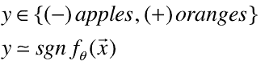
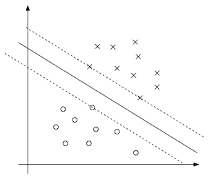
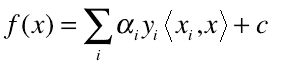
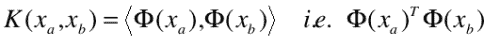

<!--yml

类别：未分类

date: 2024-05-18 15:37:42

-->

# 回归方法 | Tr8dr

> 来源：[`tr8dr.wordpress.com/2009/11/13/probabilistic-regressors-the-mean/#0001-01-01`](https://tr8dr.wordpress.com/2009/11/13/probabilistic-regressors-the-mean/#0001-01-01)

博客的一位读者（skauf）建议研究 KRLS（核递归最小二乘法），这是一种与 SVM 和高斯过程方法紧密相关的多变量回归“在线”算法。KRLS 算法中让我觉得聪明的地方是它融入了在线稀疏化方法。为什么这很重要，我将在下一节尝试简要解释。

稀疏化方法在效果上与 PCA 相似，因为它减少了维度并确定了系统的最有影响力的方面。我一直在考虑一种结合 PCA/基分解的方法有一段时间了，它让我觉得 KRLS 可能是这样做的方法。

**基于核的学习算法**

核递归最小二乘法（KRLS）和支撑向量机（SVM）算法在分类（或回归）方面采用了共同的方法。在最简单的情况下，假设我们想要找到某个函数 f(x)，它能将 n 维向量分为属于两个集合（苹果或橙子）之一，我们通过 f(x)的+和-值来区分这两个集合：

假设向量 X 是线性可分的，我们可以在 n 维空间中尝试找到一个超平面，将向量分开，使得两个类别之间的距离平衡（在某些约束条件下最大化）。超平面（或在二维中为直线）与点之间的距离由一个**间隔**函数确定。

优化通过最大化**间隔** subject to 约束来实现。优化解决权重α，使得 X 与每个 Xi 的加权点积之和得出预测值。f(x)的形式如下：

现在，上述图表显示了一个表现非常好的数据集，有一个清晰的分类边界。然而，许多数据集可能存在数据中的显著噪声和/或拒绝正确分类的异常值。这些数据对回归线有整体影响。

假设我们有 N 个样本在训练集{{X1,Y1}, {X2,Y2}, … {Xn, Yn}}中。简单来说，稀疏化过程是移除（或折扣）现有集合中已经表示的样本，从而减少回归器的偏差。确定表示程度的一种方法是观察给定向量与现有集合之间的“正交度”。稀疏化还指向了一种根据新观察值相对时间演进回归器的方法。

**核函数**

上面简要介绍了 SVM 如何利用间隔概念来分类数据。对于线性可分的数据，核函数并非必需。核函数“简单”地是一个将数据从“属性”空间映射到“特征”空间的函数。我们设计或选择核函数，以便我们的数据在“特征”空间中尽可能线性可分，并且所有可能从属性空间映射到特征空间的向量的协方差矩阵为正定半矩阵。**

**由于我们的线性 SVM 方程是用内积来表达的，给定一个特征映射函数 Φ(x)，将 X 从非线性空间映射到“线性可分空间”，我们可以将核函数表示为两个向量内积的函数，然后插入到我们的线性方程中：**

****

**关键是选择一个能最大化数据分散到线性可分集合的核函数。**

****这如何与显式的基于概率的回归相关？**

结果是，在高斯核上优化间隔函数的过程等价于找到未归一化的最大似然性，而高斯过程方法使这一点变得明确。**

****选择哪种模型？** 高斯过程方法是严格的贝叶斯方法。它提供了显式的概率/置信度量。如果知道所需标签相对于属性向量的似然，该模型表现非常好，并比 SVM 家族提供更多信息。**

**SVM 方法家族使用间隔函数来确定向量之间的相似性（用于分类）。这并不直接涉及概率，但对于高斯核可以证明与高斯过程方法等价。SVM 家族的优势在于，不需要知道似然函数。**

**最后，这两种模型都允许使用核函数将数据从非正常或非线性空间映射到线性或高斯空间。一些研究表明，在高斯过程算法中的似然函数和 SVM 中使用的核函数之间存在一定程度的等价性。**
