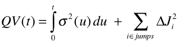
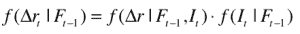
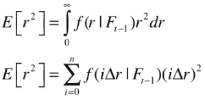
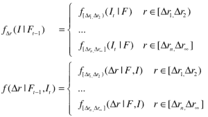
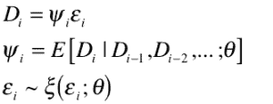
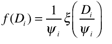
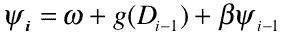
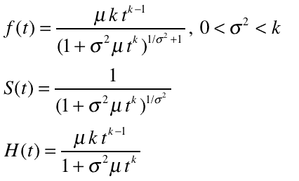
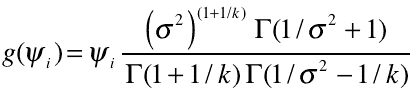
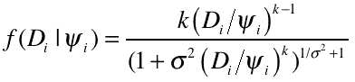

<!--yml

类别：未分类

日期：2024-05-18 15:36:47

-->

# [重新思考方差 | Tr8dr](https://tr8dr.wordpress.com/2009/11/26/rethinking-variance/)

> 来源：[`tr8dr.wordpress.com/2009/11/26/rethinking-variance/#0001-01-01`](https://tr8dr.wordpress.com/2009/11/26/rethinking-variance/#0001-01-01)

波动率（方差）估计可能是金融领域中最困难的研究领域之一。如先前的帖子所提及，最近的研究主要集中在基于持续时间的方差估计模型上。

我已经对基于持续时间的模型进行了一些实验，但还没有找到一个令人满意的办法，但我觉得我现在开始明白一个令人满意的模型可能是什么样的。我没有时间将其作为一个完整的研究，但希望找到一个满足我需求的 heuristic 方法。

有一种观点认为波动率（二次方差）可以至少分为 2 个不同的组成部分：

+   整合方差（IV）

    这是我们价格过程中扩散过程组件生成的**主要回报变异**。

+   平方跳跃项

    由于新闻或其他行为而产生的跳跃，而不是由扩散过程建模的跳跃。

这些共同解释了我们所说的二次方差（QV）：

（图片 1）](https://tr8dr.wordpress.com/wp-content/uploads/2009/11/picture-113.png)

“跳跃”和“局部波动”背后的基本概念是预期在给定时间间隔内（在连续情况下无限小，在实际市场中，离散地）的回报平方的 notion。可以构建跳跃大小 J 在时间 t 的概率的 pdf：

（图片 2）](https://tr8dr.wordpress.com/wp-content/uploads/2009/11/picture-212.png)

其中**f(I)**是“跳跃”事件指示器的 pdf，**f(Δr|I,F)**是在事件发生条件下跳跃大小Δr 的条件分布。一起提供了一个后验，代表了价格移动Δr 的概率。方差可以然后用连续或离散的形式估计：

（图片 3）](https://tr8dr.wordpress.com/wp-content/uploads/2009/11/picture-310.png)

思考“跳跃”与基于扩散的波动（如局部波动估计σ²）之间的差异，两个过程在强度上有所不同。然而，我们仍然可以使用上述期望值来估计两者。跳跃和局部波动都可以用**相同的方法估计**，**只需概率分布的参数化不同**即可适用于不同的价格跳跃水平(Δt)。

在我最近尝试建模方差时遇到的其中一个难题是在试图将跳跃的时间和大小作为同一个过程建模。现在，如果我们将其分开呢：

1.  在跳跃级别范围内模拟事件的持续时间（或强度）

    使用经过校准的指数-ACD 模型，在范围内的事件之间计算持续时间。

1.  在范围内模拟事件的大小

    考虑自回归自激过程。AR 部分将模拟均值的回归。

我可以将方差建模为一组自激强度过程，每组价格（回报）水平都有一个。然后我可以使用每个价格范围的**f(I)**和**f(Δr|I,F)**条件分布的专业知识来计算预期平方回报：

（[图片 4](https://tr8dr.wordpress.com/wp-content/uploads/2009/11/picture-46.png)）

**指标过程**

指标（或强度）过程可以用 ACD 模型来建模，比如 Burr-ACD 模型（已经在实证中显示拟合得很好）。这可以校准两组持续时间，一组用于“局部波动率”，另一组用于“跳跃波动率”。理论上我们可以考虑进一步细分为更多级别。

由 Engle 和 Russell 发展的 ACD 过程指定持续时间为一个混合过程：

（[图片 5](https://tr8dr.wordpress.com/wp-content/uploads/2009/11/picture-56.png)）

那么**Di**的条件密度是：

（[图片 6](https://tr8dr.wordpress.com/wp-content/uploads/2009/11/picture-63.png)）

最终形式的选取取决于危险函数的选择。ACD 更新方程的通用形式与 GARCH 类似：

（[图片 8](https://tr8dr.wordpress.com/wp-content/uploads/2009/11/picture-83.png)）

其中 g(D)是我们分布的生存函数的类似物。在我们这个案例中，我们将使用 Grammig 和 Maurer（2000）提出的 Burr 分布。Burr 分布的密度、生存和危险函数由：

（[图片 4](https://tr8dr.wordpress.com/wp-content/uploads/2009/11/picture-47.png)）

我们使用 Burr 密度作为指标组件ε[i]的分布 Di = ψ[i]ε[i]中的ξ[i]。我们选择一个分布ψ[i]的密度作为伽玛混合（来自 Guirreri 2009）：

（[图片 8](https://tr8dr.wordpress.com/wp-content/uploads/2009/11/picture-84.png)）

以及上述 Burr 分布的指标过程**ε[i]**的分布。为了确定给定**ψ[i]**的持续时间**D[i]**的概率，因为我们有**ε[i] = D[i] /** **ψ[i]**：

（[图片 7](https://tr8dr.wordpress.com/wp-content/uploads/2

附加说明：更深入地探索这个问题后，看起来 Ghysels 、Gourieroux、Jasiak 和 Joann（2004）提出的**随机波动率持续时间模型**会提供更好的预测能力。

**水平过程**

跳变水平过程可以相对简单。我们观察到在回报之间存在自回归衰减，无论是与扩散相关的还是跳变回报。在这两种情况下，回报事件之间都存在间隙，但我们的混合模型与指示过程将允许我们模拟这一点。

对于每个范围的跳变水平，可以使用相对简单的自回归过程来模拟事件大小的衰减。考虑到观察将在非均匀时间进行，指数时间依赖的自回归模型可能是最好的选择。分布需要进行估计。

**结论** 用两个过程来模拟模型波动：

1.  用强度过程来表示周期性/间隙行为

1.  用大小过程来表示自激励的自回归行为

补充：发现其他人也在沿着同样的思路思考。大约在 2008/2009 年，有几篇论文提出了与我概述的类似的模型。
