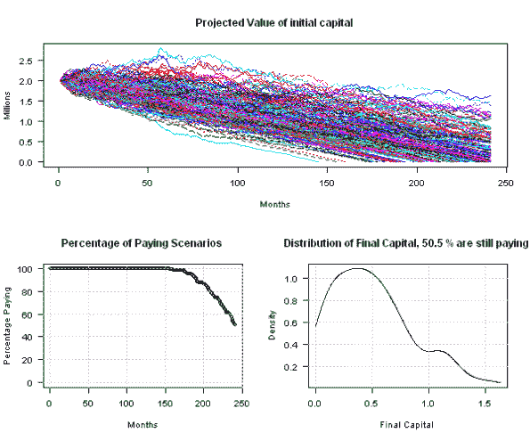

<!--yml

类别：未分类

日期：2024-05-18 14:33:06

-->

# 退休：模拟随机回报、通货膨胀和提款的财富 – Shiny 网页应用 | 系统投资者

> 来源：[`systematicinvestor.wordpress.com/2013/04/06/retirement-simulating-wealth-with-random-returns-inflation-and-withdrawals-shiny-web-application/#0001-01-01`](https://systematicinvestor.wordpress.com/2013/04/06/retirement-simulating-wealth-with-random-returns-inflation-and-withdrawals-shiny-web-application/#0001-01-01)

今天，我想分享这个[退休：模拟随机回报、通货膨胀和提款的财富](http://glimmer.rstudio.com/systematicin/retirement.withdrawal/) – [Shiny](http://www.rstudio.com/shiny/)网页应用（代码在[GitHub](https://github.com/systematicinvestor/SIT/tree/master/Shiny/retirement.withdrawal/)）。

这个应用是由 Pierre Chretien 开发和贡献的，我只是做了一些小更新。这个应用很好地展示了将你的 R 脚本转换成互动性[Shiny](http://www.rstudio.com/shiny/)网页应用是多么简单。

请参阅下面的示例脚本，以模拟财富的随机回报、通货膨胀和提款：

```

#-------------------------------------
# Inputs
#-------------------------------------

# Initial capital
start.capital = 2000000

# Investment
annual.mean.return = 5 / 100
annual.ret.std.dev = 7 / 100

# Inflation
annual.inflation = 2.5 / 100
annual.inf.std.dev = 1.5 / 100

# Withdrawals
monthly.withdrawals = 10000

# Number of observations (in Years)
n.obs = 20

# Number of simulations
n.sim = 200

#-------------------------------------
# Simulation
#-------------------------------------

# number of months to simulate
n.obs = 12 * n.obs

# monthly Investment and Inflation assumptions
monthly.mean.return = annual.mean.return / 12
monthly.ret.std.dev = annual.ret.std.dev / sqrt(12)

monthly.inflation = annual.inflation / 12
monthly.inf.std.dev = annual.inf.std.dev / sqrt(12)

# simulate Returns
monthly.invest.returns = matrix(0, n.obs, n.sim)
monthly.inflation.returns = matrix(0, n.obs, n.sim)

monthly.invest.returns[] = rnorm(n.obs * n.sim, mean = monthly.mean.return, sd = monthly.ret.std.dev)
monthly.inflation.returns[] = rnorm(n.obs * n.sim, mean = monthly.inflation, sd = monthly.inf.std.dev)

# simulate Withdrawals
nav = matrix(start.capital, n.obs + 1, n.sim)
for (j in 1:n.obs) {
	nav[j + 1, ] = nav[j, ] * (1 + monthly.invest.returns[j, ] - monthly.inflation.returns[j, ]) - monthly.withdrawals
}

# once nav is below 0 => run out of money
nav[ nav < 0 ] = NA

# convert to millions
nav = nav / 1000000

#-------------------------------------
# Plots
#-------------------------------------
layout(matrix(c(1,2,1,3),2,2))

# plot all scenarios    
matplot(nav, type = 'l', las = 1, xlab = 'Months', ylab = 'Millions', 
	main = 'Projected Value of initial capital')

# plot % of scenarios that are still paying
p.alive = 1 - rowSums(is.na(nav)) / n.sim

plot(100 * p.alive, las = 1, xlab = 'Months', ylab = 'Percentage Paying', 
	main = 'Percentage of Paying Scenarios', ylim=c(0,100))
grid()	

# plot distribution of final wealth
final.nav = nav[n.obs + 1, ]
	final.nav = final.nav[!is.na(final.nav)]

plot(density(final.nav, from=0, to=max(final.nav)), las = 1, xlab = 'Final Capital', 
	main = paste('Distribution of Final Capital,', 100 * p.alive[n.obs + 1], '% are still paying'))
grid()	

```



相应的[Shiny](http://www.rstudio.com/shiny/)网页应用包含两个文件：

+   ui.r – 用户界面

+   server.r – R 模拟和计算

以下是用于描述退休模拟所需输入的用户界面（ui.r）：

```

# Define UI for application that plots random distributions 
shinyUI(pageWithSidebar(

  # Application title
  headerPanel("Retirement : simulating wealth with random returns, inflation and withdrawals"),

  # Sidebar with a slider input for number of observations
  sidebarPanel(
    sliderInput("n.obs", 
                "Number of observations (in Years):", 
                min = 0, 
                max = 40, 
                value = 20),

    sliderInput("start.capital", 
                "Initial capital invested :", 
                min = 100000, 
                max = 10000000, 
                value = 2000000,
                step = 100000,
                format="$#,##0",
                locale="us"),

    sliderInput("annual.mean.return", 
                "Annual return from investments (in %):", 
                min = 0.0, 
                max = 30.0, 
                value = 5.0,
                step = 0.5),

    sliderInput("annual.ret.std.dev", 
                "Annual volatility from investments (in %):", 
                min = 0.0, 
                max = 25.0, 
                value = 7.0, 
                step = 0.1),

    sliderInput("annual.inflation", 
                "Annual inflation (in %):", 
                min = 0, 
                max = 20, 
                value = 2.5,
                step = 0.1),

    sliderInput("annual.inf.std.dev", 
                "Annual inflation volatility. (in %):", 
                min = 0.0, 
                max = 5.0,
                value = 1.5,
                step = 0.05),

    sliderInput("monthly.withdrawals", 
                "Monthly capital withdrawals:", 
                min = 1000, 
                max = 100000, 
                value = 10000,
                step = 1000,
                format="$#,##0",
                locale="us",),

    sliderInput("n.sim", 
                "Number of simulations:", 
                min = 0, 
                max = 2000, 
                value = 200)

  ),

  # Show a plot of the generated distribution
  mainPanel(
    plotOutput("distPlot", height = "600px")
  )
))

```

最后一步是修改退休模拟逻辑以使用用户输入：

```

library(shiny)

# Define server logic required to generate and plot a random distribution
#
# Idea and original code by Pierre Chretien
# Small updates by Michael Kapler 
#
shinyServer(function(input, output) {

  # Function that generates scenarios and computes NAV.
  getNav <- reactive({ 
	#-------------------------------------
	# Inputs
	#-------------------------------------

	# Initial capital
	start.capital = input$start.capital

	# Investment
	annual.mean.return = input$annual.mean.return / 100
	annual.ret.std.dev = input$annual.ret.std.dev / 100

	# Inflation
	annual.inflation = input$annual.inflation / 100
	annual.inf.std.dev = input$annual.inf.std.dev / 100

	# Withdrawals
	monthly.withdrawals = input$monthly.withdrawals

	# Number of observations (in Years)
	n.obs = input$n.obs

	# Number of simulations
	n.sim = input$n.sim

	#-------------------------------------
	# Simulation
	#-------------------------------------

	# number of months to simulate
	n.obs = 12 * n.obs

	# monthly Investment and Inflation assumptions
	monthly.mean.return = annual.mean.return / 12
	monthly.ret.std.dev = annual.ret.std.dev / sqrt(12)

	monthly.inflation = annual.inflation / 12
	monthly.inf.std.dev = annual.inf.std.dev / sqrt(12)

	# simulate Returns
	monthly.invest.returns = matrix(0, n.obs, n.sim)
	monthly.inflation.returns = matrix(0, n.obs, n.sim)

	monthly.invest.returns[] = rnorm(n.obs * n.sim, mean = monthly.mean.return, sd = monthly.ret.std.dev)
	monthly.inflation.returns[] = rnorm(n.obs * n.sim, mean = monthly.inflation, sd = monthly.inf.std.dev)

	# simulate Withdrawals
	nav = matrix(start.capital, n.obs + 1, n.sim)
	for (j in 1:n.obs) {
		nav[j + 1, ] = nav[j, ] * (1 + monthly.invest.returns[j, ] - monthly.inflation.returns[j, ]) - monthly.withdrawals
	}	

	# once nav is below 0 => run out of money
	nav[ nav < 0 ] = NA

	# convert to millions
	nav = nav / 1000000

	return(nav)  
  })

  # Expression that plot NAV paths. 
  output$distPlot <- renderPlot({
	nav = getNav()

	layout(matrix(c(1,2,1,3),2,2))

	# plot all scenarios    
	matplot(nav, type = 'l', las = 1, xlab = 'Months', ylab = 'Millions', 
		main = 'Projected Value of initial capital')

	# plot % of scenarios that are still paying
	p.alive = 1 - rowSums(is.na(nav)) / ncol(nav)

	plot(100 * p.alive, las = 1, xlab = 'Months', ylab = 'Percentage Paying', 
		main = 'Percentage of Paying Scenarios', ylim=c(0,100))
	grid()	

	last.period = nrow(nav)

	# plot distribution of final wealth
	final.nav = nav[last.period, ]
		final.nav = final.nav[!is.na(final.nav)]

	if(length(final.nav) ==  0) return()		

	plot(density(final.nav, from=0, to=max(final.nav)), las = 1, xlab = 'Final Capital', 
		main = paste('Distribution of Final Capital,', 100 * p.alive[last.period], '% are still paying'))
	grid()	
  })

})

```

我们都做完了！！！Shiny 在允许你仅用两个简单步骤将你的脚本转换为互动性网页应用方面真是太棒了。

请尝试使用[退休：模拟随机回报、通货膨胀和提款的财富](http://glimmer.rstudio.com/systematicin/retirement.withdrawal/) – [Shiny](http://www.rstudio.com/shiny/)网页应用（代码在[GitHub](https://github.com/systematicinvestor/SIT/tree/master/Shiny/retirement.withdrawal/)）。

周末愉快
