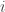

<!--yml

类别：未分类

日期：2024-05-18 13:46:26

-->

# 通过混合实现的回报分解 | Quantivity

> 来源：[`quantivity.wordpress.com/2011/12/28/estimating-mixture-index-return-decomposition-via-maximum-likelihood/#0001-01-01`](https://quantivity.wordpress.com/2011/12/28/estimating-mixture-index-return-decomposition-via-maximum-likelihood/#0001-01-01)

存在各种技术用于估计回报分解模型的参数，先前在[指数回报分解](https://quantivity.wordpress.com/2011/12/14/index-return-decomposition/)中介绍过。本文考虑通过最大似然估计（MLE）来估计*独立混合模型*，这是频率统计学的主要工具，也是一个很好的起点。

请记住是*不可观测*的，因此模型不能直接通过 MLE 估计。因此，需要决定如何为这个潜在变量进行估计。一种方法是很天真的，简单地假设是股票和指数之间回报的确定性差异（从技术上讲，这会生成一个[轮廓似然](http://en.wikipedia.org/wiki/Likelihood_function#Profile_likelihood)，由[Severini 和 Wong [1992]](http://people.csail.mit.edu/~jrennie/trg/papers/severini-conditionally-92.pdf)形式化，[Murphy 和 Van Der Vaart [2000]](http://www.jstor.org/pss/2669386)验证与确切似然函数一致）：


这个假设使得我们可以专注于估计，从而提供对被分解的回报*混合行为*的洞察：如果股票回报的行为类似于其指数，那么混合度很低，很小（当股票的行为与其指数完全相同时，混合度为零，即，因为不需要混合）；相反，如果股票回报与其指数经常不相关，那么混合度很高，很大。

值得考虑的是和的自相关性，因为这有助于确定是否需要对进行时间索引。对于自相关性不显著的回报（常见于*有符号*的股票回报），时间索引被舍弃，并且估计一个单一的。然而，*条件依赖关系*通常存在于和之间，与[代理/交叉套期保值](https://quantivity.wordpress.com/2011/10/02/proxy-cross-hedging/)系列中的先前帖子一致（下面是 CRM / QQQ 示例的 r-z copula 示意图）：


使用该身份证明将分解模型转换为：

![r_t = s_t \left[ \alpha_t | (r_t - i_t) | + (1 - \alpha_t) \beta | i_t | \right] ](img/f32c42b7f1f93f3ffdcab23e1872b887.png)

该模型进一步简化为熟悉的*独立混合模型*，通过放弃符号和，并使用密度和回报分布函数进行最大似然估计（MLE）：


MLE 估计需要对的参数分布进行假设，其中文献中常见的选择为正态、学生-t、偏 t 或偏超 bolic 学生-t（[Aas and Haff [2006]](http://www.econ.ku.dk/fru/conference/Programme/Sunday/F4/Aas_226.pdf)）。下一个问题是如何估计参数：和一系列参数（*例如*如果假设为正态，则和）。由于观察到，一种方法是通过两步估计进行：

1.  通过从中的最大似然估计（MLE）来估计参数。

1.  通过对混合物进行最大似然估计（MLE），共同估计和参数，保持参数不变。

对于两者，回顾似然度，对数似然度，定义如下：


其中混合物的 MLE 是通过对参数进行似然度最大化来完成的，其中选择对数以确保数值稳定性：

![ \displaystyle \max_{\boldsymbol{\theta}} \ln \mathcal{L} = \max_{\boldsymbol{\theta}} \sum\limits_{t=1}^T \left( \ln \left[ \alpha (r_t - i_t) + (1 - \alpha) i_t \right] \right)](img/cdf953d7d59bf32767f8f0679d0f2692.png)

此优化可以通过在 R 中使用`DEoptim`对负对数似然`negLogLikeFun`进行最小化来实现（负值是因为`DEoptim`中的最小化与的最大化相对）。选择`DEoptim`是因为它在对非光滑全局优化方面具有快速的收敛性。

例如，继续在[代理/交叉对冲](https://quantivity.wordpress.com/2011/10/02/proxy-cross-hedging/)的前一篇帖子中介绍的 CRM/QQQ 例子，生成的结果如下：

```

> symbols <- c("CRM", "QQQ")
> endDate <- Sys.Date()
> startDate <- endDate - as.difftime(52*5, unit="weeks")
> quoteType <- "Close"
> p <- do.call(cbind, lapply(symbols, get.hist.quote, start=startDate, end=endDate,  quote=quoteType))
> colnames(p) <- symbols
> doReturnDecomp(p)
normal mix likelihood: -3485.55 phi1 params: 0.0003471366 0.01673634 params 0.2546208 -0.001208877 0.0113988
skew-t mix likelihood: -3566.512 phi1 params: 0.003844969 0.01079941 -0.3252923 2.893228 params 0.2357737 -0.004188977 0.01099266 0.4157174 26.5643
skew-hyp-t likelihood: -3083.700 phi1 params: 0.01051675 0.1485529 -3.945452 10.10836 params 0.8295289 -0.0003636940 0.03071332 -0.5 5

```

这些结果对应于偏态 t 混合的以下密度函数：


这些密度的一个有趣观察是它们的位置参数位于零的相反侧：具有正位置，而具有负位置。这种解释的一个意思是，CRM 的正回报很大程度上源自于个别的回报，而负回报则源自于指数。从经济角度来看，这是合理的：正面消息通常是特有的，而负面消息通常是广泛的。

可以从这些结果中得出几个额外的推论：

+   模型选择：似然性表明偏态 t 分布是首选模型，表明长尾巴和偏度（与风格化事实相匹配）。

+   混合：，表明超过 75%的 CRM 回报由相应的 QQQ 指数决定；剩余的 25%由未观察到的回报系列决定。

+   尾巴：CRM  df = 2.89，这表明其尾巴比 QQQ  df = 26.56 要厚（与个股相对于指数的风格化事实相匹配）。

后续帖子可能考虑这个模型中的替代估计技术。

* * *

生成通过混合的两阶段 MLE 回报分解的 R 代码：

```

library("MASS")
library("stats")
library("DEoptim")
library("sn")
library("SkewHyperbolic")

normalMixtureIndexDecomp <- function(r, i)
{
  # Two-step MLE estimation of return decomposition model, assuming both
  # return distributions are normal.
  #
  # Args:
  #   r: return series being decomposed
  #   i: index series used for decomposition
  #
  # Return value: MLE parameter estimates

  z <- r - i
  id <- fitdistr(i, "normal")$estimate
  negLogLikeFun <- function(p) {
    a <- p[1]; mu1 <- p[2]; s1 <- p[3];
    ll <- (-sum(log(a * dnorm(z,mu1,s1) + (1 - a) * dnorm(i, id[1], id[2]))));
    return (ll); 
  }
  mle <- DEoptim(negLogLikeFun, c(0, -0.5, 0), c(1, .5, .5), control=list(trace=FALSE))

  cat("normal mix likelihood:", last(mle$member$bestvalit), "phi1 params:",id, "params", last(mle$member$bestmemit),"\n")
  mle <- last(mle$member$bestmemit)

  x <- seq(-.25,.25,length.out=500)
  dnorm1 <- dnorm(x, id[1], id[2])
  dnorm2 <- dst(x, mle[2], mle[3])
  plot(x, dnorm1, type='l', ylim=c(0, max(dnorm1,dnorm2)), ylab="Density", main="Normal Mixture")
  lines(x, dnorm2, col='red')
  abline(v=id[1], lty=2)
  abline(v=mle[2], col='red', lty=2)
  legend("topleft",legend=c("phi1", "phi2"), fill=colors, cex=0.5)

  return (mle)
}

mixtureSkewTIndexDecomp <- function(r, i)
{
  # Two-step MLE estimation of return decomposition model, assuming both
  # return distributions are skew-t.
  #
  # Args:
  #   r: return series being decomposed
  #   i: index series used for decomposition
  #
  # Return value: MLE parameter estimates

  z <- r - i
  idp <- st.mle(y=i)$dp
  negLogLikeFun <- function(p) {
    a <- p[1]; mu1 <- p[2]; s1 <- p[3]; s2 <- p[4]; df1 <- p[5]
    ll <- (-sum(log(a * dst(z,location=mu1,scale=s1,shape=s2,df=df1) + (1 - a) * dst(i, dp=idp))));
    return (ll); 
  }
  mle <- DEoptim(negLogLikeFun, c(0, -0.5, 0, 0, 2), c(1, .5, .5, 5, 50), control=list(trace=FALSE))

  cat("skew-t mix likelihood:", last(mle$member$bestvalit), "phi1 params:", idp, "params", last(mle$member$bestmemit),"\n")
  mle <- last(mle$member$bestmemit)

  x <- seq(-.25,.25,length.out=500)
  dst1 <- dst(x, dp=idp)
  dst2 <- dst(x, dp=mle[2:5])
  plot(x, dst1, type='l', ylim=c(0, max(dst1,dst2)), ylab="Density", main="Skew T Mixture")
  lines(x, dst2, col='red')
  abline(v=idp[1], lty=2)
  abline(v=mle[2], col='red', lty=2)
  legend("topleft",legend=c("phi1", "phi2"), fill=colors, cex=0.5)

  return (mle)
}

mixtureSkewHypTIndexDecomp <- function(r, i)
{
  # Two-step MLE estimation of return decomposition model, assuming both
  # return distributions are skew hyperbolic student-t.
  #
  # Args:
  #   r: return series being decomposed
  #   i: index series used for decomposition
  #
  # Return value: MLE parameter estimates

  z <- r - i
  iparam <- skewhypFit(i,plots=FALSE,printOut=FALSE)$param
  negLogLikeFun <- function(p) {
    a <- p[1];
    ll <- (-sum(log(a * dskewhyp(z,param=p[2:5]) + (1 - a) * dskewhyp(i, param=iparam))));
    return (ll); 
  }
  mle <- DEoptim(negLogLikeFun, c(0, -5, 0, -0.5, 0), c(1, 5, .5, -0.5, 5), control=list(trace=FALSE))

  cat("skew-hyp-t likelihood:", last(mle$member$bestvalit), "phi1 params:",iparam,"params", last(mle$member$bestmemit),"\n")
  mle <- last(mle$member$bestmemit)

  x <- seq(-.25,.25,length.out=500)
  dskewhyp1 <- dskewhyp(x, param=iparam)
  dskewhyp2 <- dskewhyp(x, param=mle[2:5])
  plot(x, dskewhyp1, type='l', ylim=c(0, max(dskewhyp1,dskewhyp2)), ylab="Density", main="Skew Hyperbolic Student-T")
  lines(x, dskewhyp2, col='red')
  abline(v=iparam[1], lty=2)
  abline(v=mle[2], col='red', lty=2)
  legend("topleft",legend=c("phi1", "phi2"), fill=colors, cex=0.5)

  return (mle)
}

doReturnDecomp <- function(p)
{
  # Decompose return of two series, using several parametric distributions.
  #
  # Args:
  #   p: p[,1] is return being decomposed; p[,2] is index returns
  #
  # Return value: none

  r <- ROC(p[,1], type="discrete", na.pad=FALSE)
  i <- ROC(p[,2], type="discrete", na.pad=FALSE)

  normalMixtureIndexDecomp(r, i)
  mixtureSkewTIndexDecomp(r,i)
  mixtureSkewHypTIndexDecomp(r,i)
}

```
