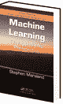

<!--yml

类别：未分类

日期：2024-05-18 13:52:27

-->

# 评论：机器学习 | Quantivity

> 来源：[`quantivity.wordpress.com/2011/03/27/review-machine-learning/#0001-01-01`](https://quantivity.wordpress.com/2011/03/27/review-machine-learning/#0001-01-01)

以下是 Marsland 所著《机器学习：算法视角》的评论。

机器学习（ML）是那些引起广泛不同反应的主题之一。有些人认为它在交易中没用，回想起早期失败的生物启发 AI 技术，如[神经网络](http://en.wikipedia.org/wiki/Neural_net)。其他人认为它是圣杯（它不是）。还有一些人对其适用性不确定，为其多学科性质以及相应的历史教育连贯性缺乏而困扰。

所有这些视角都受到了现代机器学习书籍相当复杂的数学基调的困扰(*例如* Hastie *et al.* 和 Bishop; 更多信息请参阅[如何学习算法交易：第二部分](https://quantivity.wordpress.com/2010/01/12/how-to-learn-algorithmic-trading-part-2/)）。这种风格导致了两个实际问题：

+   认知负担：相当重的认知负担来深入理解这些方法。这对于交易来说是一个巨大的问题，因为使用这些方法需要理解它们的*直觉*，并大量改编算法来解决具体的交易问题（过滤、预测、信号*等*）。

+   实际差距：理论与交易代码之间存在显著差距；无论使用哪种语言，从积分到 for 循环都需要付出努力。当与其他量化构建块顺序组合时，ML 通常能提供最大的性价比。

在这种背景下，文本通过一个*实践算法镜头*为机器学习提供了一个令人耳目一新的介绍：与其他机器学习文本不同，它真正擅长建立概念性直觉，并为关键的机器学习主题提供从想法到代码的智力面包屑。如果你用编程代码思考并喜欢轻量级的数学机械，这是一本很好的机器学习入门书。

文本中的几个地方是通常强烈的节奏的例外。

首先，使用多层感知器作为激励模型感觉过时（第三章）。这可能反映了激励机器学习的风格偏见：较老的文本从经典 AI（*例如* [Russell 和 Norvig](http://aima.cs.berkeley.edu/))中获取动机，而越来越多的近期文本从统计学习（*即*回归、排名和分类）中获取动机。两者都是有效的视角，但它们的前置洞见有很大不同。

其次，马尔可夫链蒙特卡洛（MCMC）和图形方法（第十四章和第十五章）的覆盖范围特别困难，存在几个问题：

+   主题选择：各自领域内独特的细分领域，其理解和有效应用取决于对更广泛背景的理解

+   数学复杂性：这些主题所需的相当深厚的数学直觉和机械设备不太适合文本所采用的散文和算法风格，因此提供的示例和代码不如前几章那样具有相同的说明性

+   过早性：这两个主题目前都有活跃的研究文献，对其进行简要总结或许还为时尚早

考虑一下由 Koller 和 Friedman 合著的[概率图模型](http://pgm.stanford.edu/)，作为图形方法的另一种教材，尽管其文体与本书完全不同。
