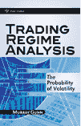

<!--yml

类别：未分类

日期：2024-05-18 13:54:12

-->

# 评论：交易政权分析 | Quantivity

> 来源：[`quantivity.wordpress.com/2010/01/24/review-trading-regime-analysis/#0001-01-01`](https://quantivity.wordpress.com/2010/01/24/review-trading-regime-analysis/#0001-01-01)

 以下是对 Gunn 的《交易政权分析》的评论，与 Quantivity 持续的市场政权主题一致，并响应读者的请求。

寻求严格数量处理的政权分析的读者将会感到失望（正如作者经常愉快地承认的那样），因为本文试图通过案例研究行为金融和一种独特的技术分析篮子来主要分析政权。话说回来，本文*建立直觉，并最终赞同许多类似的智力主题，这些主题同样支撑着市场政权的严格数量分析*。

这无疑是出乎意料的好奇心。因此，价值在于观察这种政权直觉是如何被一个认证的技术分析师框架的，从一个量的角度窥视。尽管技术分析可以被视为定量分析的思想祖先（如在[为什么移动平均线](https://quantivity.wordpress.com/2010/01/08/why-moving-averages/)中介绍的），技术分析和现代定量分析在直觉上很少有交集。像任何智力对比一样，这种好奇心值得研究。

以下是对比直觉的要点，其中一些对于一个经典的技术分析师来说是非常惊人的让步：

+   确定性预测的无效性：“我们通常认为的‘预测’是完全不可能和无效的练习。”（第 3 页）

+   没有圣杯：“认为‘每件事都管用，但仅在某些时候’这一认识，在我看来，对于在金融交易市场中长期的成功的生存至关重要。”（第 7 页）

+   三元状态分类（趋势、区间或不确定）：市场“能做三件事之一。它可以趋势，它可以在一个大致的区间内交易，或者它可以两者兼而有之。”（第 15 页）

+   概率性政权预测：“政权交易分析的目的在于确定市场目前所处的交易环境，并关键地确定市场何时*可能*即将进入趋势或区间交易政权。”（第 15 页）

+   行为金融学：涵盖了行为金融学的一些心理学和社会学原则，包括认知失调（第 28 页），“大傻瓜理论”（第 38 页），有限理性（第 40 页），以及市场心理学（第 73 页）

+   波动性的中心性：波动性在推动政权演变中的作用在第三章中提出，包括从定量世界中部分重新定位的许多细微差别：均衡（第 45 页），实现波动性（第 51 页），波动性聚集（第 54 页），隐含波动性（第 55 页），相对价值（第 57 页），以及波动性的波动（第 65 页）

+   价格范围和交易区间：“书中最重要的部分”（第 60 页）解释了交易区间是由价格变化的速度（由标准差衡量）驱动的，而不是价格变化的速度；尽管缺乏分析严密性，但许多量化策略在概念上与图 3.12 中说明的直觉相似

在第一部分表达了这些见解之后，接下来的近 200 页的第二部分，书中回顾了一个独特的技术分析技术组合：正统的模式识别、K 线图、成交量考虑、之前的高/低点、艾略特波浪、移动平均线、布林带、ADX、点/柱图、变化/背离率、威廉姆斯%R 和唐奇安通道。在《量化图书馆》中，讨论[Vanna](http://en.wikipedia.org/wiki/Greeks_%28finance%29#Vanna)和艾略特波浪在同一本书中是独一无二的。

第三章再次将期权波动率曲面（第十七章和第十八章）的基本分析与一些技术趋势跟踪指标（第十九章和第二十章）并列。第二十一章引入了一个新的指标（任何技术分析书籍中都不可或缺的），几乎顺带提及，名为交易区间指标（第 292 页）：

> 交易区间指标（TRI）是通过取价格序列的标准差，对该标准差取移动平均，并检查两者之间的差距来计算的。

在第二十二章中，Gunn 试图将故事连贯地编织在一起，引入了一个“交易区间网格”（第 301 页）。熟悉量化博客的读者会发现这个技术指标网格与各种量化“市场状态”摘要之间有惊人的*概念*相似性（包括建议的[市场区间仪表盘](https://quantivity.wordpress.com/2009/08/23/market-regime-dashboard/)）。

最后，在第二十六章中，Gunn 用两个特别引人入胜的引语进行了总结。首先，是对交易区间分析的简化表述（第 389 页）：

> 交易区间分析是不是只是说一些大幅快速移动的资产可能会减慢速度并且要么反转要么在区间内交易，或者一些长时间没有移动的资产可能很快会有大幅移动的一种花哨说法？好吧，坦白说，是的。”

与提出一种名为“技术经济分析”的混合技术经济方法（第 390 页）并列：

> 当然，提出这样一个问题是有价值的……即是否可以将与系统化、机械化的入场和出场方法相结合的自主评估仓位大小和风险。”

除了自主评估仓位大小之外，可以想象零售量化交易者会对自己的策略提出类似的问题。对于特别喜欢艾略特波浪的趋势跟踪技术分析师来说，这确实是一个令人着迷的并列。
