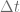
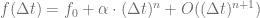
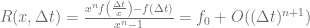
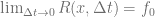
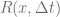

<!--yml

类别：未分类

日期：2024-05-17 23:30:53

-->

# Richardson Extrapolation for American Options – HPC-QuantLib

> 来源：[`hpcquantlib.wordpress.com/2012/06/10/richardson-extrapolation-for-american-options/#0001-01-01`](https://hpcquantlib.wordpress.com/2012/06/10/richardson-extrapolation-for-american-options/#0001-01-01)

像一维的 Crank-Nicholson 方案或多维的操作分解方法如 Hundsdorfer-Verwer 方案这样的流行有限差分方案，通常在金融工程中的典型偏微分方程中以实现二阶收敛。不幸的是，如果这些方案与动态规划结合使用来定价美式期权，动态规划步骤的一阶收敛会破坏二阶收敛。

理查森外推法是一种简单的数值宝石，用以提高数值方法的收敛阶。比如说，一个数值方法的收敛行为如下

 .

请注意，这比假设数值方法的阶数为*n*的要求更为严格，因为不依赖于。现在公式

也有

但理查森外推法的收敛阶是 *n+1*。阶数不依赖于*x*的具体值，但通常*x*选择为 2。这个简单的技巧可以扩展到*n*未知的情况，或者可以使用理查森外推法*m*次以提高收敛阶到*n+m* [2]。

让我们将理查森外推法应用于海森随机微分方程下美式看跌期权的价格。相应的偏微分方程

使用 Hundsdorfer-Verwer 方案[1]求解。在每一步之后，使用动态规划实现提前行权条件。实验的参数是

源代码可在[此处](http://hpc-quantlib.de/src/richardson.zip)找到。它依赖于从[SVN 主干](http://sourceforge.net/p/quantlib/code/HEAD/tree/)获取的最新 QuantLib 版本。

[1] Karel in ’t Hout, [ADI 有限差分法用于具有相关性的 Heston 模型](http://win.ua.ac.be/~kihout/ADI_Heston_lecture.pdf)。

[2] Eric Hung-Lin Liu, [数值外推法的基本方法及其应用](http://ocw.mit.edu/courses/mathematics/18-304-undergraduate-seminar-in-discrete-mathematics-spring-2006/projects/xtrpltn_liu_xpnd.pdf)。
