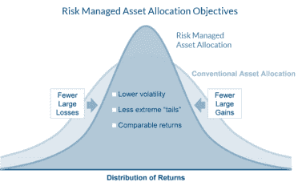

<!--yml

分类：未分类

日期：2024-05-12 17:44:54

-->

# 风险管理与动态贝塔播客 | CSSA

> 来源：[`cssanalytics.wordpress.com/2017/08/04/risk-management-and-dynamic-beta-podast/#0001-01-01`](https://cssanalytics.wordpress.com/2017/08/04/risk-management-and-dynamic-beta-podast/#0001-01-01)

我有幸最近与 Cambria Investment Management 的**[Mebane Faber](http://mebfaber.com/)**交谈，在广受欢迎的播客**“Mebane Faber Show”**中，我讨论了风险管理的话题，并介绍了如何应用动态贝塔方法。这次采访几乎持续了一个小时，涵盖了无论是像我这样的量化极客还是投资者各种各样的主题。

以下是播客的[链接](http://mebfaber.com/2017/08/02/episode-64-managing-risk-absolutely-critical/)。

[**第六十四期：David Varadi，“管理风险至关重要”**](http://mebfaber.com/2017/08/02/episode-64-managing-risk-absolutely-critical/)
