<!--yml

分类：未分类

日期：2024-05-18 14:07:56

-->

# 短波交易 | 第二部分 | 常见问题解答和其他芝加哥地区网站——Sniper In Mahwah &朋友们

> 来源：[`sniperinmahwah.wordpress.com/2018/06/07/shortwave-trading-part-ii-faq-and-other-chicago-area-sites/#0001-01-01`](https://sniperinmahwah.wordpress.com/2018/06/07/shortwave-trading-part-ii-faq-and-other-chicago-area-sites/#0001-01-01)
> 
> ##### [我很高兴地分享鲍勃·范瓦尔萨的《短波交易》系列的第二部分。第一部分有超过 25,000 次的浏览，这是相当疯狂的。感谢我们收到的所有评论。带括号的[]和斜体的 SIM（代表 SniperInMahwah]是我的评论——亚历山大。祝大家阅读愉快]

我曾[声称通过短波无线电交易是真实的](https://sniperinmahwah.wordpress.com/2018/05/07/shortwave-trading-part-i-the-west-chicago-tower-mystery/)，并介绍了我所找到的第一份证据的故事。看到故事被[IEEE Spectrum](https://spectrum.ieee.org/tech-talk/telecom/wireless/wall-street-tries-shortwave-radio-to-make-highfrequency-trades-across-the-atlantic)、[Hacker News](https://news.ycombinator.com/item?id=17028892)、[Hackaday](https://hackaday.com/2018/05/12/hft-on-hf-you-cant-beat-it-for-latency/)和其他人采纳，令人愉快地感到惊讶。但是由于我没有预料到如此多样化的观众，我没有提供理解短波交易背景所需的细节，因此引起了很多问题。我在这里提供一些背景信息，回答问题，并记录在芝加哥附近发现的另外两个短波交易网站。交易者可以跳过这里，同时我向更广泛的观众介绍内容。

#### 为什么会有延迟竞赛？这不是在浪费钱吗？

电子交易技术专家们认为延迟竞赛是理所当然的，但思考它存在的原因和对普通人意味着什么是很重要的。当你想给你的车加满汽油时，你有选择去附近的加油站接受他们的价格，或者也许比较一下稍远一点的加油站的油价。如果我们必须非常有信心，我们当地的加油站的价格是有竞争力的，我们都会花更多的时间进行比较购物。但是是什么保持那些价格具有竞争力呢？

将您当地的加油站与电子市场进行类比确实不够完美，但我认为这有助于理解为什么延迟很重要以及您如何受益。没有人能在纽约购买一艘油轮的汽油并立即在芝加哥出售。物理定律阻止我们经济地将如此重的负载远距离快速移动。但是苹果股票的一份重量几乎为零。芝加哥的价格和纽约的价格可以相互比较并在瞬间改变。好吧，大约 4 毫秒是更新价格旅行的时间。价格在一秒钟内可以进行大约 250 次单程旅行。

所以当你买卖苹果公司的股票时，你不需要四处寻找最佳价格。电子交易公司有激励去构建连接金融中心的最快网络，这样价格就可以快速地在它们之间移动。买卖双方受益，因为他们的本地市场有知道其他市场最佳价格的电子交易员，并愿意以最佳全球价格进行本地交易（这是市场制造）。这种类型的交易中，看到商业机会不需要火箭外科医生，所以高速交易员必须有效率，因为他们互相竞争。每个市场都必须有最佳价格，才能发生延迟比赛。电子交易员之间的竞争限制了他们的支出，只得到了更好的定价带来的好处。

#### 无线信号是如何帮助赢得延迟比赛的？

交易员使用无线信号，因为它能比光纤更快地移动价格。

这支直的钢笔在水下看起来似乎弯曲了。

我不会让你感到无聊地讲解物理学，但我会让你们回忆起这个小学实验，在这个实验中，一支铅笔在水中看起来似乎弯曲了。这是因为光在空气中的传播速度比在水中的传播速度要快。同样地，无线电波在空气中的传播速度比光在光纤中的传播速度要快。在交易术语中，无线电在给定距离上的延迟低于光纤。

但无线信号之所以更快，也是因为它几乎总是覆盖更短的距离。光纤路径往往会沿着道路和财产线走，可能不会完全沿着期望的方向走。无线塔可能不方便，但它们的优势在于信号可以采取物理学允许的最短路径，而不是由权利路径决定的曲折路径 [*我在那篇著名的 “[HFT 在我后院](https://sniperinmahwah.wordpress.com/2014/09/22/hft-in-my-backyard-part-i/)” 中解释了这一点 —— SIM*]。

无线信号的速度优势随着距离的增加而增加。我上面提到的 4 毫秒是指芝加哥和纽约之间微波无线信号的飞行时间。（实际上，是芝加哥郊区的奥罗拉和纽约郊区的泽西市的 Secaucus 之间。）作为比较，那条路线上最快的光纤路径是 6.75 毫秒，无线信号的优势是 2.75 毫秒。在芝加哥到欧洲的短波路径上，无线信号的优势更像是在 10 毫秒左右。

即使是在短距离内，节省的延迟也是至关重要的。[彭博社观察到](https://www.bloomberg.com/news/articles/2017-05-12/mysterious-antennas-outside-cme-reveal-traders-furious-land-war) 一家交易公司购买了 CME 旁边的土地，很可能是为了用无线路径替换光纤路径。我测量后发现，光纤路径长度约为 1400 英尺，而无线路径长度约为 1000 英尺。见空中照片 [*我将在第四部分详细说明围绕 CME 发生了什么，这非常令人惊讶——SIM*]。

用 1000 英尺的无线电路径替换 1400 英尺的光纤，大约可以节省 1 微秒。

400 英尺的优势可能听起来不多，但当你考虑到更直、更短的路径和更快的飞行时间时，这相当于大约 1 微秒的优势。那只是百万分之一秒，可能听起来不多，但一个快速的 Xeon CPU 在那个时间内可以执行大约 3000 条指令。所以回到上面关于效率的观点，如果没有土地，从而拥有更短的无线电路径的交易员要想保持竞争力，就必须用 3000 条更少的指令完成同样的计算[*这正是我将在第四部分 - SIM 中详细说明的*]。再回到芝加哥和欧洲之间的短波与光纤的极端案例，没有短波的交易员就处于 30,000,000 条指令的劣势。

#### 微波无线电和短波无线电之间有什么区别？

我在这里比较短波和微波时相当草率，尽管它们 quite different。之前的评论显示有些混淆，我将尝试澄清。这个博客上的大部分文章都是关于只能直线传播的微波。线路不能被树木或建筑物或其他东西阻挡。一杯水在微波炉里变热是因为水吸收了微波。树木大部分是水，所以它们也吸收微波。因此，微波天线建在很高的塔上或山上，以避开树梢。

当微波链路的长度变长时，你需要更高的塔和更大的天线。你达到一个在中间添加一个中继塔并形成双链路的智慧选择。中继增加了一些延迟和成本，所以设计多链路微波链路涉及许多妥协和权衡。从芝加哥到纽约 840 英里的路径上的链路的确切数量是每个网络严格保密的，但很可能超过 20，但不到 30。

一些从奥罗拉到新泽西的微波网络。（来自 Laughlin, Aguirre & Grundfest 论文“芝加哥和纽约金融市场之间的信息传输”，2013 年）

芝加哥和纽约之间的微波链路穿越密歇根湖和伊利湖的南端，但它们不能穿越大洋，因为距离太远。为此，你需要短波或微波/光纤混合网络，如[GoWest，之前在这个博客上介绍过](https://sniperinmahwah.wordpress.com/2016/09/23/once-upon-a-time-in-the-west/)。

#### 短波与微波和光纤相比如何？

光纤的可靠性基本上是完美的，但微波链路会有糟糕的日子，通常与天气有关。路径中的雨、雪和冰可能会在信号到达接收器之前吸收它。天线直径可达 6 英尺，因此在强风中会受到很大的力量，可能会使它们偏离轨道。尽管如此，微波的可靠性可能相当好。低延迟微波的先驱 McKay Brothers 有句谚语：“与其 99.999%的时间慢，不如 99%的时间快。”

另一方面，短波的可靠性比微波差得多，原因有很多。接收器附近的电风暴或人为干扰可能会产生如此多的噪音，以至于来自遥远发射器的微弱信号无法被听到。短波依赖于[地球电离层](https://en.wikipedia.org/wiki/Ionosphere)的变幻莫测，这是平流层的一部分。短波信号通常只能传播几百英里。但是当电离层条件恰到好处时，信号的一小部分会从电离层反射回来，而不是直接进入外太空。因此，希望使用短波进行交易的交易者要受到许多他们无法控制的物理力量的摆布。我无法合理猜测可靠性百分比，但短波的可靠性远低于微波——可能低好几个数量级。

即使条件适宜短波良好工作，我也不期望其带宽比拨号上网调制解调器好多少。与微波的数百兆比特和光纤的数十吉比特相比，这一点尤其明显。

短波的低带宽有一个微妙的结果：相对于光纤的延迟优势很容易被发送即使是小消息（按光纤标准衡量）所需的串行化延迟时间所消耗。整个 10 毫秒的延迟优势可能被发送单个 64 字节数据包所需的时间所消耗，该数据包的速度相当于拨号上网。因此，短波交易员需要有方法将他们的价格或其他信息非常紧凑地编码在只有几字节或位中——上述提到的另一个效率压力。

综合上述所有内容，我们可以制作一个比较光纤、微波和短波的表格。

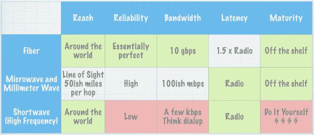

光纤、微波和短波的比较。绿色背景突出了相对优势，而红色背景突出了相对劣势。

简要总结是，短波具有光纤的无限制覆盖范围和微波最低可能的延迟，但其可靠性极低，成本高昂，带宽仅相当于拨号上网。

当解释无线电链路和光纤的相对优势时，我经常使用双枪比喻。想象一下，你是一名需要将信息发送到远程地点的交易员。你必须把信息写在一颗子弹上才能发送。你一只手拿着“光纤枪”，另一只手拿着“无线电枪”。

每一颗纤维枪的子弹都会击中目标，但无线电枪的子弹有百分之一的爆炸在空中，永远到不了。无线电枪的子弹飞行速度是纤维枪的 1.5 倍。你可以随时拉动纤维枪的扳机，但在无线电枪开火后，你必须等待，重新装弹。重新装弹的时间可能是毫秒级，这打开了“射手懊悔”的可能性。你决定用无线电枪开枪，然后迅速得到新信息，让你想在你的枪重新装弹之前再次开枪。

#### 如果交易员通过无线电发送信号，其他人能听到吗？

必须考虑的威胁是一个竞争对手设法将接收天线靠近一个交易所并找出如何解码你的信号。并非每一次交易都是赢者通吃的机会，但没有交易者希望他们的发射器的成本受益于竞争对手。

加密是我能想到的唯一答案。它很快，因为只需要在发送和接收时将每个比特与只有发射器和预期接收者才知道的秘密比特模式进行异或操作。密码学家已经证明，将信息流与伪随机比特流进行异或操作会产生一个与噪声无法区分的新比特流。换句话说，信息流的所有痕迹都被移除了。所以，没有秘密比特模式的接收器只能接收到噪声。

考虑到短波上的数据率较低，整个交易日的秘密比特模式只需几 MB 长。在市场关闭时，通过安全的纤维链接传输这一点只需花费几分之一秒。更好的是，只需向一个加密质量的伪随机数生成器发送一个 256 位的种子，就大功告成。

请注意，大多数互联网加密协议要求无损传输，因此它们在有损的短波上无法工作。这可以通过将加密比特流按照 GPS 时钟而不是接收到的比特来推进，轻松解决。

#### 那卫星呢？

地球静止卫星对交易来说是不可能的。带宽很大，但到达卫星并返回的时间需要 270 毫秒。物理阻碍了这一切。

低地球轨道卫星是一个可能的选择，因为它们离地球更近。我不了解目前有任何星座适合交易。一些正在设计中的星座在海底光纤之上可能有时会有延迟优势。但没有一个是无条件优于光纤的，因为星座相对于地面站移动时路径长度会发生变化。有关卫星用于交易的可能性的更多信息，请参阅 Stéphane Tyč的演讲。[ McKay Brothers 的](https://stacresearch.com/STAC-Summit-1-Nov-2017-mckay)。

电离层比最低的低地球轨道卫星更接近地球，所以短波总是会有更短的斜边，因此延迟更低。然而，微波信号只是擦过地球表面，所以链式微波链路的延迟低于短波，在它们可能的陆上路径上。

#### 你在泄露秘密吗？

不。关于短波交易的讨论已经在这[博客](https://sniperinmahwah.wordpress.com/2015/01/14/hft-in-my-backyard-v/)和[Meanderful](https://meanderful.blogspot.com/2017/05/lines-radios-and-cables-oh-my.html)上进行过。我只是刚刚学会了如何在公共记录中找到 FCC 许可证。天线太大，无法隐藏。我将上述内容与地图、背景信息和我的分析相结合。考虑到人们希望将最佳价格拉近，因此会有延迟竞赛，因此可以预见，交易技术将直接追求物理学允许的最低延迟。简单地说就是：商业+物理学=短波。

#### 这一切是从什么时候开始的？

一些过期的实验许可证可以追溯到 2011 年底。然而，自从那时以来，软件定义的无线电已经有了长足的发展。当前一轮的许可证申请是在 2015 年中到晚期提交的[*这是我第一次听说这些项目的时候——SIM*]。在印第安纳州讨论的塔是在 2016 年 10 月至 2017 年 4 月之间建造的。

2018 年 3 月，我拍摄了安装在[西芝加哥塔](https://sniperinmahwah.wordpress.com/2018/05/07/shortwave-trading-part-i-the-west-chicago-tower-mystery/)的软件定义无线电的纸板箱。它正坐在垃圾堆里，在一层尚未完全分解的树叶上面，所以我假设它是 2017 年秋天之后安装的。此外，这个箱子暴露在芝加哥冬天的恶劣环境中，看起来并没有坏掉。所以我猜它实际上是在 2018 年 2 月左右安装的。新鲜的东西。

#### 你在芝加哥周围还发现了什么？

我去了 FCC 实验许可证数据库，在 CME 在奥罗拉的数据中心 100 英里范围内找到了九个短波许可证的有效记录。其中两个是假的；一个是我在西芝加哥偶然发现的地点。我访问了四个地点，那里没有发现短波天线。但这仍然剩下两个有趣的地点。

第一个位于印第安纳州的瓦纳塔附近([41.457048°, -86.859156°](https://www.google.fr/maps/place/41%C2%B027'25.4%22N+86%C2%B051'33.0%22W/@41.457048,-86.8613447,713m/data=!3m1!1e3!4m5!3m4!1s0x0:0x0!8m2!3d41.457048!4d-86.859156)).从这个地点的空中俯瞰，看起来很有趣。

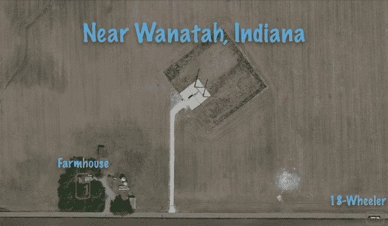

将天线的尺寸与农舍和 18 轮大卡车进行比较。

你可以看到玉米地中有一个很大的正方形区域看起来与众不同。有一条通往正方形浅色部分的道路。注意与农舍和 18 轮卡车相比的大小比例，以了解比例尺。

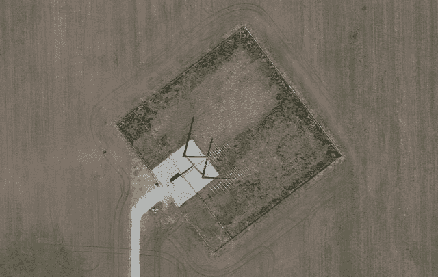

那看起来很有希望，所以我开车去了，并从上面航拍照片的底部道路上的这个角度拍了这张照片。

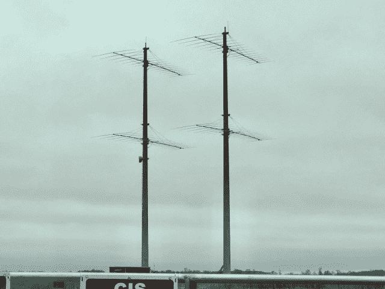

从最近的乡村道路看 wanatah 天线站点。

根据[联邦通信委员会（FCC）的数据库](http://wireless2.fcc.gov/UlsApp/AsrSearch/asrRegistration.jsp?regKey=2697146)，这两座塔高 160 英尺（49 米），根据[另一个 FCC 数据库](https://apps.fcc.gov/oetcf/els/reports/442_Print.cfm?mode=current&application_seq=66454&license_seq=67065)，它们装有四个大型对数周期天线。我从馈线可以看出，天线被配置为作为单个大型天线运行。许可证上显示有一个 10 千瓦的发射机，由于天线增益，有效辐射功率（ERP）为 768 千瓦。数据库还确认了你在航拍照片中肉眼能看到的：整个天线站点都是指向 50 度角，这个角度坚实的击中欧洲，因为天线的 26 度波束宽度。

在塔上有一个微波天线。联邦通信委员会（FCC）的许可证显示，塔的所有者拥有一系列三个微波中继站，向西通往伊利诺伊州奥克森林的一个地点。

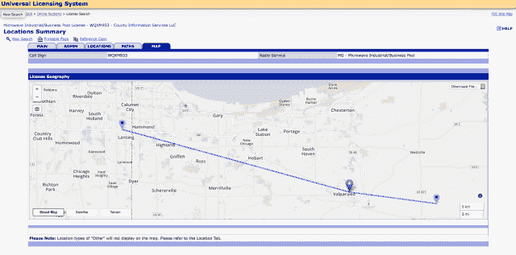

位于伊利诺伊州奥克森林的办公楼，Wanatah 塔的所有者的微波许可证在此处停止。

这是当地无线互联网服务提供商[UrbanCom.Net](http://UrbanCom.Net)的一个接入点，它还在 CME 旁边的塔上有一个天线。我猜测短波交易员只是从 UrbanCom 购买从奥克森林到 CME 剩下路径的带宽[*当我分析关于 Wanatah 设施的 FCC 文件时，我很惊讶地发现了一个我喜欢的人的姓氏，这就是我如何推断出背后是 County Information Services, LLC，他们建造了天线 —— SIM*]。

第二个地点位于艾尔班伊利诺伊州外面([41.926495, -88.499110°](https://www.google.fr/maps/place/41%C2%B055'35.4%22N+88%C2%B029'56.8%22W/@41.926495,-88.5012987,858m/data=!3m1!1e3!4m5!3m4!1s0x0:0x0!8m2!3d41.926495!4d-88.49911)). [这里的天线](http://www.datasheetarchive.com/pdf/download.php?id=5929674a837d08b565e6eb6c51022c2bc51d42&type=M)和其他的天线一样是日志周期天线，但它们的结构本质上不同。 instead of using rigid aluminum tubing, this antenna is made from comparatively thin wire that is pulled taut by ropes and springs. The ropes attach to tall supporting trusses and to ground anchors to hold them in tension. This style of antenna is difficult to photograph because the wire doesn’t need to be very thick. I’ve overlaid blue surfaces on the photo to show the planes of the two stacked antennas.

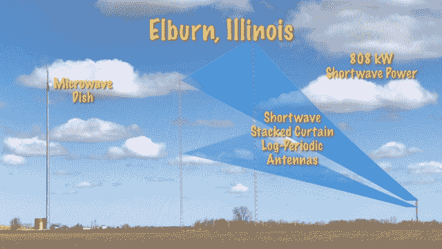

艾尔班附近伊利诺伊州短波交易天线站点。蓝色高亮显示天线导线的平面。

在[FCC 实验许可证数据库](https://apps.fcc.gov/oetcf/els/reports/442_Print.cfm?mode=current&application_seq=73823&license_seq=74541)的搜索显示，这个站点（由一家名为 10Band LLC 的公司）已经获得了一个 20 kW 发射机和 808 kW 的 ERP 的许可。短波天线指向 48º角度，而欧洲在 38

在这个地点明显有一个微波天线，但我还没有找到它的 FCC 许可证。但我已经能够通过沿着波束路径拍摄的照片的 GPS 坐标得到天线的朝向。它指向 CME。

*当鲍勃和我开始使用 FCC 数据库的坐标来绘制短波天线时，我的第一步是使用谷歌地球“观察”这些设施。对于艾尔班地点，这是无用的……*

，这个网站比谷歌地球更新得更频繁，而天线在那里：*

*通过查阅档案照片，似乎天线是在 2016 年 5 月之后在艾尔班建立的。我收到了另一张场地的照片，是由一个想保持匿名的人发送的。我真的不知道他是谁，但他有很多各种“高频交易”天线的照片，既有美国的，也有英国的……*

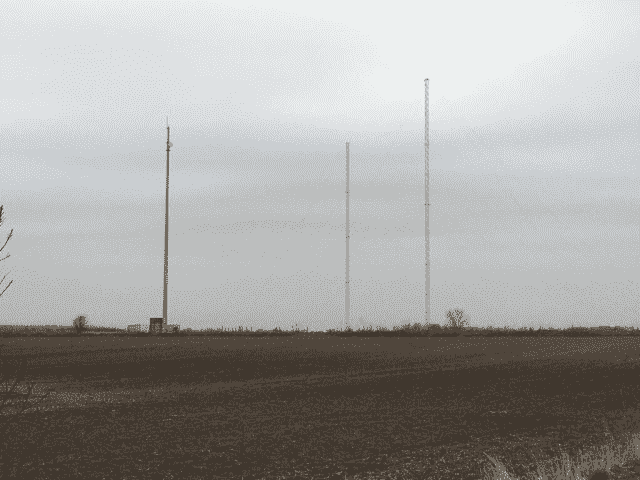

艾尔班，来自某人的图片。

*话说回来，鲍勃下面的图片更漂亮：*

艾尔班，图片来自鲍勃。

*最后但并非最不重要，像往常一样，我很想知道哪个交易公司隐藏在 10Band LLC 的名称背后。有人为我找到了，并发送了我这份” Kane County Property Tax Inquiry “ [链接](http://kaneil.devnetwedge.com/parcel/view/0724300005/2017)，我们可以在其中了解到，安装天线的场地在 2011 年以 1,338,325.00 美元的价格卖给了位于芝加哥的 10Band LLC 公司——当我看到地址时，我笑了——SIM] *

#### 你确定这些天线站点真的是用于短波交易，而不是太空外星人绑架者的信标或其他什么吗？

我将假设这些太空外星人绑架者不会为他们的信标在联邦通信委员会（FCC）那里申请许可。我在此记录的这些站点都获得了在可能横跨大西洋的短波频率上发射的许可。

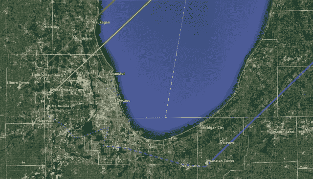

芝加哥周围的短波交易站点。实线是通往伦敦的路径。虚线是与 CME 的微波链接。

他们的短波天线都指向欧洲。他们都有与 CME 的微波链接。IEEE 光谱杂志关于短波交易的这篇文章深入链接到 FCC 数据库，揭示了拥有其中一个站点的交易公司的名称。

#### What’s next?

我正前往新泽西州数据中心周围地区，看看我是否能在那里找到短波天线。

#### Post-scriptum

[这里与短波交易无关，但多亏了鲍勃，我玩这个[网站](http://www.micronetcommunications.com/LinkRegistration/QueryResults.aspx)很有趣。在美国，联邦通信委员会（FCC）的数据库不包括毫米波的许可——毫米波频率通常比微波频率更稀疏，因此在城市环境中，毫米波很有趣。交易员在伦敦和芝加哥都使用毫米波。我在奥罗拉周围搜索了所有的毫米波许可，得到了一个以这个开始的冗长列表：*

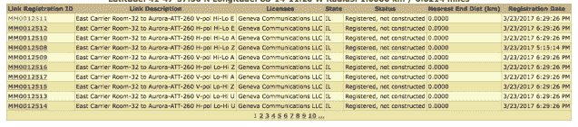

*无聊，但我点击了* kmz *按钮，得到了一个非常惊人的谷歌地球地图（点击放大）：*

Aurora <-> Cermak

*这张地图展示了从奥罗拉（CME）到塞马克（ICE）的所有毫米波许可——包括远离两个数据中心直线的老许可。视线是黄色的，第一个费涅耳区是红色的.*

*然后我搜索了（新泽西州）股权三角（Mahwah-Secaucus-Carteret）的许可。从上面看，三角形看起来像这样…*

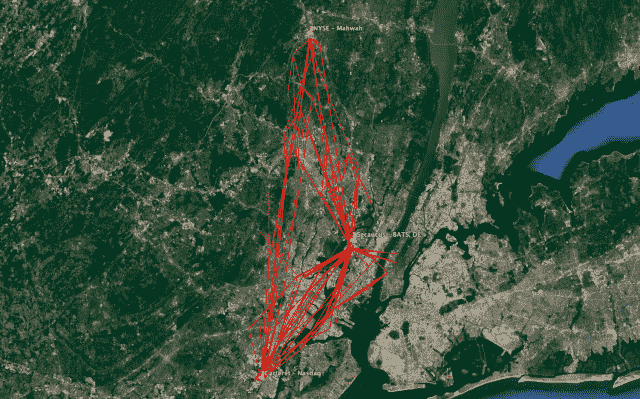

The Equity Triangle

*…但更令人愉快的是仔细观察：*

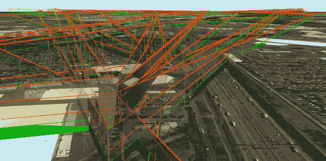（[点击此处](https://sniperinmahwah.wordpress.com/wp-content/uploads/2018/06/capture-d_c3a9cran-2018-06-07-c3a0-12-44-11.png)）

从卡特雷特（位于底部）的股权三角形毫米波网络

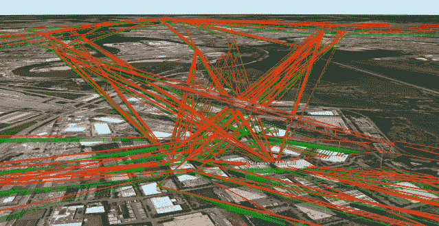（[点击此处](https://sniperinmahwah.wordpress.com/wp-content/uploads/2018/06/capture-d_c3a9cran-2018-06-07-c3a0-12-29-55.png)）

从泽西市（位于底部）的股权三角形毫米波网络

*顺便说一下，我向中国的老板猫打招呼！也许这只猫就在我后院用无人机拍摄的这个 2160p 视频中：*

股权三角形毫米波网络视频（[点击此处](https://www.youtube.com/embed/e7ocPoizZGM?version=3&rel=1&showsearch=0&showinfo=1&iv_load_policy=1&fs=1&hl=en&autohide=2&wmode=transparent)）

视频

*那就这样吧——SIM*
