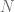

<!--yml

类别：未分类

日期：2024-05-17 23:42:27

-->

# 扰动的 Sobol 序列 – HPC-QuantLib

> 来源：[`hpcquantlib.wordpress.com/2011/05/11/pricing-asian-options-using-scrambled-sobol-sequence/#0001-01-01`](https://hpcquantlib.wordpress.com/2011/05/11/pricing-asian-options-using-scrambled-sobol-sequence/#0001-01-01)

[1][2]的作者们提出了一种有效创建扰动 Sobol 数的方法，并展示了他们的扰动算法可以导致显著更高的收敛速度。即将推出的 CUDA 4.0 版本提供了[2]概述的扰动算法的实现。

目标是现在比较 PRNG（梅尔塞纳-特怀斯勒）、QRNG（Sobol）和这个扰动的 QRNG 在几何亚洲期权组合定价中的收敛阶数。基准组合中亚洲期权的观察日期数量在 45 到 120 之间。定价问题的维度相当大。我们将使用布朗桥来构造路径。这确保了 Sobol 序列的第一个坐标用于采样最重要的模式。

错误分析并非易事。简单地应用另一个随机移位是不够的，因为这种变换改变了点集的偏差（一个移位后的（t,m,d）-网不一定是一个（t,m,d）-网）。在[3]中，这个问题通过关注 RMS 相对误差来克服。

是一组基准期权的真值价格，由给出，蒙特卡洛近似由给出。

我们特别关注 PRNG、QRNG 和扰动的 QRNG 误差之间的比率以及收敛阶数。对于 PRNG，我们预计收敛阶数为，其中且是路径数量。

如图所示，扰动的 Sobol 序列提供了最小的总体误差界限，但扰动与非扰动的 Sobol 序列的收敛阶数并无显著差异。由于实现起来几乎不费吹灰之力，所以绝对值得一试扰动的 Sobol 序列。

C++和 CUDA 代码可以在[这里](http://hpc-quantlib.de/src/scrambled.zip)找到。它依赖于[QuantLib 1.1](http://quantlib.org)和[CUDA 4.0](http://www.nvidia.com/object/cuda_home_new.html)。如果你想在 C++程序中直接生成图表，你还需要[R](http://www.r-project.org/)、[RCPP](http://cran.r-project.org/web/packages/Rcpp/index.html)和[RInside](http://cran.r-project.org/web/packages/RInside/index.html)。

[1] J. Dick, [高阶混沌数字格达到平滑被积函数的根均方误差最优率](http://arxiv.org/abs/1007.0842). ArXiv, 8 July 2010.

[2] A.B. Owen, [带混沌格子的局部反向抽样](http://arxiv.org/pdf/0811.0528). ArXiv, 28 May 2008

[3] P. Glasserman, 金融工程中的蒙特卡洛方法. ISBN-0387004513
