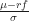
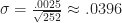
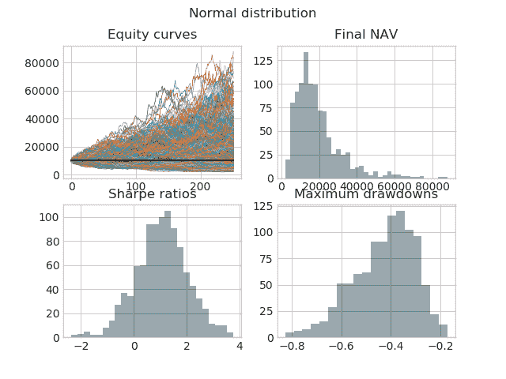
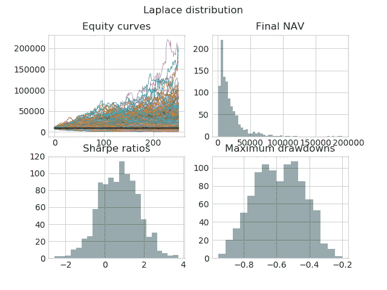

<!--yml

分类：未分类

日期：2024-05-18 13:59:33

-->

# 夏普比率 > 1 : 小心你渴望的东西 —— 量子金融家

> 来源：[`quantumfinancier.wordpress.com/2018/06/02/sharpe-ratio-1-careful-what-you-wish-for/#0001-01-01`](https://quantumfinancier.wordpress.com/2018/06/02/sharpe-ratio-1-careful-what-you-wish-for/#0001-01-01)

我最近有幸与来自[Resolve Asset Management](http://www.investresolve.com)的各位好友相聚。我们讨论的一部分集中在两个世界之间的区别。正如你可以想象，props 交易与机构资产管理相当不同。然而，对我们两人来说，一个特别感兴趣的话题是是如何管理预期。在他们那边，你可以想象，为了成功，确保客户对应该合理预期的结果范围有很好的理解是很重要的。在我的世界里，同样重要的是要有一个很好的想法，即具有特定回报统计特征的交易在实践中可能看起来如何。

人们通常会关注的一个性能指标是夏普比率 。现在长期关注这个博客的读者对我对这个指标的厌恶应该不陌生，但请耐心听我说一会儿。在资产管理行业中，寻求夏普比率大于 1 是很常见的。那样的一份样本比率将是一个极好的卖点。然而，我主张大多数人实际上并不知道交易这样的策略会实际看起来和，最重要的是，感觉会怎样。让我们诚实一点，虽然我们大家都喜欢试图以一种完全无情感的方式接近市场，但在实践中这种情况很少见。回撤令人心痛，并且是经历策略所必须承受的精神痛苦的很好的指标。在 props 方面，回撤是当你开始怀疑策略并想知道它是否不再有效的时候，而在资产管理领域，你也会经历同样的情况，但更糟糕的是，你还得处理客户电话和赎回请求等。

这次讨论让我想看看，给定一个夏普比率为 1.0 的回测策略，统计上合理经历的东西会是什么。为此，我创建了一个包含 1000 个样本的数据集，这些样本是平均每天收益 25 个基点，标准差为  的 252 天日收益。你可以把它想象成你有 1000 个不同的策略，都有传说中的 1.0 夏普回测。这些样本代表了一年后潜在的样本外结果。

-   在下面的图表中，你可以找到（起始资本为 10,000 美元）各个股票的权益曲线、期末净资产价值（NAV）的分布、夏普比率的分布，以及最大的回撤。请记住，这里的每一个都来自一个回报分布，其平均夏普比率为 1。其中一些表现非常糟糕，甚至会让最有决心和纪律的交易者感到沮丧。大幅回撤出现的频率要比我预期的要高得多。你呢？

-   此外，这一假设是基于策略回报呈正态分布的。如果我改用拉普拉斯分布来进行同样的分析（这种分布也是对称的，但与正态分布相比尾部更厚）），你可以看到下面的平均夏普比率仍然约为 1，但结果却大相径庭。特别是注意期末净资产价值（NAV）的厚右侧尾部和最大回撤分布的巨大变化。

-   我想强调的是，为了正确地设定预期，考虑一个广泛的成果范围是至关重要的。上面简单的分析显示，即使结果完全符合回报的模拟分布，它可能也不像你预期的那样好。最后，正态分布和拉普拉斯分布之间的比较也表明，在评估表现时，考虑的不仅仅是前两个瞬间是很重要的，夏普比率（或索提诺比率）也是如此。一个值得探究的好选择是[欧米伽比率](https://en.wikipedia.org/wiki/Omega_ratio)，它定义为某些阈值回报目标下，收益与损失的概率加权比率。
