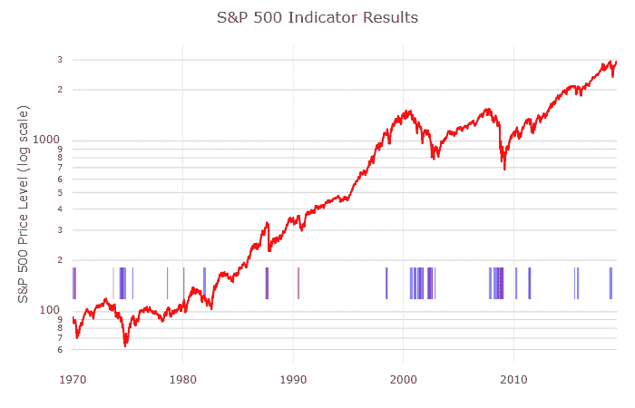

<!--yml

分类：未分类

date: 2024-05-12 17:43:18

-->

# 闪亮的新玩具 | CSSA

> 来源：[`cssanalytics.wordpress.com/2019/05/14/shiny-new-toys/#0001-01-01`](https://cssanalytics.wordpress.com/2019/05/14/shiny-new-toys/#0001-01-01)

大家好，好久不见，但我们有一些闪亮的新玩具正在制作中。行业内的当前趋势以及与数据科学家的合作使我成为了一个相信使用机器学习方法的信徒。我一直在这篇博客上提倡“无理论”的方法，只要它们是以健壮的架构设计的。相比之下，对过于简单的理论和规则的严格遵循对于像股市这样的复杂系统来说并不是最优的。在经历了许多年被传统指标来回摆动的日子后，最近我像《哲学经济学》([看看这篇精彩的文章](http://www.philosophicaleconomics.com/2016/01/gtt/))一样确信，你需要有一个模型（们）来提供对市场回报/风险的洞察，而不严格依赖基于价格的指标。一个真正的宏观经济模型有助于衡量可能不在当前价格中存在的风险，并有助于减少对虚假警报的价格运动的依赖。预测衰退对于宏观模型来说并不一定是最有用的，因为 1）你可以有熊市而没有衰退，2）你也可以有衰退而没有熊市。此外，你还可以有既不是熊市也不是衰退的大幅且具有破坏性的调整。因此，**预测回调**可能是更有趣且实用的练习。

# S&P 500 指标系列

（[点击这里](http://lr-economics.herokuapp.com/)）

标普 500 指标系列是使用机器学习预测模型，利用 1）宏观经济 2）情绪 3）技术或 4）季节性数据，以及非常广泛的指标/输入来进行投资决策。

**S&P 500 经济预测模型简介**

**S&P 500 经济预测模型**采用了一种[梯度提升模型](https://en.wikipedia.org/wiki/Gradient_boosting)（GBM），利用经济数据来预测标普 500 指数在未来 90 天内的回报分布。GBM 是一种机器学习方法，可以用于回归或分类。

标普 500 经济预测模型是一个分类模型，用于预测 90 天内股票市场回调（中等或大幅调整）的可能性以及回报方向（正、负或持平）。输入变量是月度汇总宏观经济数据的衍生品，不包括基于价格或技术数据。选择分类模型的原因是股票市场由广泛的自然非线性变量驱动。此外，值得注意的是宏观经济变量只是解释股票市场回报波动的一个组成部分，通过使用分类器，我们避免了许多回归模型在未观察特征上的问题。

该模型本身是基于 GBM 风格模型的集合（具体使用了[XGBoost](https://xgboost.ai/)库）。选择了大量的输入宏观经济数据系列（参见[模型重要性](http://lr-economics.herokuapp.com/sp500_econ_model/#model_importances)列表）并转换以创建衍生时间序列。鉴于月度经济数据仍然相对稀疏（60 年的回测数据 x 12 个月/年），我们想要选择一种不需要大量数据，但仍然非常灵活的模型技术。因此我们排除了诸如逻辑回归和神经网络等替代模型。

在试图匹配类似时期的 GBM 模型中，使输入值在某种意义上“可比较”是很重要的，因此原始值在大多数情况下是不合适的。否则，模型可能会简单地使用这些值来记住它在时间上的位置，这并不会有很好的泛化效果。相反，将值转换为相对值（即年度百分比变化，或对数正态差异）。在严格的统计意义下使输入值平稳并不是必要的，但这有助于最大化模型的普遍性。

模型使用 k 折训练算法进行训练，使用贝叶斯优化程序选择超参数（树深度、学习率等）。再次这样做是为了最大化准确性和普遍性，同时避免过拟合。

模型的输出是一个分数，然后优化以最大化[马修斯相关系数](https://en.wikipedia.org/wiki/Matthews_correlation_coefficient)，这可以被认为是非平衡分类集（训练数据中就是）的一个鲁棒性准确度度量。

下图中展示了模型结果随时间的变化。蓝色和红色的条形图分别显示了我们预期会出现 10%+（中等调整）或 15%+（大幅调整）的时期*从那个时期结束之日起*。

关于这个模型，很快就会有更多内容，包括预测输出的每周模型更新。
