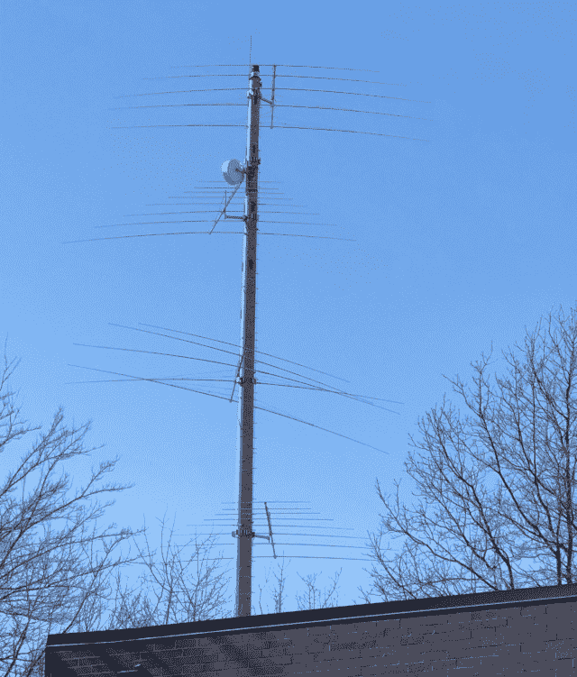
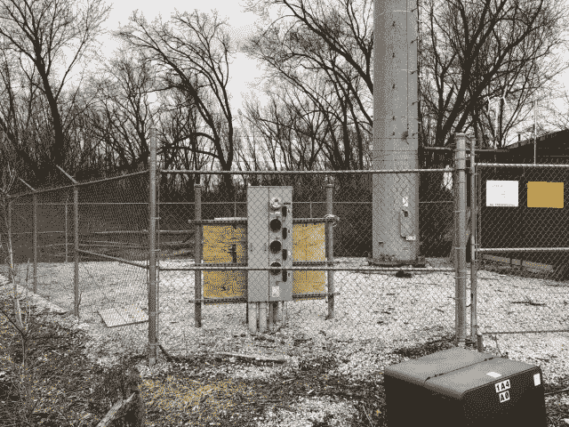
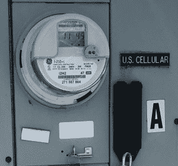
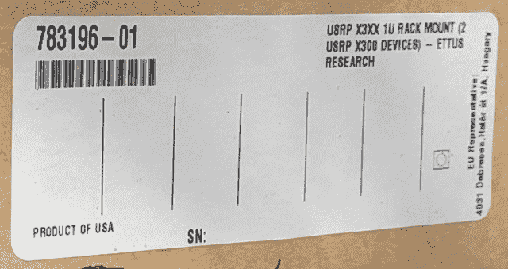
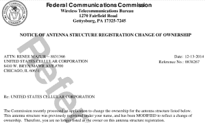
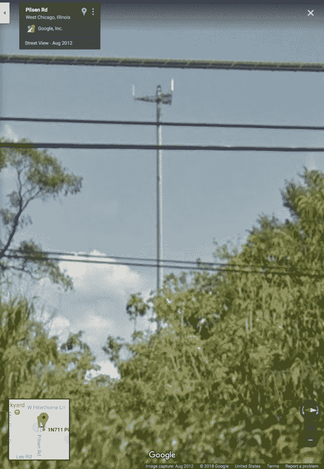
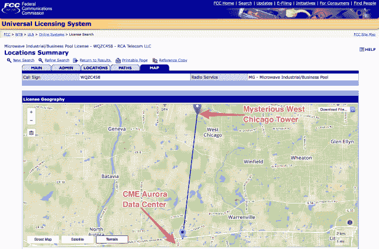
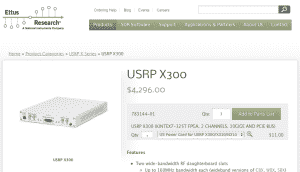
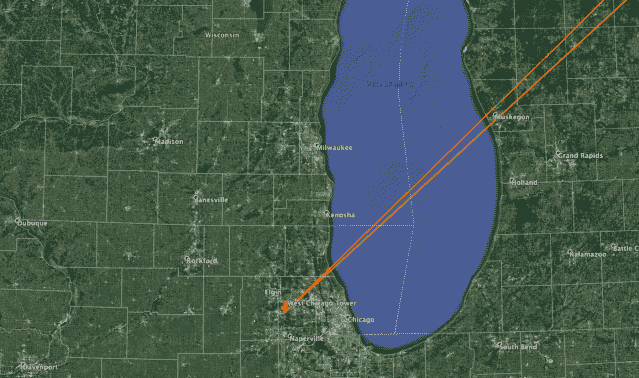
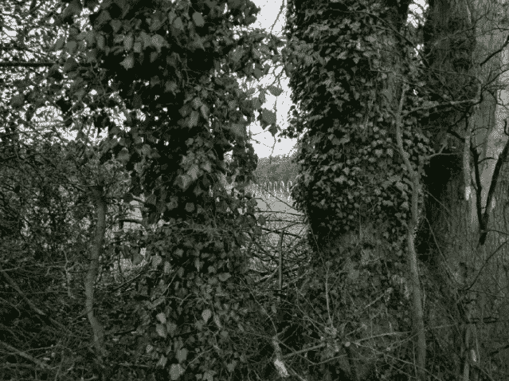

<!--yml

category: 未分类

date: 2024-05-18 14:07:33

-->

# 短波交易 | 第一部分 | 西芝加哥塔之谜 —— 由 Mahwah 狙击手及其朋友们撰写

> 来源：[`sniperinmahwah.wordpress.com/2018/05/07/shortwave-trading-part-i-the-west-chicago-tower-mystery/#0001-01-01`](https://sniperinmahwah.wordpress.com/2018/05/07/shortwave-trading-part-i-the-west-chicago-tower-mystery/#0001-01-01)

自 2014 年以来，本博客详细报道了由高频交易（HFT）公司或网络提供商构建的无线网络，以降低世界各地不同交易所之间的延迟（市场制造商需要快速连接以管理风险，新闻交易员也需要快速，等等）。这场关于微波的史诗般的调查始于*《后院的高频交易》（https://sniperinmahwah.wordpress.com/2014/09/22/hft-in-my-backyard-part-i/）*，我目前正在写的书中将全面报道（目前是法语）。由于我忙于写作（以及其他更有趣的市场结构相关事务），我并没有真正有时间去了解我所听说过的“短波”或者“高频”无线电。这是高频交易公司可能使用短波无线电直接连接相隔甚远的地点的方式（简而言之，交易员愿意使用短波穿越海洋，以低于任何光纤的延迟——比如 Hibernia）。

但最近我获得了更多关于这种情况的情报（还有一些有趣的趣闻）。在美国的帮助之下，我发现一家公司购买了一个场地，以建造发射塔和天线，花费超过一百万美元；在欧盟的帮助下，我得到了关于德国的线索；我查阅了英国公共记录。去年三月在阿姆斯特丹，我还遇到了那些项目相关人员。不出所料，至少有五家 HFT/市场制造商公司出现在他们用来隐藏的壳公司/名称背后。都是一些老面孔。最近，我收到了来自芝加哥的鲍勃的来信，他决定调查自己后院里的“短波”网络。今天，我很高兴地在这个博客上邀请鲍勃作为新嘉宾作家。这个“短波交易”系列的第一部分与鲍勃在芝加哥的[STAC 峰会](https://stacresearch.com/spring2018CHI)上谈论他的发现同时发布。接下来的部分将很快发布。

我是鲍勃·范瓦尔萨，目前在芝加哥两家高频交易公司担任性能工程师，目前处于工作之间的“休假”状态。最近，我在伊利诺伊州西芝加哥的一个网站上偶然发现了短波交易的第一个证据，然后运用联邦通信委员会（FCC）数据库研究技术，找到了另外两个地点。通常，与雇主的保密协议会阻止我谈论这些，但在休假期间，与交易相关的发现都属于我个人。我的研究结果可能会引起一些人的兴趣，因此我愿意在这个博客上做一些客座文章。我将在七月再次“安静”下来，因为我回去工作了。

人们可能会合理地假设“西芝加哥”只是伊利诺伊州芝加哥市西部的一部分。实际上，它是一个[独立的市](https://en.wikipedia.org/wiki/West_Chicago,_Illinois)，位于大城市西边约 20 英里处。一个典型的周末，我会骑自行车沿着附近的一条自行车道骑行。三月份，泥泞的路径条件使我不得不绕道通过西芝加哥的一个工业区，那里就是西芝加哥塔谜团的发源地。我从车把上抬头望去，看到了这座塔。

神秘的西芝加哥塔，2018 年 3 月 10 日。

我是一名业余无线电操作员，“火腿”（KE9YQ），那四根又大又显眼的天线看起来很像火腿们用来跨越大洋进行通信的天线。在这里我称它们为短波天线，但铝制风水学（天线设计）的实践者会认出它们是日志周期天线。在顶部的两根短波天线之间还有一个微波天线。这些信息仅凭观察就能得知。

你每天看到的绝大多数无线电塔都是移动通信塔。美国有 215,000 座。它们与其他无线电塔的区别在于，它们几乎总是会有一个或多个三角形的结构，每面三角形上都有三个或更多的方向性天线。一个由移动通信塔组成的网格覆盖了一个大致六边形的区域，这样你就能在任何地方都获得良好的信号。

西芝加哥塔没有三角结构，所以我敢肯定它不是一座移动通信塔。而且这些天线比普通移动通信塔的天线要大得多。我 literally 能在半英里外看到它们。有些移动通信塔确实在难以将光纤引入场地时会配备微波天线，但在我看来，短波天线和微波天线似乎不太搭配。

**谜团#1：如果不是一座移动通信塔，那它是什么？**

好奇心驱使我骑车来到塔的底部四处查看。和所有的移动通信塔一样，有一个带刺铁丝网的围栏，我看到一个电表，电力从那里进入场地。这个面板可以容纳最多四个电表，因为两个或更多的运营商共享一个场地是很常见的。为每个运营商还设有一个主电源开关，这样他们就可以在维护时关闭自己的电源，而不会将其他运营商的通信信号中断。

这座塔的基座和外围围栏。

现场唯一的电表。

我径直走到围栏跟前，拉近镜头查看电表。上面写着“[U.S. Cellular](https://en.wikipedia.org/wiki/U.S._Cellular).”他们确实是一家区域性移动运营商，但只服务于美国的 23 个州，不希望信号跨越任何海洋。

**谜团#2：为什么一家区域性移动运营商要支付跨越海洋的电力费用？**

在一个炎热的天气里，我可能会在基站下阴影处停下来喝口水，所以我看到了很多基站的样子。围栏内通常有一个小建筑物，用来容纳运行基站设备。围栏内的地面通常是粗碎的石头，以防止杂草生长。

这个“基站”的一个奇怪之处在于，它在围栏内有垃圾堆。基站是无人值守的，不需要太多维护。在那里工作的员工通常会把现场清理干净，把他们的垃圾带走。这个地方没有垃圾收集，所以看起来很奇怪，为什么会有装满午餐包装纸和纸板箱的垃圾桶。如果这是一个基站，那么它是由比我通常看到的要粗心的员工维护的。

垃圾堆中的一个盒子引起了我的注意，所以我穿过围栏放大镜头，用我的 iPhone 拍下了标签的最佳照片。我从未听说过该公司[Ettus Research](https://www.ettus.com)或[USRP X300 设备](https://www.ettus.com/product/details/X300-KIT)。世界上所有的基站，你会认为它们是由现成的零件制造的，而不是在研发实验室里研制的东西。

垃圾堆中一个有趣盒子的标签。

**谜团#3：为什么一个基站需要研究公司的设备？**

大多数带有塔的基站都会有一个带有七位数字的标志，这个标志被称为 FCC 天线结构注册（ASR）号码。如果你是一个细胞运营商，正在寻找一个放置天线的好地方，你可以使用这个数字来查找塔的高度，并从 FCC 数据库中获取其他有用的信息。我想当我回家的时候可能会用到这个数字，所以我拍了一张照片。

美国细胞公司在 2014 年出售了这座塔。

回到家后，我调用了 FCC ASR 数据库，发现这座塔确实是由美国细胞公司在 2009 年建造的。再深入挖掘，我还发现他们于 2014 年底将其出售的记录。这种交易在业内相当常见。随着用户的来来去去，细胞运营商不得不移动他们的基站，并不断调整天线的高度，以保持良好的覆盖。

谷歌街景是一个查看世界过去的绝佳工具。我从 2012 年 8 月的视角找到了这座塔的照片，那时它已经被清空了所有的细胞天线（它们有回收价值!),只剩下塔顶的三角安装结构。

2012 年 8 月，这座塔看起来是这样的。

所以这部分历史变得清晰了。这座塔是由美国细胞公司在 2009 年建造的，但在 2012 年之前不久就停止使用了。它最终在 2014 年底被出售。

像现在的手机基站一样，塔站被[Vertical Bridge](http://www.verticalbridge.com)，一家天线站点管理公司收购。与拥有天线站点本身不同，现在似乎常见的做法是，运营商只是在由管理公司拥有天线站点的塔上租用空间。所以这并不能真正说明塔当前的所有权或使用情况。

**谜团 #4：那条微波链路的另一端在哪里？**

微波链路需要进行操作的许可证，所以我回到 FCC 数据库，查找与那座塔相关的许可证。每个许可证都给出了链路两端 GPS 坐标，FCC 还有一个有用的映射功能。它显示了西芝加哥塔和芝加哥商业交易所附近的另一座塔之间有一条直接链接！这还是间接证据，但这是最早的线索，表明西芝加哥塔与交易有关。这座塔越来越不像是被间谍使用。

CME 和西芝加哥塔之间的微波连接的 FCC 地图。

顶级软件定义无线电。

**谜团 #5：垃圾堆里的那个箱子里有什么？**

谷歌详细解释说，Ettus Research 是软件定义无线电（SDR）的主要提供商。这些是你需要制作任何类型的定制无线电的设备。只需更改软件，你就可以发送语音、图片、视频或交易信息。箱子里的是他们的顶级型号，带有 FPGA、两个 10 千兆以太网端口和 PCIe 总线接口。箱子里的一对成本接近 10,000 美元。你在手机基站不需要这样的设备。

**谜团 #6：跨越大西洋还有什么有趣的？**

我在交易的技术方面要比理解如何通过交易赚钱做得更好。但似乎合理的猜测是，CME 市场上的价格与英国 Slough 和德国法兰克福等欧洲市场的活动相关。所以我启动了谷歌地球，并绘制了无线电信号在西芝加哥和伦敦、法兰克福市场之间必须穿越的线路。

西芝加哥和欧洲市场之间的最短路径。

我们习惯于看到地球的平面投影，因此一个芝加哥人可能会认为欧洲位于芝加哥的东部。但实际上到欧洲的最短路径是向东北方向，大约呈 45 度角。

对于无线电来说，欧洲位于芝加哥的东北方向。

这个角度很重要，因为塔上的这些短波天线是方向性的。如果你知道你想和欧洲通话，为什么还要把任何信号发送到关岛呢？方向性短波天线将你的信号聚焦在天线尖端的指向方向。在上面塔的照片中，我站在顶部天线指向路径的正下方。

在短波频率上，很难制作出窄波束宽度的天线。当你从芝加哥瞄准时，伦敦和法兰克福之间的距离大约只有 5º，所以一个天线应该能覆盖这两个城市。这让人好奇为什么这座塔需要四个短波天线，而且都指向基本相同的方向。

塔上的某些天线信号聚焦很好，产生更强大的信号，但只在短波频率的狭窄范围内运行。其他的天线在广泛的频率上运行，但不能产生强信号。

较低的两个天线已经从塔上移除。

看起来从底部向上数的第二个短波天线在风暴中受损，或者可能安装不当，因为其五个元素中的四个已经显著偏离水平面。尽管如此，当我几周后访问现场时，发现较低的两个天线已经被移除，我还是感到惊讶。所以这个网站在 2018 年春天正在积极开发中。他们正在移动天线，还没有清理垃圾堆，所以还有工作要做。

综合来看，我发现了这座西芝加哥塔拥有制作低延迟跨大西洋市场连接所需的所有要素。我还发现了芝加哥附近另外两个拥有指向欧洲的大型短波天线和到 CME 的微波链路的大型网站，所以这场比赛不止有一匹马。我会在未来的文章中记录这些网站。东海岸也存在许可。我将在 6 月中旬的旅行中寻找它们。FCC 的搜索还发现了在阿拉斯加安克雷奇的许可，它位于 CME 到东京的路径上[*Sniper 的注释：*这让我想起我最近没有检查过围绕 Go West 发生了什么]。观察者已经开始寻找伦敦和法兰克福周围的天线。

英国斯劳附近，2018 年 3 月

短波不是万能的。它不可靠，昂贵，且带宽非常低。想想拨号上网的速度。但在延迟方面无法匹敌。我计划在未来的文章中详细讨论短波的权衡。你可能会想知道是否有人能够接收他们的信号，或许能更快地将订单发送到市场。是的，任何人都可以接收，但发送者如果不用一种无法破解的方式加密信息那就太愚蠢了。这很容易做到，而不会影响性能。

一条泥泞的自行车道让我偏离了常规路线，我偶然发现了这座塔。作为一个无线电爱好者，我认出了短波天线。我看到了潜力，因为我曾在交易领域工作过。我现在处于休假状态，所以我可以公开谈论我在交易方面发现的内容——我刚刚整理了公共记录、照片、地图、背景信息，并加入了我自己的分析，其中有些灵感来自于这个博客对[微波网络](https://sniperinmahwah.wordpress.com/2014/09/22/hft-in-my-backyard-part-i/)的调查方式。我下次的帖子将描述微波、短波、光纤和卫星之间的区别。请保持关注。

在美国 Kane County 的某个地方，2018 年 4 月 8 日
