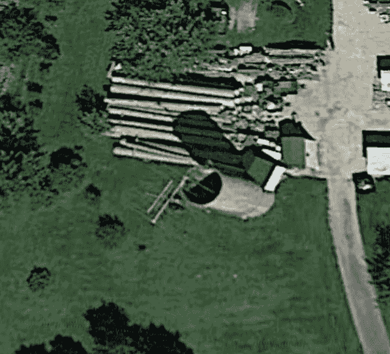

<!--yml

分类：未分类

日期：2024-05-18 14:08:22

-->

# Shortwave Trading | Part III | Fourth Chicago Site, East Coast, Patent, Regulation, and Farmer Kevin Mystery – Sniper In Mahwah & friends

> 来源：[`sniperinmahwah.wordpress.com/2018/07/13/shortwave-trading-part-iii-fourth-chicago-site-east-coast-patent-regulation-and-farmer-kevin-mystery/#0001-01-01`](https://sniperinmahwah.wordpress.com/2018/07/13/shortwave-trading-part-iii-fourth-chicago-site-east-coast-patent-regulation-and-farmer-kevin-mystery/#0001-01-01)

* * *

*[以下是鲍勃·范瓦尔萨系列的第三部分：“短波交易”。这次我没有太多评论，因为我正在休假。一旦鲍勃的休假结束，我会覆盖欧洲的 HF 站点。快乐阅读，感谢鲍勃带来这一新章节。亚历山大。]*

* * *

我听说多年前，有一个稳定的业务是向地方政府出售微波数据无线电，用于办公室网络。然后交易员发现了微波，无线电供应商的业务随之改变。他们的新客户并不太关心成本——他们只是想要无线电和中继器中尽可能低的时延。

我注意到其他行业领域的供应商现在也看到了短波交易引起的业务激增。例如，[TCI](https://www.tcibr.com/) 已经制造短波天线半个世纪了。然后在 2018 年 4 月，他们发布了一份[新闻稿](https://www.tcibr.com/tcis-hf-antenna-business-still-strong-after-50-years/)，称他们现在正在与“非政府客户合作，提供最小化时延的 HF 天线通信系统。”

彭博社已经[报道了短波交易的故事](https://www.bloomberg.com/news/articles/2018-06-18/hft-traders-dust-off-19th-century-tool-in-search-of-market-edge)，翻查公共记录，揭露了我之前在一篇帖子中描述的一个站点的所有权。这似乎是一个热门话题！

在这篇文章中，我将展示一些最近的站点变化，记录下我发现的第四个 CME/欧洲短波交易站点，详细介绍我沿东海岸旅行时的发现，讨论监管问题，涵盖两个关于短波交易的专利，还有一些其他杂项内容，最后解释萨克斯风演奏的羊农与短波交易之间的联系。这篇文章很长，主题多样，如果你不感兴趣，请直接跳到下一部分。

### 快速变化的领域

在偶然发现原始西芝加哥短波交易网站后，通过查看 FCC 的实验许可证数据库，我找到了其他网站。关于这些许可证的详细信息稍后介绍，但你可以从名字猜到，持有这类许可证的人预计会做一些实验。我相信有很多技术和商业实验是我们看不到的，但天线的变化是难以隐藏的。考虑一下自我在四个月前发现它以来，西芝加哥塔站发生了什么。

四个月内，西芝加哥塔上的天线演变。

我从未打算记录时间的变迁，所以我的相机角度并不完全相同，但我仍然尝试通过裁剪和放大来进行公平的对比。变化用更窄的带宽天线替换了较宽的短波天线，并加强了将天线固定在塔上的安装系统。新天线的臂长几乎是之前天线的两倍，使它们获得更多的增益。在我看来，他们决定使用更窄的频率带宽，并需要更多的力量，这可以转化为更好的可靠性或更高的吞吐量。短波交易似乎是一个快速变化的领域。

我有一种预感，贸易公司不是在没有借鉴他人经验的情况下进入这个领域的。今年 4 月，我在参观西芝加哥场地时，注意到围栏上贴着一份建筑许可证。

西芝加哥塔场周围的围栏上贴着建筑许可证。

进行这项工作的承包商列为“长波”，可能是[长波战略通信](http://www.longwaveinc.com)。他们似乎在为全球政府建造短波站点方面经验丰富。当我问他们是否知道有关西芝加哥的塔时，他们没有发表任何评论。

### 第四个芝加哥/欧洲天线站点

联邦通信委员会（FCC）的实验许可证数据库显示，6 月 6 日在伊利诺伊州的枫叶公园颁发了一份新的许可证](https://apps.fcc.gov/oetcf/els/reports/442_Print.cfm?mode=current&application_seq=83686&license_seq=84556)，距离 CME 在 Aurora 的数据中心不到 16 英里。谷歌地球显示几座建筑物被玉米田环绕，我可以看到一些模糊的形状，那可能是一个短波天线，它附着在一个老式的农场粮仓上的塔上，所以我感到很感兴趣。

来自拥有 FCC 实验短波许可证的网站的引人入胜的空中图像。

我搜索了该地址，并了解到这个网站是[TowerWorks, Inc.](http://towerworks.net/aboutus.htm)的所在地，他们是一家“通信塔专业公司”。现在回顾上面这张图片，我能理解图片中粮仓上方的灰色和黑色区域。起初我以为那是覆盖着遮阳布的圆柱形草料堆的阴影。但在一个塔公司的背景下，我猜测那些是单柱塔段。用起重机将这些塔段堆叠两三层在一起，您就可以建立一个很好的天线放置位置！

经过一番更深入的谷歌搜索，我找到了[一份有趣的文件](http://www.countyofkane.org/FDER/Zoning%20Petitions%20Documents/Petition%20af-2017-0355.pdf)，该文件于 2017 年 6 月 17 日提交给了当地规划委员会。这份手写的申请请求土地的特殊用途，以储存塔段、为客户增加一座塔，以及“男士玩具”。

我参观了该网站，并发现了我所预期的模式。几座巨大的短波天线指向欧洲，一座微波天线指向 CME。与西芝加哥一样，我认为我看到了一个窄带、高增益的天线，以及一个更宽带、低增益的天线。

我在第四个网站上发现了与 CME 在欧洲的联系。

在过去，所有芝加哥和纽约之间的交易都是通过光纤完成的。但在现代，竞争性的交易公司似乎使用自己的微波网络，或者使用[麦凯兄弟](https://www.mckay-brothers.com)的网络。看到这种转变，我开始思考短波交易的将来。对于只有少数顶级交易公司进行的疯狂实验，还是成为任何认真参与跨洋交易的参与者的实际“入场费”？在找到一个独立的、与之前三个不同的 CME/欧洲网站后，我认为是后者。

与短波通信的一个显著区别是，单个站点上没有足够的带宽进行共享。由于一个微波链路可以提供数百兆比特的带宽，麦凯可以提供“专用带宽”服务，其中链路总带宽的一部分是出售的。即使这种商业模式对短波来说不太可能行得通，[昆西数据](https://www.quincy-data.com)（麦凯的一个子公司）的市场数据分布模型可能会奏效。关于这一点下面还会详细讨论。

### 东海岸侦察和演讲之旅

一份 FCC 实验许可证可以涵盖从几个地点发射。因此，我最初对 CME 在 Aurora 数据中心 100 英里内的短波许可证进行的搜索也发现了沿东海岸甚至阿拉斯加的发射位置。我使用谷歌街景查看了阿拉斯加许可区域的周围情况，但没有找到任何天线。

尽管如此，东海岸仍有许多天线站点，我答应在纽约的[STAC 峰会](https://stacresearch.com/spring2018NYC)上谈论短波交易。我一直想看看华盛顿特区的博物馆，所以我的休假似乎是一个自然的时间租一辆车去东海岸参观天线站点。如果没有 GPS 导航，我无法想象在八个小时的驾车穿越陌生地区时我会犯多少个错误。

计划前往持有实验许可证的东海岸站点进行访问。

正如芝加哥人和纽约人都有自己喜欢的披萨风格一样，我开始认为他们也有一种自己喜欢的短波交易风格。由于巴尔的摩和华盛顿特区的许可证很早以前就过期了，所以我并不真的期望在那里找到任何活跃的东西。然而，2011 年过期的一个许可证覆盖了一个仍在运行的芝加哥地区天线，所以我认为寻找链路的另一端是值得的，但最终没有找到。

此次旅行中出现的一个普遍结论是“首先建设芝加哥”。我在芝加哥找到的几个允许在东海岸传输站点的许可证，但我没有发现任何一家在芝加哥和东海岸都有运营的公司，即使他们有这样做许可证。

来自海洋彼岸的信号比来自城镇彼岸的信号弱数亿倍，因此在决定放置接收天线的位置时，电气噪声是一个很大的考虑因素。人们喜欢围绕自己放置电气噪声大的机器（如汽车、电脑、剃须刀等），因此我并不惊讶在像新泽西州的 Secaucus 这样人口密集的地区找不到天线。

一个伪装良好的蜂窝塔。

我对在新泽西州马瓦希州界对面的纽约州韦斯利山的一个人口较少的地区找到一个天线站点抱有更大的希望。我在那里除了在树林中间的一个伪装良好的蜂窝塔外没有找到任何东西，但这个站点与芝加哥西部的塔是在同一许可证上，所以我感觉我必须去参观。

### 新泽西州阿尔派恩天线站点

到目前为止访问的所有站点都位于 FCC 的实验许可证上，但我得到了一个关于可能与交易有关的东海岸短波广播许可证的提示。短波广播的黄金时代早已过去，但这个新电台在 2017 年 8 月[获得了建设批准](https://transition.fcc.gov/Daily_Releases/Daily_Business/2017/db0802/DOC-346036A1.pdf)。

与过去的短波电台不同，这个许可使用了一种名为[数字无线电全球](https://en.wikipedia.org/wiki/Digital_Radio_Mondiale)（大致翻译为全球数字电台）的新数字传输形式。该格式支持多种不同的声音/音乐数字编码方案，允许在无线电带宽、复制质量和信号覆盖范围之间进行权衡。但对于交易员来说最相关的是，数据和声音可以同时发送（“数据广播”）。想想现代汽车收音机是如何知道播放的每一首歌的歌曲和艺术家的。

[该许可的申请](https://ecfsapi.fcc.gov/file/104112444521024/TURMS%20TECH%20-%20FCC%20Form309%2004-11-2017.pdf)称申请人的主要业务是“广播和数据服务”，这对于前面提到的 Quincy Data 业务模式的一个短波版本来说是一个很好的描述。

在 LinkedIn 上稍作查找显示，申请人与一家涉及证券的公司在 Lexington Ave 上有相同的地址。公司的一名董事被列为独立外汇交易员。申请书中说天线将指向 52º，并在欧洲获得良好的覆盖。

该天线位于新泽西州的阿尔派恩。申请书中有一张很好的空中照片展示了该地点：

从申请建立位于新泽西州阿尔派恩的短波广播站的空中照片。

尽管许可的天线将位于申请照片中突出显示的较小的“雷达塔”上，但值得注意的是，左边还有一个更大的红白相间的塔。它通常被称为[阿姆斯特朗塔](https://en.wikipedia.org/wiki/Armstrong_Tower)，以 FM 无线电先驱埃德温·阿姆斯特朗的名字命名，他在 1938 年建造了它。他的工作使我们今天仍在全球使用的 FM 广播标准得以存在。

但让我们回到雷达塔上的短波天线的申请。我在阿尔派恩警察追捕我之前设法拍下了这座雷达塔的照片：

阿尔派恩，新泽西州的雷达塔--看不到短波天线。

在检查了我的租赁汽车和外州驾驶执照后，官员接受了我是来寻找[阿姆斯特朗博物馆](http://www.wa2fnq.com/armstrg/armstrg1.htm)的故事。它就在同一个场地上，但显然几年前就关闭了。官员礼貌地解释说，他们对这个场地的防范相当警惕，因为 9/11 恐怖袭击后，它曾作为纽约/新泽西大都会区的备用传输站点。它位于哈德逊河对岸，距离曼哈顿的北端只有 6 英里。

但回到短波交易的话题，关键的一点是，当我于 2018 年 6 月初访问时，并没有建成计划中的短波天线，尽管 FCC 已经允许在 10 个月前开始建设。

### 纽约州 Riverhead 天线场地

有一个[实验性短波执照](https://apps.fcc.gov/oetcf/els/reports/442_Print.cfm?mode=current&application_seq=83167&license_seq=84039)位于长岛的 Riverhead, NY，这个地点非常有希望。在用自己的相机前往天线场地之前，我总是先看看从[航拍图像](https://www.google.com/maps/@40.8813112,-72.6372005,853m/data=!3m1!1e3)中可以获得什么信息。

纽约州 Riverhead 的天线场地被茂密的森林所环绕。

上述图像覆盖了一个大约 1/2 英里每边的区域。我之前调查过的最大的天线场地覆盖了几英亩。我雇佣的无人机飞行员测量了这个场地为 26 英亩。它非常大。这是无人机视角的视图。

纽约州 Riverhead 的天线场地的无人机视角。

这里使用的大多数天线是由相对细的电线悬挂在钢塔之间，而不是由更容易从空中看到的刚性铝管制成。所以，除非你仔细观察，否则它看起来像是有人在树林里剪了一个巨大的洞，这样他们就可以竖立大约 20 个红白相间的塔。

一个在三座塔之间悬挂的对数周期天线。

上面是 Riverhead 的一个较小的天线和放大镜头使得尺寸难以判断。距离最近的两个塔大约 90 英尺，而在树后的那个带有红色“T”字的顶部则是 125 英尺远。前景中的对角线是场外塔的拉线。

在之前的调查中，我从未遇到过像这样的金字塔天线。

一个全向的、金字塔形的、对数周期天线。

它有一个中心塔和四个侧面，每个侧面都是在对数意义上向基部膨胀。这个场地实际上就像一个天线动物园。它似乎拥有所有的一切。

对场地的历史和所有权的研究表明，它并不是像我所记录的其他站点那样最近为了短波交易而建造的。历史图像显示，大多数塔至少自 1994 年以来就在那里。

该场地是许多年前由 ARINC 建造的。你甚至需要使用互联网档案馆的[时光机器](https://archive.org/)才能找到[他们的历史](https://web.archive.org/web/20130511064112/http://www.arinc.com:80/about/history.html)。简而言之，他们被联邦通信委员会指定，在飞机飞行超出其通常 VHF 无线电的范围时提供通信服务。这被称为[“超地平线”通信](https://www.faa.gov/about/office_org/headquarters_offices/ato/service_units/air_traffic_services/ny_owg/media/hf_fundamentals.pdf)，因为它要求超出 VHF 视距限制。如果你曾经从欧洲飞回来，想知道飞行员是如何知道 JFK 的天气的，现在你知道了。实际上，今天的跨洋飞行员也可以访问卫星通信，但我读到[他们的上司仍然喜欢他们使用短波](http://www.qsl.net/hiarc/Presentations/Aircraft%20HF%20Coms%20HIARC%202-9-17.pdf)，因为它成本较低。

2013 年，ARINC 公司被 Rockwell Collins 公司收购，后者有一系列业务是为飞机驾驶舱制造短波收音机。他们接着[同意被联合技术公司收购](https://www.rockwellcollins.com/Data/News/2017-Cal-Yr/RC/20170904-United-Technologies-to-Acquire-Rockwelll-Collins.aspx)。美国联邦通信委员会实验许可证数据库显示，Rockwell Collins 在这个地点也有一个许可证，我假设这是为了测试他们[的短波调制解调器](https://www.rockwellcollins.com/Products-and-Services/A-Z/M/MDM-Q9604-High-Data-Rate-HF-Data-Modem.aspx)。

纽约州 Rocky Point 的 Radio Central。当时世界上最大的无线发射机。

如果你深入挖掘这一地区的歷史，你会发现[无线电在其中占有重要地位](https://lirtvhs.org/quick-li-radio-history/)。在 1920 年代，RCA 在纽约州 Rocky Point 建起了[Radio Central](http://www.rockypointhistoricalsociety.org/rca-radio-central/)，这是世界上最大的无线发射机，距离仅 17 英里。Riverhead 是互补的接收站。负责这项无线电工作的是[大卫·萨尔诺夫](https://en.wikipedia.org/wiki/David_Sarnoff)，他监管 RCA 和 NBC。他还与上面提到的新泽西州 Alpine 塔的历史中的埃德温·阿姆斯特朗合作。1978 年，[RCA 将 Riverhead 的 2,000 英亩土地和 Rocky Point 的 5,000 英亩土地卖给州政府，价格为 1 美元](http://nyshistoricnewspapers.org/lccn/sn95071025/1978-10-05/ed-1/seq-2.pdf)。Riverhead 的土地现在是[大卫·A·萨尔诺夫松树荒野保护区](https://www.dec.ny.gov/lands/81092.html)，紧邻着我调查过的天线场地的围栏。

回到现代的 Riverhead，我使用了无人机图像来确定那里的短波天线的轮廓。

短波天线的轮廓。红色的已经存在了几十年。淡蓝色的出现在 2016 年。

毫不奇怪，红色的天线轮廓指向大西洋上常见的飞行路径。谷歌地球有一种类似于时光机器的空中图像，所以你可以看到时间的变迁。从 1994 年到 2016 年 5 月，除了我用淡蓝色轮廓突出显示的天线外，没有太多变化。淡蓝色正方形中一个是上面提到的金字塔形短波天线。较小的淡蓝色形状是一个非常有趣的刚性短波天线，类似于在其他短波交易站点看到的天线。

一种由桁架和刚性铝管制成的方向性短波天线。

我们知道这些新天线正在传输，因为它们的执照给出了电台呼号 WI2XER，[他们的信号被一个短波听众接收](http://i56578-swl.blogspot.com/2018/03/wi2xer-skycast-experimental-radio.html)。实验性电台通常请求免除通常要求电台定期用呼号标识自己的规定。WI2XER 没有请求免除，所以他们定期暂停高科技数据传输实验，用老式的莫尔斯电码标识自己。

WI2XER 被一个短波听众接收。

细心的观察者会注意到塔上的微波天线。我没有找到 FCC 的记录，但凭肉眼，我可以告诉你，它指向的是泽西城的方向。公平地说，那也是拉瓜迪亚机场和中央公园的方向，所以我对于微波的最终目的地没有确定性。

1922 年查尔斯·威廉·陶西格出版的《无线电之书》中 Riverhead, NY 接收小屋的图片。

所以，在 Riverhead 周围有一个世纪之久的短波无线电历史。那里的天线在最近几十年里与飞机进行了通信。只有过去两年显示出任何似乎与在其他地方使用的短波交易者模式相匹配的新活动迹象。但如果交易者现在在那里工作，这不是第一次。1922 年出版的一本关于无线电的书籍描述了在 Riverhead 树林里的一座“小屋](https://earlyradiohistory.us/1922RCA.htm)”，在那里，“永远不会怀疑美国与欧洲的五分之一贸易实际上是在那里进行的。”将近一个世纪前，从欧洲通过莫尔斯电码发送的价格在 Riverhead 接收，然后通过陆地线路发送到曼哈顿的 64 Broad St.，推动了国际贸易。

### 监管问题

许多人都想知道美国联邦通信委员会（FCC）将如何监管短波交易台。我对这一领域并不在行，因此在离开华盛顿特区之前，我寻求了[Bennett Z. Kobb](http://www.kobb.bz/)的观点。他是一位无线行业的老观察家，也是[@experimradio](https://mobile.twitter.com/experimradio)的策展人，这是一个极佳的 Twitter 账号，它突出展示了有趣的 FCC 实验性牌照。我将我们对话的内容浓缩成几段，供其他人了解关于短波交易的监管洞见。

如果你的业务想要在两个办公室之间建立一个微波链路，FCC 有一个牌照类别适合你。如果你想要成为一个 AM、FM 或电视广播员，显然也有相应的牌照类别。甚至有针对向大众的短波广播的牌照。但是，如果你的业务想要在国际办公室之间建立一个私人的短波链路，很抱歉，没有永久的牌照类别适合这个需求。直到最近，没有人想要这种牌照。

FCC 实验性牌照似乎是当今的首选类别。这些牌照允许实验性运营几年，并可以续期。从历史上看，实验性牌照与业余牌照有一些相同的限制，特别是旧规则包含禁止商业使用和加密的规定。然而，2013 年发布的[新规则背后的理由](https://docs.fcc.gov/public/attachments/FCC-13-15A1.pdf)表明它们已经被“现代化”，特别是为了“跟上现代技术变革的速度”。

规则变更的理由还提到，通常是 proprietary business interests 推动技术变革。因此，申请人可以要求 FCC 不要公开他们的申请中 proprietary 的部分。([示例删减申请](https://apps.fcc.gov/els/GetAtt.html?id=170747&x=).)这些专有信息可能描述了新颖的技术、实验中需要解答的问题以及未来的商业计划。但是，即使 FCC 同意不公开申请中的专有信息，颁发的牌照仍然会透露发射机的位置、使用的频率、其他基本的技术数据和联系方式。

任何关注 FCC 的人都很清楚，规则是会随时间变化的。我最好的猜测是，那些运行不成功的实验的短波交易者会让他们的牌照到期。但是那些取得成功的人会续牌，并同时向 FCC 申请规则变更，以创建一个新的牌照类别，允许永久运营。但请注意，短波的跨洋特性也使其受到的监管不仅仅是 FCC。显然，有相应的机制，但与国际相关的因素可能会与仅限国内的变更相比，推迟这种永久的规则变更。

从我的角度来看，我现在已经观察到至少有四家不同的公司在对短波交易的将来成功下大赌注。他们并不是规避规定，希望监管机构没有注意到。他们已经申请并获得了联邦通信委员会（FCC）的运营许可证。尽管今天的许可证是有限期的，但我可以从这些赌注的大小推断出交易员看到一条继续合法运营的道路。

### 短波交易专利

自从我开始公开谈论短波交易后，我开始收到一些有趣的信息，这些信息常常以“嘿，鲍勃，你看到这个了吗？”开头。

一位线报提到一项美国[专利，涉及使用短波进行长距离低延迟交易的](https://patents.google.com/patent/US20160173360A1/en)。它包含了使用软件定义无线电（SDR）让计算机控制无线电参数等关键思想。该专利于 2016 年 6 月发布，优先日期为 2014 年 12 月 12 日。

我收到的另一条信息指向[一项涵盖短波交易多路径的美国专利](https://patents.google.com/patent/US9136938B1/en)。它在 2015 年 9 月授予，优先日期为 2014 年 12 月 11 日。那是上面提到的专利优先日期前一天。该专利链接到本博客上的三篇先前的帖子*[著名的“后院高频交易”系列——亚历山大]*作为非专利引用。*[看来背后推动这个专利的人/人们是 SniperInMahwah 的 Twitter 关注者——亚历山大。]* 

我不是知识产权律师，但我阅读了这项专利，它描述了一个可能带宽和延迟不同的多路径通信系统。它描述了“命令数据”，比如买入或卖出的订单，还有“触发数据”，它会导致命令运行，可能还有一些简单的参数可以和触发器一起传递。

它举了一个使用光纤和短波通信的交易系统的例子。代码和订单可以通过光纤发送，而短波只传递销售的*何时*触发器，可能还有一些小的参数。

### 短波收音机

由[莱罗伊·尼曼](https://en.wikipedia.org/wiki/LeRoy_Neiman)创作的表达主义画作，描绘了芝加哥商品交易所交易大厅的摊位，这幅画最近被短波收音机适当地用作测试图像。

[短波广播](https://en.wikipedia.org/wiki/Shortwave_radio)自 20 世纪 20 年代以来一直很普遍，但现代替代品如互联网使一些人称其为一种遗产技术，其辉煌的日子已经过去。给创新者如[金安德鲁·埃利奥特博士](http://www.kimandrewelliott.com/)起绰号并不能阻止他们发明像[短波无线图](http://swradiogram.net/)这样的东西。这是一个由强大的短波电台在周末发送的数字文本和图像的广播节目，那时他们不忙于正常的语音传输。来自世界各地的接收报告不断涌入。

这与短波交易有关，因为这是一种通过短波发送数据的实际证明。快速查看 YouTube 上的[以色列](https://youtu.be/AOddXSjzALs?t=533)、[德国](https://youtu.be/aYEEb87fg4I?t=564)或[安大略](https://youtu.be/Vhj58rd4lzs?t=427)接收报告，以了解数据和图像通过短波传播的速度和声音。

YouTube 视频中的屏幕截图，显示在以色列接收短波无线图。

[6 月 22-25 日的节目](http://swradiogram.net/post/175139183212/shortwave-radiogram-22-25-june-2018-turning-the)载有[美国业余无线电联盟](http://www.arrl.org/)撰写的关于短波交易的[一个故事](http://www.arrl.org/news/experiments-look-to-leverage-low-latency-hf-to-shave-microseconds-off-trade-times)。在上面的链接中观看接收报告视频，会让你对短波数据传输速率有所了解。数字发射器可能能够实现比所显示更高的数据传输速率，但这个数量级可能是你思考的正确顺序。

### 农民凯文之谜

我知道我不应该对当今世界联系的深度感到惊讶，但谁能想到一个吹萨克斯的羊倌和短波交易之间的联系呢？让我解释一下。

农民凯文·哈里森在英格兰巴斯市的田野里吹中音萨克斯，照顾他的羊。他以[@FarmerKev100](https://twitter.com/FarmerKev100)的身份发推文，2018 年 6 月 17 日，他在推特上发布了一张一张出现在他田里的神秘装置的照片，询问它是什么。

一个带有太阳能电池板的神秘装置出现在农民凯文的田里。

它被锁在他的田里的树上，所以他回去拿电锯锯断锁链。当他回来的时候，“[两个伙计正在拿走它](https://twitter.com/FarmerKev100/status/1008363867389480960)”。

两个伙计正在拿走这个神秘的装置。

Reddit 有一个名为“WhatIsThisThing”的子版块（[点击这里](https://www.reddit.com/r/whatisthisthing/)），有 60 万名订阅者，人们会在那里发布未知事物的照片和视频，寻求帮助以识别它们。Kevin 农夫现在约有 600 名 Twitter 关注者。不知怎的，Reddit 用户[Pontifff](https://www.reddit.com/user/Pontifff)看到了 Kevin 的照片，并在 Kevin 发布照片的同一天向子版块寻求帮助进行识别。四天后，Kevin 惊讶地发现他的推文被观看了 71,000 多次。

这个神秘的设备被迷彩胶带覆盖，并有一个太阳能电池板。Reddit 上的许多人都喜欢这个建议，说它看起来像是一个“为猎人准备的太阳能啤酒冰箱”。上面链接的 Twitter 讨论串也有一些非常有趣的评论。

我之所以知道这些事件，是因为我在查看关于短波交易的先前博客文章的流量来源时，看到了 3,000 次点击来自这个子版块。我发现在 Reddit 上的用户[linotype](https://www.reddit.com/user/linotype)和[spiregrain](https://www.reddit.com/user/spiregrain)对那个神秘的设备发表了评论，并建议它可能与短波交易有关，并链接到了我先前的文章。

他们的怀疑心因为设备上的电线延伸进树中，看起来像是临时天线而提高了。

现在想象你是位有抱负的短波交易员。有些天线站点比其他的要好，那么你如何挑选它们呢？你的目标是接收到来自大西洋另一边的微弱信号，所以你想选择一个远离噪音源的接收位置。你可能制作一个便携式宽带短波接收设备，它将噪音读数记录到 SD 卡上以供以后分析。增加一个太阳能电池板就可以省去更换电池的需要。你可能带着这个设备到每一个拟定的接收站点，把它固定下来，希望没人注意到，然后收集几周的当地噪音水平数据，这样你就有数据可以用来比较接收站点了。

现在再考虑到这个位于 Bath 的网站在缓缓倾斜的山坡上，面向美国。我喜欢这样的解释：有人正在评估这个地点作为短波交易接收站的使用。Reddit 和 Twitter 在一天内得出了我认为最合理的结论，并在这个过程中玩得很开心。

### 下一个小节

我希望在我 7 月 17 日结束休假并回去工作之前，在这里再完成一篇帖子。我知道还有很多发现和见解等着我去获得，但即将到来的雇佣协议不会允许我公开讨论它们。

我打算列出我在调查中使用的一些工具和技术。我也会提供一些可能有趣的网站的线索，希望其他人可以继续调查。

* * *

（链接：[点击这里](https://sniperinmahwah.wordpress.com/wp-content/uploads/2018/07/sim.jpg)）

与此同时，这个博客的主人正在研究交换的本质（在本地法国葡萄酒的帮助下）。
