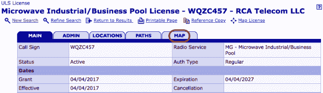

<!--yml

category: 未分类

date: 2024-05-18 14:07:14

-->

# 短波交易 | 第四部分 | 侦探实例、研究工具、技术以及副天线侦探家庭作业—— Mahwah 狙击手 & 朋友们

> 来源：[`sniperinmahwah.wordpress.com/2018/07/16/shortwave-trading-part-iv-sleuthing-examples-research-tools-techniques-deputies-wanted/#0001-01-01`](https://sniperinmahwah.wordpress.com/2018/07/16/shortwave-trading-part-iv-sleuthing-examples-research-tools-techniques-deputies-wanted/#0001-01-01)

*[这里 是 Bob Van Valzah “短波交易”系列的最后一集。同样，我会在周四回到自己后院时添加一篇关于欧洲的第五部分。与此同时，我希望你会喜欢 Bob 的这一部分——Alexandre]*

* * *

在我的几篇关于短波交易的公开文章之后，我逐渐意识到我无意中建立了一个遍布全球的副天线侦探网络。这是“短波交易”系列的最后一片文章，因为即将到来的雇佣协议将禁止我未来公开讨论交易技术。我想留下一些我曾经使用过的研究工具和技术的细节。这就是香肠是如何制作的。

我还会留下一些可能值得关注的位置列表。其中一些可能离你很近。即使我不能谈论未来发现的内容，也许你可以？下面的评论可能是一个记录新发现的不错地方，直到有更好的地方出现。

此外，接下来的部分将阐述我用来评估发现短波交易网站信心标准的准则，提供 FCC 搜索的示例，列出我发现有用的基于网页的研究工具，提供一些研究技术的提示，并感谢为这项工作幕后贡献的许多人。

> 我的短波交易演讲的视频已经可以在[这里](https://stacresearch.com/STAC-Summit-13-Jun-2018-shortwave-trading)找到，这是在[纽约 STAC 峰会](https://stacresearch.com/spring2018NYC)上的演讲。视频时长 31 分钟，包括最后的问答环节。此外，我还录制了一集关于短波交易的播客[在这里](https://itunes.apple.com/us/podcast/the-technology-evangelist/id1253336133?mt=2#)。如果你更喜欢看或听而不是阅读，可以试试这些。感谢 STAC 的 Peter Lankford 提供的视频以及 Solarflare 的 Scott Schweitzer 提供的播客。

### 可信度标准

如果你发现了一个看起来像短波交易网站的东西，你有多大的信心确定自己找到的是真的，而不是外星人绑架人类的着陆信标呢？由于短波交易网站的存在是为了将本地市场与远程市场连接起来，我能想到的两件事构成了一个可能性最低的标准：

1.  有指向远程市场的短波天线的视觉证据。本系列的前几篇文章展示了许多可以作为预期模型的短波天线。例子包括从芝加哥出发，覆盖欧洲的大约 50º的方向。

1.  通往当地市场的连通路径。这种视觉证据可以是面向当地市场的微波天线。

我想，确定您找到的是短波交易网站的最好方式，应该是该网站的所有者公开承认这是他们的，并且他们正在用它进行短波交易。这不会发生，但仍然有许多间接证据可以累积。

+   政府颁发的许可证允许该地点进行短波传输。

+   政府颁发的许可证允许该地点与当地市场之间使用微波链接。

如果你能找到将一个地点追溯到一家贸易公司的政府记录，那么你的结论的可信度就会提高。贸易公司通常会创建空壳公司来持有他们的短波交易资产。寻找：

+   无线电许可证所有权

+   塔楼所有权（参见下方的 FCC ASR 数据库链接）

+   区域划分变更

+   建筑许可证

+   地产销售记录

+   地产税收记录

请注意，FCC 许可证将包含联系方式。这通常是一个在华盛顿特区有办公室的电信律师，他准备了许可证申请，并创建了空壳公司来持有许可证。一个律师或一个律师事务所可能代表许多客户工作，所以认为任何相关性都是 circumstantial, but suggestive.

## 联邦通信委员会（FCC）搜索示例

政府记录在提高您发现的信誉方面是难以匹敌的。找到在同一地点既允许短波又允许微波传输的 FCC 许可证是一个很好的目标。有很多方法可以搜索 FCC 数据库，但我将给出两个短波许可证的搜索示例。一旦您获得了允许短波传输的地点的坐标，我将展示如何围绕这些坐标进行微波搜索。

### 按城市搜索的 FCC 短波许可证搜索

蜂窝塔无疑是您最常看到的东西，然后可能是 AM、FM 和电视发射天线。但让我们假设你很幸运，在城市里看到一些奇怪的东西，并想检查你的直觉。我将以西芝加哥市为例。

您想要搜索西芝加哥的所有实验性短波许可证，所以您需要前往[实验许可系统通用搜索](https://apps.fcc.gov/oetcf/els/reports/GenericSearch.cfm)网站。填写短波`频率范围`为 3 至 30，并在未标记的后缀下拉菜单中选择`MHz`。填写`发射器城市`为西芝加哥。

不要填写`发射器州`字段，否则会触发 FCC 网站的一个错误。

我已经报告了这种行为，得到了感谢，并被告知这是一个已知的问题。

如果您搜索到任何许可证，请参阅下面关于阅读 FCC 实验许可证搜索结果的部分。

### FCC 通过坐标搜索短波许可证

我的搜索始于这样一个问题：“什么实验性许可证允许在距离 CME 100 英里内的地区使用短波发射器？”以下是执行该查询的步骤。

我们需要我们 100 英里搜索半径中心的坐标。我听说 CME 没有正式透露其主要数据中心的位置，但谷歌在搜索结果中直接给出了答案，所以你甚至不需要点击就能看到它。

谷歌方便的回答提出了一个重要的旁题：有几个不同的地理坐标系统在使用中，有时需要[它们之间进行转换](https://en.wikipedia.org/wiki/Geographic_coordinate_conversion)。上述查询结果显示的是十进制度数，但 FCC 搜索需要度、分和秒。与其转换，有时不如在谷歌地球中找到我的目标，然后从显示中读取度、分和秒。

请从[FCC 网站/频率查询](https://fjallfoss.fcc.gov/General_Menu_Reports/engineering_search.cfm?service_select=Select&accessible=NO&state_select=&begin_freq=&begin_freq_type=M&end_freq=&end_freq_type=M&polar=B&radio_ch0=P&lat_ddd=&lat_ddd_cfforminteger=Latitude+degrees+must+be+numeric.&lat_mm=&lat_mm_cfforminteger=Latitude+minutes+must+be+numeric.&lat_ss=&lat_ss_cfformnumeric=Latitude+Seconds+must+be+numeric.&ns_radio_ch1=N&lon_ddd=&lon_ddd_cfforminteger=Longitude+degrees+must+be+numeric.&lon_mm=&lon_mm_cfforminteger=Longitude+minutes+must+be+numeric.&lon_ss=&lon_SS_cfformnumeric=Longitude+seconds+must+be+numeric.&ew_radio_ch1=W&radius=&Radius_cfformnumeric=Radius+must+be+numeric.&distance_type=&lat_ddd2=&lat_mm2=&lat_ss2=&ns_radio_ch2=&lon_ddd2=&lon_mm2=&lon_ss2=&ew_radio_ch2=&soundex_select=&begin_grant_date=&end_grant_date=&begin_expiration_date=&end_expiration_date=&sortstring=%2C+lic_name%2C+file_num&limit_select=4)页面开始，将`服务选择`设置为`仅特定服务`，并勾选`实验数据库`的复选框。

将`频率`部分的`开始`和`结束`字段分别设置为 3 MHz 和 30 MHz，以限制搜索到短波频率。

在`位置搜索方法`部分，点击`点半径`单选按钮。

现在输入您搜索中心和搜索

点击`提交查询`，你应该会看到几行输出。我将突出显示 West Chicago 的那一行。从这里，你可以获取进行微波搜索所需的坐标。

你也可以点击`呼号`链接查询一个站的全部许可证。结果的解释在下一节中描述。

### 阅读 FCC 实验许可证搜索结果

我看到的 West Chicago 的实验许可证查询结果是这样的：

像这个例子一样，常见到一个过期和续签的许可证列表。也很常见到在许可证到期前很长时间就更新了许可证；毕竟这些是实验许可证。左侧列中的`初始`和`当前`链接之间可能没有区别，但如果在许可证有效期内进行了更改，它们将显示为在那里更改。

授予的许可证将在 FCC 表单 442 上显示。通过在`查看表单`列中的`当前`链接查看表单。有时比较与已过期许可证的变化，以了解趋势，这是有洞察力的。

请注意，你的浏览器和 FCC 的网站可能会勾结，在新的标签页或新窗口中打开 FCC 表单 442， leaving the search results still to be seen。点击搜索结果中其他表单 442 链接可能只是更新了先前显示早期表单 442 结果的标签页或窗口，覆盖了它们。

表单的一个有趣部分是`制造商`部分，列出了使用的发射设备。这通常包括发射器、调制解调器或 SDR、功率放大器和天线。

表单以一个`站点位置`部分结束，其中包括每个许可发射站的子部分。纬度和经度的 GPS 坐标应该能让你非常接近天线位置。但请注意，街道地址和城市可能是近似的。我访问过的有些地方足够偏远，可能不属于一个 Incorporated 城市。在映射应用程序上使用的地址似乎是根据为该地区提供邮政邮件投递的城市来决定的，这可能与 FCC 看待地址的方式不同。

申请人有时会请求删除天线指向（从真北的度数）。但是当他们这样做时，你只需要访问现场，站在一个想象中的线上，这个线指向短波天线的指向。沿着这条线远离天线站点，每隔 500 英尺左右停一下。确保你仍然在指向线上并用水手机拍摄天线照片。回到家后，获取照片的 GPS 坐标并用 GoogleEarth 绘制它们以获得指向线。只需要几个点就可以建立一条线。

### FCC 通过坐标搜索微波许可证

微波链路使用成熟的技术，因此无需实验。这样的许可证是[通用许可证系统（ULS）在线数据库](http://wireless2.fcc.gov/UlsApp/UlsSearch/searchLicense.jsp)的一部分。如果我们有来自短波实验许可证的电台位置坐标，我们可以使用这些坐标来查找附近的微波许可证。我没有找到一个简单的方法进行地理 ULS 搜索，所以这是一个多步骤的过程。首先，点击`基于站点`链接。

感兴趣的微波许可证将来自商业池，因此在`基于站点`部分选择`MG`，并在`无线电服务代码`滚动列表中选择。

然后确保你点击了`地理搜索`按钮，**而不是**`搜索`按钮。

点击`坐标`单选按钮，并填写`纬度`、`经度`和`半径`。如果你对你的坐标准确性有信心，可以使用较小的半径，否则可能需要增加以获得击中。点击`搜索`按钮。

我看到的搜索结果是这样的：

这显示了两个微波许可证，一个是在 CME 附近的微波发射机，另一个是在西芝加哥的微波发射机。点击任一许可证以打开主页面。

现在点击`地图`标签以查看链路另一端的地理位置：

请注意，有时微波搜索找不到许可证，但似乎它们应该存在。我知道一个原因是有时使用更高频率（“毫米波”）。联邦通信委员会（FCC）不要求在这些频率上进行点对点许可证。然而，根据我所了解的规定，仍然要求点对点链路在频率协调数据库（见下面的 Micronet 数据库）中注册。在那儿查查再放弃。

但是即便如此，我仍然看到在数据库中找不到的链路，所以我认为我仍然遗漏了什么。如果任何读者知道如何进行更彻底的搜索，我会在下面的评论中非常乐意听到。

### 研究工具链接

+   **[FCC 实验性许可证地点或位置搜索](https://fjallfoss.fcc.gov/General_Menu_Reports/engineering_search.cfm?service_select=X%2521&state_select=&begin_freq=&begin_freq_type=M&end_freq=&end_freq_type=M&polar=B&radio_ch0=P&lat_ddd=&lat_mm=&lat_ss=&ns_radio_ch1=N&lon_ddd=&lon_mm=&lon_ss=&ew_radio_ch1=W&radius=&distance_type=&lat_ddd2=&lat_mm2=&lat_ss2=&ns_radio_ch2=&lon_ddd2=&lon_mm2=&lon_ss2=&ew_radio_ch2=&ACCESSIBLE=NO&soundex_select=&begin_grant_date=&end_grant_date=&begin_expiration_date=&end_expiration_date=&sortstring=%2C+lic_name%2C+file_num&limit_select=4)：** 我找到的所有确认的短波交易站点都在这个数据库中。使用这个链接搜索具有位于 GPS 坐标内半径内的发射机站点的许可证。

+   **[FCC 实验性许可证通用搜索](https://apps.fcc.gov/oetcf/els/reports/GenericSearch.cfm)：** 与上面链接相同的数据，但只是不针对位置的搜索条件。与上面链接允许的某些条件有所重叠。

+   **[FCC 通用许可证搜索](http://wireless2.fcc.gov/UlsApp/UlsSearch/searchLicense.jsp)：** 包括用于微波链路的非实验性许可证。

+   **[FCC 天线结构注册（ASR）搜索](http://wireless2.fcc.gov/UlsApp/AsrSearch/asrRegistrationSearch.jsp)：** 搜索塔和其他您可能想要放置天线的地方的数据库。请参见下面的 FCCInfo。

+   **[FCC FRN 搜索](https://apps.fcc.gov/coresWeb/simpleSearch.do)：** 每个与 FCC 互动的商业实体或个人都必须有一个 FCC 注册号码（FRN）。许可证和天线站点所有权都追溯到 FRN。希望保持隐私的公司会创建空壳公司向 FCC 注册。

+   **[FCC 应用程序搜索](http://wireless2.fcc.gov/UlsApp/ApplicationSearch/searchAppl.jsp)：** 申请者向 FCC 发送申请以获取许可证。可能有一些有趣的历史细节或未包含在已发放许可证中的内容。例如，有一个申请将许可证控制权从一家公司转移到另一家的申请。

+   **[Micronet 毫米波链路数据库查询](http://www.micronetcommunications.com/LinkRegistration/Query.aspx)：** 可能能够找到未在 FCC ULS 搜索中出现的链路。

+   **[谷歌地球专业版](https://www.google.com/earth/desktop/)：** 不可或缺。移动版本可能在字段中进行快速检查时可行，但我发现我确实需要桌面版本的力量。我寻找了一种方法，以便在桌面之间或桌面与移动设备之间共享地标，但没有成功。所以我最终不得不在同一台电脑上完成所有研究，但请看下一个子弹点。

+   **[谷歌地球网页版](https://earth.google.com/web)：** 如果我选择的浏览器是 Chrome 或 Firefox，那么我在谷歌地球遇到的某些挑战可能会减少。愿意在 Google 到处登录也可能有助于分享。

+   **[谷歌地图](https://www.google.com/maps/)：** 规划访问天线站点所需的驾驶和骑行路线的好工具。

+   **[Google Street View](https://support.google.com/maps/answer/3093484?co=GENIE.Platform%3DDesktop&hl=en)：**我在阅读了链接的支持文档后才知道“Pegman”有名字。

+   **Apple Maps：**使用的数据库与 Google 不同。有时候有一个第二意见有帮助。空中影像的新鲜度有时比 Google 好，有时比 Google 差。不要忘记尝试卫星模式和“3D”。

+   **[FCCInfo 在 Google Earth 上的应用](http://www.fccinfo.com/fccinfo_google_earth.php)：**这是一个非常实用的工具，你只需下载一次并安装到你的电脑上的 Google Earth 中。它专注于 AM、FM 和 TV 电台，但除非你想知道当地广播台的天线位置，否则无需勾选这些选项。在`Places`面板中，点击`FCCInfo`。当它展开时，点击`ASR Towers`。这将显示所有注册的 ASR 塔楼的红色垂直线条。超过 200 英尺的塔楼必须注册，那些靠近机场跑道的塔楼也必须注册。这包括我找到的许多用于短波交易和微波链路的塔楼。

+   **[GeoHack](https://tools.wmflabs.org/geohack/)：**为地图、卫星图像等提供了一个很好的抽象层。输入 GPS 坐标，得到一个包含各种基于网页的地图和图像服务的链接页面。例如，这是 [西芝加哥塔楼位置的页面](https://tools.wmflabs.org/geohack/geohack.php?params=41_53_54_N_88_13_14_w)。注意没有西半球偏见：经度默认为东。

+   **[比较许可证](https://www.copyscape.com/compare.php)：**通过比较实验许可证随时间的变迁，有时可以得出有趣的结论。如果手动进行，这是一个繁琐的过程，但有许多网站将 FCC 数据库中两个不同实验许可证的 URL 进行比较，并突出显示差异。

+   **[发射设计 ator 参考](http://www.swld.com.au/pages/emissions.pdf)：**实验许可证将提供“发射设计 ator”，这些设计 ator 简洁地描述了信息如何编码以进行传输（即无线电载波如何调制）。这个链接解释了 FCC 使用的紧凑编码。

### 研究技术

+   **尊重地进行实地工作：**请尊重自然和他人的财产及意愿。避免闯入*[我确认，这很重要：有一次我进入了一个私人塔楼/财产，这座塔楼的大规模高频交易公司报了警——这是真的，亚历山大]*。

+   **书签：**这些帖子包含了我从超过 1000 个网页中精心挑选的 100 多个链接。我不得不放弃过去积累浏览器窗口的习惯，每个窗口都有无数标签。由于同时进行许多调查线索和无数的分支，旧方法根本无法扩展。找到一种组织书签并将它们跨设备同步的方法。也许如果你不喜欢浏览器提供的服务，可以使用 [Pinboard](https://pinboard.in/)？

+   **截图：** 找到一种方便的截图和注释方法。我在我的 Mac 上使用`Command-Control-Shift-4`快捷键开始选择一个有趣的截图区域。我把那部分粘贴到`预览`中并进行注释。我认为 10.14 有更好的东西。

+   **那个天线是谁的？** 我不想激怒那些努力模糊其短波交易资产所有权的潜在雇主，所以我没有太多谈论所有权。然而，记者已经查阅了公共记录，并在[一些](https://spectrum.ieee.org/tech-talk/telecom/wireless/wall-street-tries-shortwave-radio-to-make-highfrequency-trades-across-the-atlantic) [案例](https://www.bloomberg.com/news/articles/2018-06-18/hft-traders-dust-off-19th-century-tool-in-search-of-market-edge)中发现了答案。他们没有告诉你他们是怎样做到的，但[Matt Hurd 在他的优秀博客 Meanderful](https://meanderful.blogspot.com/)上展示了他是如何将这些信息联系起来的。

+   **最新图像：** 关注左下角`图层`下的`3D 建筑`复选框。在一些地方，它确实让建筑看起来更好，但它可能会隐藏没有 3D 信息的更 recent imagery。我建议运行时不选中`3D 建筑`。

### 副天线侦探作业

如果你对短波交易感兴趣，我想到了几件事情，你可能会做来帮助我们了解更多。如果你看到任何有趣的东西，请在下面的评论中补充。

+   **观察你附近的变动：** 如果你住在已知的短波交易地点附近，请在开车经过时留意天线。

+   **重复 FCC 地理搜索：** 每隔几个月，重新搜索交易市场数据中心和跨洋电缆登陆站周围的地区可能是个好主意。如我在第三部分所展示的，截至 2018 年年中，事情仍在迅速变化。

+   **关注新泽西州的阿尔卑斯山：**我在第三部分提到，一种不同寻常的[短波广播许可](https://ecfsapi.fcc.gov/file/104112444521024/TURMS%20TECH%20-%20FCC%20Form309%2004-11-2017.pdf)已经授予了[新泽西州阿尔卑斯山的一个天线站点](https://tools.wmflabs.org/geohack/geohack.php?params=40_57_40.4_N_73_55_24_w)。当我检查时，已经批准了近一年的建设，但没有活动。无人机将是检查该网站的好方法。当地警察知道我在周围晃悠，因为我把车停在了从主要道路可以看到的地方。

    通过谷歌地球看到的阿尔卑斯塔，3D 选项在

+   **监控安克雷奇，阿拉斯加州**：已经批准了从安克雷奇，阿拉斯加州进行传输的[实验性许可证](https://apps.fcc.gov/oetcf/els/reports/442_Print.cfm?mode=current&application_seq=78952&license_seq=79672)，相同的许可证涵盖了从 Aurora，伊利诺伊州和 Secaucus，新泽西州进行传输。 [Anchorage antenna site](https://tools.wmflabs.org/geohack/geohack.php?params=61_6_13_N_149_40_18_w)将非常靠近 CME 和东京之间的最短路径。短波天线将指向东京。那是一大堆间接证据，表明该网站计划进行短波交易。当我用谷歌街景四处查看时，我没有找到在那里建造的任何东西的照片。

+   **监控 Orangeburg，纽约州**：[一个站点](https://apps.fcc.gov/oetcf/els/reports/442_Print.cfm?mode=current&application_seq=83686&license_seq=84556)的许可证允许从距离 CME 不远的站点进行传输，还包括一个[位于 Mahwah 附近的 antenna site](https://tools.wmflabs.org/geohack/geohack.php?params=41_1_53_N_73_58_36_w)，刚刚越过边境进入纽约。如果他们扩展到东海岸，这很可能是他们将建设的地方。

+   **监控西雅图，华盛顿州**：[另一个站点](https://apps.fcc.gov/oetcf/els/reports/442_Print.cfm?mode=current&application_seq=84316&license_seq=85209)的许可证允许从[距离 PC-1 电缆登陆站不远的 antenna site](https://tools.wmflabs.org/geohack/geohack.php?params=47_36_55_N_122_18_33_w)进行传输，该电缆连接到日本。但请注意，许可证在 antenna site 的经度上有一个错误——应该是 122 度西，而不是 112 度西。

+   **监控 Wesley Hills，纽约州**：覆盖西雅图的许可证也允许从[Wesley Hills，纽约州的 antenna site](https://tools.wmflabs.org/geohack/geohack.php?params=41_9_38_N_74_5_19_w)进行传输。这就是我在第三部分中提到的伪装蜂窝塔。我认为这就是他们将在东海岸扩展的地方。

+   **监控 Glendale Heights，伊利诺伊州**：[这个天线站点](https://tools.wmflabs.org/geohack/geohack.php?params=41_55_49_N_88_5_14_w)正好位于 CME 和欧洲之间的最短路径上。与为了最小化接收噪音而选择的更偏远的站点相比，它在传输时可能具有延迟优势。在我 2018 年 4 月 11 日访问时，现有的塔楼有两个移动运营商，但没有短波。

### 致谢

主要感谢 Alexandre Laumonier（又名 Mahwah 的 Sniper），他的开创性工作在《HFT 在我的后院》系列帖子中启发了我从事这项工作。

我关于短波交易的公开帖子不仅吸引了一些副 antenna 侦探，还有一些不能公开说话的顾问。感谢他们提供的所有见解。

感谢所有在之前的帖子上发表评论的人。如果您在这里找到任何有趣的东西或发展出其他研究技巧，请留言。

****

法国声音艺术家在从事关于高频交易“声音”项目的其中一个短波网站。© Jean-Philippe Renoult & Dinah
