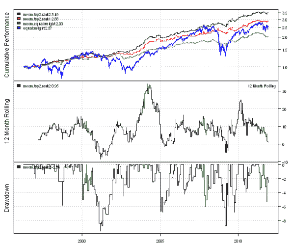
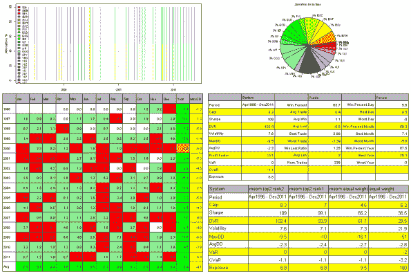
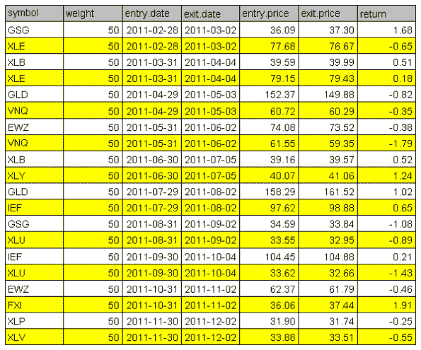
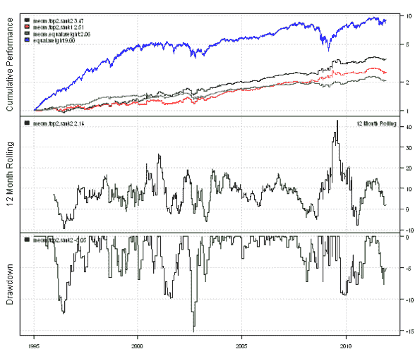

请注意，以下内容已从原文中删除：

类别：未分类

date: 2024-05-18 14:44:40

（请注意，以上内容已从原文中删除）

# 简单且有利可图 | 系统化投资者

> 来源：[`systematicinvestor.wordpress.com/2011/12/09/simple-and-profitable/#0001-01-01`](https://systematicinvestor.wordpress.com/2011/12/09/simple-and-profitable/#0001-01-01)

市场科学公司在[月底的 blahs](http://marketsci.wordpress.com/2010/03/24/the-last-day-of-the-month-blahs/)一文中检查了月底效应。这个想法很简单：在月底买入，几天后卖出。量化荷兰人在[策略 2 - 月末结束策略（MEOM）](http://quantingdutchman.wordpress.com/2010/06/30/strategy-2-monthly-end-of-the-month-meom/)一文中提出了这个策略。

我将遵循量化荷兰人的策略大纲，并使用[Systematic Investor Toolbox](https://systematicinvestor.wordpress.com/systematic-investor-toolbox/)中的回测库来实现它。

该策略投资于 26 个 ETF 中的交易价格高于中期移动平均（WMA89）的前 2 个 ETF：DIA, EEM, EFA, EWH, EWJ, EWT, EWZ, FXI, GLD, GSG, IEF, ILF, IWM, IYR, QQQ, SPY, VNQ, XLB, XLE, XLF, XLI, XLP, XLU, XLV, XLY, XLK。策略在每月底的最后一天进入头寸。策略在两天后的收盘时退出头寸。我将研究两种排名方案，每月选择两个 ETF：

+   Rank1 = MA( C/Ref(C,-2), 5 ) * MA( C/Ref(C,-2), 40 )

+   Rank2 = MA( C/Ref(C,-2), 5 ) * Ref( MA( C/Ref(C,-2), 10 ), -5 )

以下代码实现了使用[Systematic Investor Toolbox](https://systematicinvestor.wordpress.com/systematic-investor-toolbox/)中的回测库的此策略：

```

# Load Systematic Investor Toolbox (SIT)
setInternet2(TRUE)
con = gzcon(url('https://github.com/systematicinvestor/SIT/raw/master/sit.gz', 'rb'))
	source(con)
close(con)

	#*****************************************************************
	# Load historical data
	#******************************************************************
	load.packages('quantmod')
	tickers = spl('DIA,EEM,EFA,EWH,EWJ,EWT,EWZ,FXI,GLD,GSG,IEF,ILF,IWM,IYR,QQQ,SPY,VNQ,XLB,XLE,XLF,XLI,XLP,XLU,XLV,XLY,XLK')	

	data <- new.env()
	getSymbols(tickers, src = 'yahoo', from = '1995-01-01', env = data, auto.assign = T)
		for(i in ls(data)) data[[i]] = adjustOHLC(data[[i]], use.Adjusted=T)	
	bt.prep(data, align='keep.all', dates='1995::2011')

	#*****************************************************************
	# Code Strategies
	#****************************************************************** 
	prices = data$prices   
	n = ncol(prices)
	nperiods = nrow(prices)

	# Equal Weight
	data$weight[] = ntop(prices, n)
	equal.weight = bt.run(data)	

	# find month ends
	month.ends = endpoints(prices, 'months')
		month.ends = month.ends[month.ends > 0]		
	month.ends2 = iif(month.ends + 2 > nperiods, nperiods, month.ends + 2)

	# Strategy MEOM - Equal Weight
	data$weight[] = NA
		data$weight[month.ends,] = ntop(prices, n)[month.ends,]	
		data$weight[month.ends2,] = 0

		capital = 100000
		data$weight[] = (capital / prices) * data$weight
	meom.equal.weight = bt.run(data, type='share')

	#*****************************************************************
	# Rank1 = MA( C/Ref(C,-2), 5 ) * MA( C/Ref(C,-2), 40 )
	#****************************************************************** 			
	# BuyRule = C > WMA(C, 89)
	buy.rule = prices > bt.apply.matrix(prices, function(x) { WMA(x, 89) } )		
		buy.rule = ifna(buy.rule, F)

	# 2-day returns
	ret2 = ifna(prices / mlag(prices, 2), 0)

	# Rank1 = MA( C/Ref(C,-2), 5 ) * MA( C/Ref(C,-2), 40 )
	position.score = bt.apply.matrix(ret2, SMA, 5) * bt.apply.matrix(ret2, SMA, 40)
		position.score[!buy.rule,] = NA

	# Strategy MEOM - top 2    
	data$weight[] = NA;
		data$weight[month.ends,] = ntop(position.score[month.ends,], 2)		
		data$weight[month.ends2,] = 0		

		capital = 100000
		data$weight[] = (capital / prices) * data$weight
	meom.top2.rank1 = bt.run(data, type='share', trade.summary=T)

	#*****************************************************************
	# Rank2 = MA( C/Ref(C,-2), 5 ) * Ref( MA( C/Ref(C,-2), 10 ), -5 )
	#****************************************************************** 		
	position.score = bt.apply.matrix(ret2, SMA, 5) * mlag( bt.apply.matrix(ret2, SMA, 10), 5)
		position.score[!buy.rule,] = NA

	# Strategy MEOM - top 2    
	data$weight[] = NA;
		data$weight[month.ends,] = ntop(position.score[month.ends,], 2)		
		data$weight[month.ends2,] = 0		

		capital = 100000
		data$weight[] = (capital / prices) * data$weight
	meom.top2.rank2 = bt.run(data, type='share', trade.summary=T)	

	#*****************************************************************
	# Create Report
	#****************************************************************** 
	plotbt.custom.report(meom.top2.rank2, meom.top2.rank1, meom.equal.weight, equal.weight, trade.summary=T)

```

（图片未翻译，因为是静态图片，不包含文本）

（图片未翻译，因为是静态图片，不包含文本）

（图片未翻译，因为是静态图片，不包含文本）

这是一个非常小且仅在 10%的时间内投资的策略。您可以通过在剩余时间内投资固定收益来提高回报。量化荷兰人在[我对“Go-In-Cash”的思考](http://quantingdutchman.wordpress.com/2010/10/24/my-thoughts-on-go-in-cash/)一文中测试了这个想法。

我还发现，使用当前道琼斯成分股而不是 ETF 取得了有希望的结果。要运行使用当前道琼斯成分股的月底策略，请替换：

```

tickers = spl('DIA,EEM,EFA,EWH,EWJ,EWT,EWZ,FXI,GLD,GSG,IEF,ILF,IWM,IYR,QQQ,SPY,VNQ,XLB,XLE,XLF,XLI,XLP,XLU,XLV,XLY,XLK')

```

为

```

tickers = dow.jones.components()

```

在上面的代码中。以下是使用当前道琼斯成分股的月底策略的摘要统计数据。

（图片未翻译，因为是静态图片，不包含文本）


要查看此例的完整源代码，请查看[bt.meom.test()函数在 github 上的 bt.test.r](https://github.com/systematicinvestor/SIT/blob/master/R/bt.test.r)。
