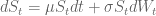
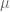
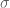
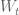
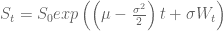
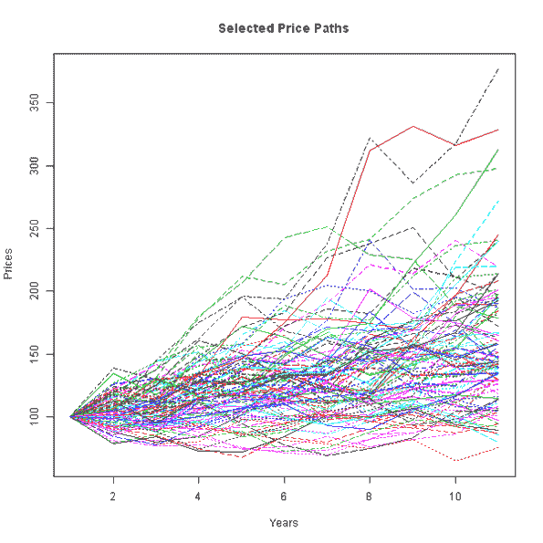
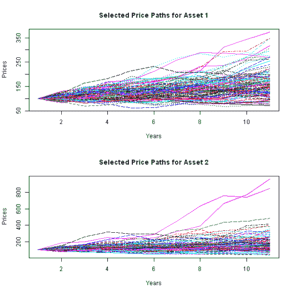

<!--yml

类别：未分类

日期：2024-05-18 14:36:08

-->

# 在 R 中模拟多个资产路径 | 系统投资者

> 来源：[`systematicinvestor.wordpress.com/2012/11/06/simulating-multiple-asset-paths-in-r/#0001-01-01`](https://systematicinvestor.wordpress.com/2012/11/06/simulating-multiple-asset-paths-in-r/#0001-01-01)

我最近阅读了[W. Sun, A. Fan, L. Chen, T. Schouwenaars, M. Albota 的论文](http://papers.ssrn.com/sol3/papers.cfm?abstract_id=639284)，该论文研究了不同再平衡方法的成本。例如，人们可能会使用日历再平衡：即每月/每季度/每年进行再平衡。或者，人们可能会使用阈值再平衡：即只有在资产权重超出政策组合周围一定范围的 3%时才进行再平衡。

为了研究不同再平衡方法的成本，作者运行了 10,000 次模拟。今天，我想展示如何根据预期的回报和协方差来模拟资产价格路径。我将假设价格遵循[几何布朗运动](http://en.wikipedia.org/wiki/Geometric_Brownian_motion)。我还将展示蒙特卡洛期权定价的一个简单应用。在下一篇文章中，我将评估不同再平衡方法的成本。

假设股票价格可以由以下随机微分方程描述：



其中  是基础资产的年预期回报， 是年化波动率，而  是一个布朗运动。这个随机微分方程的解如下：



我在资产.路径()函数中实现了这个公式。资产.路径()函数是基于 Matlab 中[Simulating Multiple Asset Paths in MATLAB](http://www.goddardconsulting.ca/matlab-monte-carlo-assetpaths.html)代码。

```

asset.paths <- function(s0, mu, sigma, 
	nsims = 10000, 
	periods = c(0, 1)	# time periods at which to simulate prices
) 
{
	s0 = as.vector(s0)
	nsteps = len(periods)
	dt = c(periods[1], diff(periods))

	if( len(s0) == 1 ) {
		drift = mu - 0.5 * sigma²
		if( nsteps == 1 ) {
			s0 * exp(drift * dt + sigma * sqrt(dt) * rnorm(nsims))
		} else {
			temp = matrix(exp(drift * dt + sigma * sqrt(dt) * rnorm(nsteps * nsims)), nc=nsims)
			for(i in 2:nsteps) temp[i,] = temp[i,] * temp[(i-1),]
			s0 * temp
		}
	} else {
		require(MASS)
		drift = mu - 0.5 * diag(sigma)
		n = len(mu)

		if( nsteps == 1 ) {
			s0 * exp(drift * dt + sqrt(dt) * t(mvrnorm(nsims, rep(0, n), sigma)))
		} else {
			temp = array(exp(as.vector(drift %*% t(dt)) + t(sqrt(dt) * mvrnorm(nsteps * nsims, rep(0, n), sigma))), c(n, nsteps, nsims))
			for(i in 2:nsteps) temp[,i,] = temp[,i,] * temp[,(i-1),]
			s0 * temp
		}
	}
}

```

接下来让我们可视化一些模拟资产路径：

```

###############################################################################
# Load Systematic Investor Toolbox (SIT)
# https://systematicinvestor.wordpress.com/systematic-investor-toolbox/
###############################################################################
setInternet2(TRUE)
con = gzcon(url('http://www.systematicportfolio.com/sit.gz', 'rb'))
    source(con)
close(con)

	#*****************************************************************
	# Plot some price paths
	#******************************************************************  
	S = c(100,105)
	X = 98
	Time = 0.5
	r = 0.05
	sigma = c(0.11,0.16)
	rho = 0.63
	N = 10000

	# Single Asset for 10 years
	periods = 0:10
	prices = asset.paths(S[1], r, sigma[1], N, periods = periods)

	# plot
	matplot(prices[,1:100], type='l', xlab='Years', ylab='Prices',
		main='Selected Price Paths')

	# Multiple Assets for 10 years
	periods = 0:10
	cov.matrix = sigma%*%t(sigma) * matrix(c(1,rho,rho,1),2,2)
	prices = asset.paths(S, c(r,r), cov.matrix, N, periods = periods)

	# plot
	layout(1:2)
	matplot(prices[1,,1:100], type='l', xlab='Years', ylab='Prices',
		main='Selected Price Paths for Asset 1')
	matplot(prices[2,,1:100], type='l', xlab='Years', ylab='Prices',
		main='Selected Price Paths for Asset 2')

```

](https://systematicinvestor.wordpress.com/wp-content/uploads/2012/11/plot1-small.png)

](https://systematicinvestor.wordpress.com/wp-content/uploads/2012/11/plot2-small.png)

接下来，让我们看看使用[资产.路径()函数在 github 上的示例](https://github.com/systematicinvestor/SIT/blob/master/R/random.r)。

```

	#*****************************************************************
	# Price European Call Option
	#******************************************************************  
	load.packages('fOptions')

	# Black–Scholes
	GBSOption(TypeFlag = "c", S = S[1], X = X, Time = Time, r = r, b = r, sigma = sigma[1])

	# Monte Carlo simulation	
	N = 1000000	
	prices = asset.paths(S[1], r, sigma[1], N, periods = Time)
		future.payoff = pmax(0, prices - X)
		discounted.payoff = future.payoff * exp(-r * Time)
	# option price
	mean(discounted.payoff) 

	#*****************************************************************
	# Price Asian Call Option
	#******************************************************************  
	load.packages('fExoticOptions')

	Time = 1/12

	# Approximation
	TurnbullWakemanAsianApproxOption(TypeFlag = "c", S = S[1], SA = S[1], 
  		X = X, Time = Time, time = Time, tau = 0 , r = r, b = r, sigma = sigma[1])

	# Monte Carlo simulation		
	N = 100000
	periods = seq(0,Time,1/360)
		n = len(periods)
	prices = asset.paths(S[1], r, sigma[1], N, periods = periods)
		future.payoff = pmax(0, colSums(prices)/n - X)
		discounted.payoff = future.payoff * exp(-r * Time)
	# option price
	mean(discounted.payoff) 

	#*****************************************************************
	# Price Basket Option
	#******************************************************************  

	Time = 0.5

	# Approximation
	TwoRiskyAssetsOption(TypeFlag = "cmax", S1 = S[1], S2 = S[2],
		X = X, Time = Time, r = r, b1 = r, b2 = r,
		sigma1 = sigma[1], sigma2 = sigma[2], rho = rho)

	# Monte Carlo simulation		
	N = 100000
	cov.matrix = sigma%*%t(sigma) * matrix(c(1,rho,rho,1),2,2)
	prices = asset.paths(S, c(r,r), sigma = cov.matrix, N, periods = Time)
		future.payoff = pmax(0, apply(prices,2,max) - X)
		discounted.payoff = future.payoff * exp(-r * Time)
	# option price
	mean(discounted.payoff) 

	#*****************************************************************
	# Price Asian Basket Option
	#******************************************************************  

	Time = 1/12

	# Monte Carlo simulation		
	N = 10000
	periods = seq(0,Time,1/360)
		n = len(periods)

	prices = asset.paths(S, c(r,r), sigma = cov.matrix, N, periods = periods)
		future.payoff = pmax(0, colSums(apply(prices,c(2,3),max))/n - X)
		discounted.payoff = future.payoff * exp(-r * Time)
	# option price
	mean(discounted.payoff) 

```

请注意，蒙特卡洛期权定价需要进行大量模拟才能收敛到期权价格。随着模拟次数、时期数或资产数量的增加，所需时间也会更长。从积极的一面来看，它为模拟那些可能无法通过分析解决的其他复杂问题提供了一个可行的选择。

在下一篇文章中，我将探讨不同再平衡方法的成本。

要查看本例的完整源代码，请查看[github 上 random.r 文件中的 asset.paths.test()函数](https://github.com/systematicinvestor/SIT/blob/master/R/random.r)。
