<!--yml

类别：未分类

日期：2024-05-18 15:29:39

-->

# 平滑的 UKF | Tr8dr

> 来源：[`tr8dr.wordpress.com/2011/08/03/smoothed-utf/#0001-01-01`](https://tr8dr.wordpress.com/2011/08/03/smoothed-utf/#0001-01-01)

平滑的 UKF 对系统状态进行后验平滑。 此滤波器的标准形式有助于准确查看先前状态，但不会为当前或下一个周期提供平滑的在线状态估计（即不会比未平滑的 UKF 提供更好的估计）。

话虽如此，平滑的 UKF 仍然很有用，因为：

1.  可用于估计稳定参数的 MLE

1.  一系列平滑的先验状态的时间序列可以回归到投影平滑的前向状态（但不是 UKF 框架的一部分）

将简要讨论的 UKF 平滑器形式是前向-后向平滑器。 如其名称所示，第一遍是执行标准 UKF 滤波器，估计每个时间步长处的分布 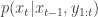。 而平滑则逆向估计平滑分布，意味着 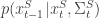。 边界 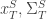 简单地是前向滤波器估计的最后状态和协方差。

然后对于每个 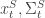，确定预测的 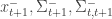，并根据计算的卡尔曼增益和预测 t+1 和实际 t+1 状态之间的差异，得出适当的调整：

![左[{\mu _{t+1}^ - },\sum _{t+1}^ - ,\sum _{t,t + 1}^ - \right] = UT\left( {{X_t},\sum _{t,t}^{},f(.), \cdots } \right)](img/43dfb3127a6aa2116dc8738a9895709f.png)

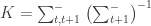

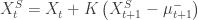

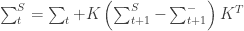

**结果** 一个非线性函数的简单示例是正弦函数。 使用标准卡尔曼滤波器对正弦函数进行线性化跟踪将表现不佳。 我对 UKF 的测试用例是以下带噪声的函数：

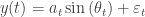

其中 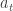 和 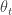 是时间的线性函数。 系统中的状态跟踪： 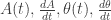。 这是没有平滑的 UKF 跟踪：


以下是带平滑的版本：


**代码** 我附上了增强 UKF 和平滑 UKF 的 R 代码。为了可读性，我没有优化所有的 R 代码（即还有一些 for 循环可以矢量化）。以下是公共部分（定义无迹变换）。

```

## modified number of columns
ncols <- function (x) ifselse(is.matrix(x), ncol(x), length(x))

## modified number of rows
nrows <- function (x) ifelse(is.matrix(x), nrow(x), length(x))

#
#	Determine transformed distribution across non-linear function f(x)
#
#
unscented.transform.aug <- function (
	MUx,				# mean of state
	P, 					# covariance of state
	Nyy,				# noise covariance matrix of f(x)
	f,					# non-linear function f(X, E)
	dt,					# time increment
	alpha = 1e-3,		# scaling of points from mean
	beta = 2,			# distribution parameter
	kappa = 1)
{
	Nyy <- as.matrix(Nyy)

	## constants
	Lx <- nrows(MUx)
	Ly <- nrows(Nyy)
	n <- Lx + Ly

	## create augmented mean and covariance
	MUx.aug <- c (MUx, rep(0, Ly))
	P.aug <- matrix(0, Lx+Ly, Lx+Ly)
	P.aug[1:Lx,1:Lx] <- P
	P.aug[(Lx+1):(Lx+Ly),(Lx+1):(Ly+Ly)] <- Nyy

	## generating sigma points
	lambda <- alpha² * (n + kappa) - n
	A <- t (chol (P.aug))
	X <- MUx.aug + sqrt(n + lambda) * cbind (rep(0,n), A, -A)

	## generate weights
	Wc <- c (
		lambda / (n + lambda) + (1 - alpha² + beta),
		rep (1 / (2 * (n + lambda)), 2*n))
	Wm <- c (
		lambda / (n + lambda),
		rep (1 / (2 * (n + lambda)), 2*n))

	## propagate through function
	Y <- apply(X, 2, function (v)
		{
			f (dt, v[1:Lx], v[(Lx+1):(Lx+Ly)])
		})

	if (is.vector(Y))
		Y <- t(as.matrix(Y))

	## now calculate moments
	MUy <- Y %*% Wm

	Pyy <- matrix(0, nrows(Nyy), nrows(Nyy))
	Pxy <- matrix(0, nrows(MUx), nrows(Nyy))

	for (i in 1:ncols(Y))
	{
		dy <- (Y[,i] - MUy)
		dx <- (X[1:Lx,i] - MUx)

		Pyy <- Pyy + Wc[i] * dy %*% t(dy)
		Pxy <- Pxy + Wc[i] * dx %*% t(dy)
	}

	list (mu = MUy, Pyy = Pyy, Pxy = Pxy)
}

```

**不带平滑的 UKF**：

```

#
#	Augmented UKF filtered series
#		- note that f and g are functions of state X and error vector N  f(dt, Xt, E)
#		- Nx and Ny state and observation innovation covariance
#		- Xo is the initial state
#		- dt is the time step
#
ukf.aug <- function (
	series,
	f,
	g,
	Nx,
	Ny,
	Xo = rep(0, nrow(Nx)),
	dt = 1,
	alpha = 1e-3,
	kappa = 1,
	beta = 2)
{
	data <- as.matrix(coredata(series))

	## description of initial distribution of X
	oMUx <- Xo
	oPx <- diag(rep(1e-4, nrows(Xo)))

	Yhat <- NULL
	Xhat <- NULL

	for (i in 1:nrow(data))
	{
		Yt <- t(data[i,])

		## predict
		r <- unscented.transform.aug (oMUx, oPx, Nx, f, dt, alpha=alpha, beta=beta, kappa=kappa)
		pMUx <- r$mu
		pPx <- r$Pyy

		## update
		r <- unscented.transform.aug (pMUx, pPx, Ny, g, dt, alpha=alpha, beta=beta, kappa=kappa)
		MUy <- r$mu
		Pyy <- r$Pyy
		Pxy <- r$Pxy

		K <- Pxy %*% inv(Pyy)
		MUx = pMUx + K %*% (Yt - MUy)
		Px <- pPx - K %*% Pyy %*% t(K)

		## set for next cycle
		oMUx <- MUx
		oPx <- Px

		## append results
		Yhat <- rbind(Yhat, t(MUy))
		Xhat <- rbind(Xhat, t(MUx))
	}

	list (Yhat = Yhat, Xhat = Xhat)
}

```

**带平滑的 UKF**：

```

ukf.smooth <- function (
	series, 					# series to be filtered
	f, 							# state mapping X[t] = f(X[t-1])
	g, 							# state to measure mapping Y[t] = g(X[t])
	Nx, 						# state innovation error covar
	Ny, 						# measure innovation covar
	Xo = rep(0, nrow(Nx)), 		# initial state vector
	dt = 1, 					# time increment
	alpha = 1e-3,
	kappa = 1,
	beta = 2)
{
	data <- as.matrix(coredata(series))

	Lx <- nrow(as.matrix(Nx))
	Ly <- nrow(as.matrix(Ny))

	## description of initial distribution of X
	oMUx <- Xo
	oPx <- diag(rep(1e-4, nrows(Xo)))

	Ey <- rep(0, nrows(Ny))
	Ex <- rep(0, nrows(Nx))

	Ms <- list()
	Ps <- list()

	## forward filtering
	for (i in 1:nrow(data))
	{
		Yt <- t(data[i,])

		## predict
		r <- unscented.transform.aug (oMUx, oPx, Nx, f, dt, alpha=alpha, beta=beta, kappa=kappa)
		pMUx <- r$mu
		pPx <- r$Pyy

		## update
		r <- unscented.transform.aug (pMUx, pPx, Ny, g, dt, alpha=alpha, beta=beta, kappa=kappa)
		MUy <- r$mu
		Pyy <- r$Pyy
		Pxy <- r$Pxy

		K <- Pxy %*% inv(Pyy)
		MUx = pMUx + K %*% (Yt - MUy)
		Px <- pPx - K %*% Pyy %*% t(K)

		## set for next cycle
		oMUx <- MUx
		oPx <- Px

		## append results
		Ms[[i]] <- MUx
		Ps[[i]] <- Px
	}

	## backward filtering, recursively determine N(Ms[t-1],Ps[t-1]) from N(Ms[t],Ps[t])
	for (i in rev(1:(nrow(data)-1)))
	{
		## transform
		r <- unscented.transform.aug (Ms[[i]], Ps[[i]], Nx, f, dt, alpha=alpha, beta=beta, kappa=kappa)
		MUx <- r$mu
		Pxx <- r$Pyy
		Pxy <- r$Pxy[1:Lx,]

		K <- Pxy %*% inv(Pxx)
		Ms[[i]] <-  Ms[[i]] + K %*% (Ms[[i+1]] - MUx)
		Ps[[i]] <- Ps[[i]] + K %*% (Ps[[i+1]] - Pxx) * t(K)
	}

	Yhat <- NULL
	Xhat <- NULL

	for (i in 1:nrow(data))
	{
		MUy <- g(dt, Ms[[i]], Ey)
		MUx <- Ms[[i]]

		## append results
		Yhat <- rbind(Yhat, t(MUy))
		Xhat <- rbind(Xhat, t(MUx))
	}

	list (Y = data, Yhat = Yhat, Xhat = Xhat)
}

```

最后，这是正弦测试：

```

#
#	Amplitude varying sine function state function:
#
#		Yt = Amp[t] Sin(theta[t]) + Ey
#
#		Theta[t] = Theta[t-1] + Omega[t-1] dt + Ex,1
#		Omega[t] = Omega[t-1] + Ex,2
#		Amp[t] = Amp[t-1] + Accel[t-1] dt + Ex,3
#		Accel[t] = Accel[t] + Ex,4
#
sine.f.xx <- function (dt, Xt, Ex)
{
	nXt <- c (
		Xt[1] + dt*Xt[2] + Ex[1],
		Xt[2] + Ex[2],
		Xt[3] + Ex[3],
		Xt[4] + Ex[4])

	nXt
}

#
#	Amplitude varying sine function observation function:
#
#		Yt = Amp[t] Sin(theta[t]) + Ey
#
#		Theta[t] = Theta[t-1] + Omega[t-1] dt + Ex,1
#		Omega[t] = Omega[t-1] + Ex,2
#		Amp[t] = Amp[t-1] + Accel[t-1] dt + Ex,3
#		Accel[t] = Accel[t] + Ex,4
#
sine.f.xy <- function (dt, Xt, Ey)
{
	y <- Xt[3] * sin(Xt[1] / pi) + Ey[1]
	as.matrix(y)
}

#debug(unscented.transform.aug)
#debug(ukf.aug)

series.r <- sapply (1:500, function(x) (1+x/500) * sin(16 * x/500 * pi)) + rnorm(500, sd=0.25)

## unsmoothed test
u <- ukf.aug (
	series.r, sine.f.xx, sine.f.xy,
	Nx = 1e-3 * diag(c(1/3, 1, 1/10, 1/10)),
	Ny = 1,
	Xo = c(0.10, 0.10, 1, 1e-3), alpha=1e-2)

data <- rbind (
	data.frame(t = 1:500, y=series.r, type='raw', window='Price'),
	data.frame(t = 1:500, y=u$Yhat, type='filtered', window='Price'),
	data.frame(t = 1:500, y=u$Xhat[,3], type='amp', window='Params'))

ggplot() + geom_line(aes(x=t,y=y, colour=type), data) + facet_new(window ~ ., scales="free_y", heights=c(3,1))

## smoothed test
u <- ukf.smooth (
	series.r, sine.f.xx, sine.f.xy,
	Nx = 1e-3 * diag(c(1/3, 1, 1/10, 1/10)),
	Ny = 1,
	Xo = c(0.10, 0.10, 1, 1e-3), alpha=1e-2)

data <- rbind (
	data.frame(t = 1:500, y=series.r, type='raw', window='Price'),
	data.frame(t = 1:500, y=u$Yhat, type='filtered', window='Price'),
	data.frame(t = 1:500, y=u$Xhat[,3], type='amp', window='Params'))

ggplot() + geom_line(aes(x=t,y=y, colour=type), data) + facet_new(window ~ ., scales="free_y", heights=c(3,2))

```

如果你觉得上面的代码有用，或者有改进建议，请随时告诉我。谢谢。

**下一步** 一些接下来的步骤：

1.  确定适合市场制造和循环模式的状态-系统

1.  确定多模型切换方法

1.  评估与分析

我可能会在下次发文时偏离另一个主题，然后再回来 revisit this。 敬请期待。

附言：如果你使用 WordPress，他们有一个我刚刚发现的 LaTeX 方程渲染功能（因此在这篇文章中更好地嵌入）。
