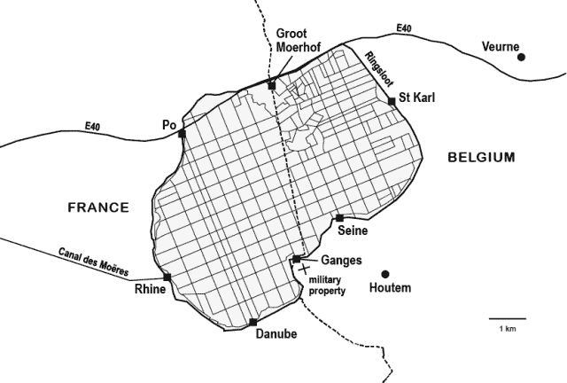

<!--yml

category: 未分类

date: 2024-05-18 14:29:24

-->

# Mahwah 狙击手及其朋友们 – 一切都是关于市场结构。“Pretium iustum mathematicum licet soli Deo notum”

> 来源：[`sniperinmahwah.wordpress.com#0001-01-01`](https://sniperinmahwah.wordpress.com#0001-01-01)

在 2018 年 9 月 19 日，我写过我将会在 2592000000000 微秒之后回到这里，但正如我总是迟到。 whatever... 对于人类来说，微秒、纳秒或者阿托秒并无重要性。我甚至忘记写一篇简短博客文章来宣布我的关于高频交易的新书“4”，该书献给最近为高频交易建立的无线网络（现在著名的[*后院的高频交易*](https://sniperinmahwah.wordpress.com/2014/09/22/hft-in-my-backyard-part-i/)系列的扩展版本），已于 1 月份发布，但我假设大多数阅读这个博客的人都在[Twitter](https://twitter.com/SniperInMahwah)上关注我。无论如何，我忙于书籍的发行（这非常令人印象深刻，超过预期——查看一些汇集在这里的[媒体评论](https://quantreg.com/2019/02/21/4-by-alexandre-laumonier-reviews/)，感谢 Marcos），采访，为德国/法国电视艺术频道（关于高频交易）拍摄电影等，以及我自己的业务（一家[图书公司](http://www.zones-sensibles.org/news/)）我必须经营（成功是美好的，但耗时）。我想写一篇关于我之前关于高频交易的书籍的帖子，以及为什么我试图工作在/理解高频交易和市场微结构的小世界，但这将稍后进行。

与此同时，我想分享的是：1/一本很美的法语比利时杂志，《Wilfried》，昨天发布了新的一期，你可以找到（用法语）我新书的前 15 页（略有混音），配以一位才华横溢的摄影师拍摄的照片，他驾驶无人机去了这里我所谈到的特殊地区（对于那些阅读这个博客的人来说，这是 2012 年 12 月一家来自芝加哥的高频交易公司购买的 Houtem 地区的无线塔周围——这个地区名叫“Les Moëres”，也是书的第一章的标题）；2/ 当我与英语出版商讨论这本书的英文翻译时（看来很多人想读它），我委托翻译了这些前几页，这样美国的英语出版商可以“预览”这本书。我不明白为什么我不能与博客的读者和我的可爱的 Twitter 粉丝分享这个翻译。所以，这是“4”的开头英文版。非常感谢我的翻译者，[Daniel Levin Becker](https://en.wikipedia.org/wiki/Daniel_Levin_Becker)，以及为《Wilfried》拍摄 Les Moëres 的摄影师[Jelle Vermeersch](http://www.jellevermeersch.be)，他允许我在这里发布一些他拍摄的好照片（点击可以放大）。书中原始的法语版本没有照片，除了黑白的一张，但我认为对于这个在线版本，一些历史文件也很感兴趣，除了 Jelle 的照片（如果你喜欢 polders 并懂法语，可以看看《Wilfried》同期的比利时作家[Chris de Stoop](http://www.chrisdestoop.be)的好文章，以及他的书《Dit is mijn hof/Ceci est ma ferme》）。

这部分/书籍的开头都是关于流动性的，直线、土地占用、战争、宗教、军事占领、无线广播网络，但与高频交易无关（我喜欢它的原因:-）……至少到 2012 年 12 月。我希望你会喜欢它——深呼吸，它很长。快乐阅读。

比利时的一根大天线。照片©Jelle Vermeersch，发表在《Wilfried》上

距离退休还有几个月，拍卖师肯定没想到自己职业生涯中最 epic 的拍卖战争。

在 2012 年 12 月 19 日那个灰色的早晨，在西弗兰德省布鲁日的联邦办公楼里，一块名为 38025/838 SV 的公共财产被拍卖，这块地被描述为“*Gewezen militair domein met communicatietoren (hoogte 243,5-m) en acht ankerpunten*”，面积为 1 公顷，31 Are，和 66 Centiares，位于 Houtem 的 rue du Héron，在 Les Moëres 地区（荷兰语中的 De Moeren），这块地的起拍价为 250,000 欧元，由比利时王国国防部拍卖。

上午 10 点，没有一毫秒的延误，十一个人聚集在一个大矩形桌子周围。拍卖师、他的秘书和来自国防部的代表坐在桌子的一个端，而他们对面，三个不同的团体坐了下来，互相怒目而视：一个美国人带着两名律师；两名为一位潜在买家工作的、来自一家知名比利时公司的律师；还有两名工程师，他们整个上午都将保持沉默——他们来的目的不是为了购买，而是为了找出谁会胜出，这对于法国、加拿大、荷兰和美国的一些人来说，是极其重要的信息。

尽管有一家高端律师事务所参与——考虑到国防部希望处理的“包含一座高 243.5 米的通信塔的前军事财产”的破败状态，这是相当不寻常的——会议开始时还是平静的。拍卖师确认参与者已经正确提交了 1,000 欧元的注册费，确保他们所有人都拥有关于财产的行政文件——包括土地登记图，上面以十字形显示军事财产——然后设置了竞价增量（或标度大小）为 5,000 欧元，并开始了销售。

原本应该只是个形式的过程，却变成了一个漫长的上午，期间拍卖师被彻底地考验了一番。仅仅二十分钟后，最高报价已经达到了 700,000 欧元，这让国防部感到兴奋（他们私下里已经决定，任何超过 400,000 欧元的东西都会让他们赚得盆满钵满），但同时也让拍卖师感到不安。他决定将竞价增量提高到 10,000 欧元，以加速销售，之后最高报价迅速达到了 100 万欧元，然后是 1.1 百万欧元，1.2 百万欧元，1.3 百万欧元，1.4 百万欧元……一小时后，当报价达到 2 百万欧元时，越来越出汗的拍卖师叫了暂停，躲进洗手间调整自己的状态。历史没有记录下他看着镜中迷茫表情的想法。“卖家这边，没有人知道发生了什么事，”一个目击者回忆道，他对在这种情况下，自己可能出的价格感到惊讶。

那一年，比利时王国为了追求流动资产，已经出售了许多军事设施，总共获得了 1200 万欧元：一个老式掩体，以 350 欧元卖给了一位农民，他很高兴能拆除它，因为它正好处在他的田地中间；一个为了保卫安特卫普市而建造的前堡垒，被一位富有的 Katoen Natie 物流公司的 CEO 以 287,000 欧元买下；一个前军事医院，被布鲁日市以 400 万欧元买下，准备改建成社会住房。加上这 1200 万欧元，2012 年 12 月 19 日，又增加了“一座包含一座高 243.5 米的通信塔的前军事财产”的销售结果。在与比利时国家代表的惊愕面前经过三个半小时的激烈争论后，良好的 38025/838 SV 最终以 500 万欧元成交，这是 2012 年该部门最好的交易。

在联邦大楼里，那些沉默的工程师们匆匆离开了房间（他们的车不幸停在警察局前面，罚单早已计满），一位代表失败一方的同事走向了那位代表胜利一方工作的律师。失败者递给胜利者他的名片：“*如果我们能安排的话，这是我的电话号码*。”2013 年 1 月 9 日，该部门公布了财产转让的文件，但没有透露新主人的姓名——“这是机密信息”，根据部长新闻办公室的说法。

那天早上早些时候，在公开销售开始之前，参与者们已经去参观了财产，这是国防部门提前安排的，以便所有人都能注意到基础设施的衰败状况。在阴霾的天空下，他们乘车前往位于北海沙滩 9 公里处、法比边境 400 米的 Les Moëres 地区的 Houtem。一种奇异的词源学将“Moëres”追溯到“Morini”，这是曾经居住在那里、住在木质高脚屋（称为*pols*）里的古老凯尔特部落的后裔。这些史前湖畔城市很可能是这个地区人类居住的第一个形式，而这个地区随后的历史则被一场漫长且不平等的与流动性的斗争所标记。

在石器时代，勒莫雷是阿河（一条源头位于法国圣奥梅尔南部的河流）三角洲的一部分，这片广阔的湾域从加来延伸至尼乌波特。只有几块陆地露出海面，莫里尼人在这些土地上搭建了他们的桩屋。当凯撒的军队到达莫里尼亚时，这个地区只是一个巨大的恶臭沼泽链，对军事占领来说远非理想。然而，根据他的《高卢战记》记载，凯撒在征服莫里尼人时遇到了巨大的困难：“*在所有民族中，比利时人是最勇敢的*，”他写道，这个公式至今仍被这个平坦国家的居民喜欢引用，尽管实际上这个词语*勇敢*是用来突出当地“野蛮人”的粗野。经过漫长的战斗，罗马人最终征服了莫里尼人，但并没有在这个不宜居的地区定居。他们更感兴趣的是南部的波洛涅-瑟尔梅港，他们计划从这里入侵英格兰。他们可能还决定保持沼泽地完整，因为当地经常被海水淹没（涨潮），形成了自然的、不可逾越的屏障，从而保护领土不受撒克逊人的定期侵犯。

然而，年年岁岁，凭借有效的排水，勒莫雷有时能够被耕种，至少在第四世纪，当阿河三角洲因气候剧变而完全被淹没之前是这样。那时，这个海湾变成了一个广阔的沉积盆地，泥炭和黏土开始出现。一个世纪后，当罗马帝国崩溃时，一些传教士试图使莫里尼亚基督教化，但并未取得真正的成功。直到第六世纪，基督徒们才最终以可持续的方式占领了这片泥泞的土地，开始了缓慢而复杂的水控制过程。

第一批负责排水的人可能是来自圣奥古斯丁修道院（成立于 544 年，距离圣奥梅尔几公里）的僧侣。一份教皇敕令确认，任何*新土地*，只要法律上定义为“人类从海潮和洪水的猛烈中夺回的土地”，将自动属于修道院。值得注意的是，后来 colonized 法国北部的本尼迪克特人来自英格兰的费恩兰地区，这是一个沼泽地带，僧侣们尝试了各种排水技术来干燥水分。凭借这一专业知识，阿河三角洲开始逐渐干涸，一些河流被运河化，新石器时代的*波尔*变成了*波尔德*。但是，恶劣的天气和洪水经常来破坏僧侣的劳动：有时整个地区，被排水并被耕种，在一夜之间就陷入了水下。

尽管迅速基督教化导致了一种新的占用空间方式，^([1])并且建造了几座涉及干燥领土的修道院，但排干如此大量的水是令人筋疲力尽的工作——一个无底洞。事实上，由于每个*terra nova*或*agri occupatorii*都成为了修士的财产，该地区的某些居民被迫继续生活在受瘟疫水饱和的景观中，有时会导致致命的疟疾或热病流行病。在本笃会，然后是熙笃会控制的区域之外，每个社区都尽力让水成为邻居的问题，最终，面对疾病，大家都决定形成人工低地湖泊，远离居民区，称为“Moëres”，来自荷兰语*moer*，即“沼泽”。直到第十世纪弗兰德斯家族的加入，土地排水管理的无政府状态才得以结束。在十二世纪，菲利普·德·埃斯凯拉斯决定干燥从加莱到尼乌波尔的全部海岸，然后将其分为四个称为*wateringues*的部分。这项艰巨的建设仍未完全达到目标：洪水、春潮、风暴、流行病、军事冲突和饥荒破坏了这项事业。自然界是一个充满敌意的领域，是需要不断斗争和改造的东西。

另一方面，第四个*湿地地带*，即现在的 Les Moëres，并没有取得任何显著的进展。当时欧洲最富有的修道院之一，[Ten Duinen Abbey](https://www.tenduinen.be/en)（沙丘修道院），成立于 1107 年，先是本笃会，然后是熙笃会，位于沼泽地以北几公里处，尽管如此，它在十三世纪还是迎来了财务和智力上的辉煌时刻。它拥有几千公顷的广阔领地，从敦刻尔克一直延伸到荷兰沿海地区，建有许多谷仓和其他附属建筑。但熙笃会修士对 Les Moëres 并不太关心，尽管当时它属于他们的财产之一。他们在切割沼泽地的沙洲上，该地区最高的地方，建立了一个农场，名为 Groot Moerhof，以开发在第四世纪当第四纪森林被水淹没时形成的泥炭。实际上，这种开发反而使情况变得更糟：开采泥炭需要扩大沼泽地，水变得越来越具有侵略性，相应地减少了周围的耕作面积。

修道院曾盛极一时，但僧侣们却让当地居民留在了勒莫雷的停滞水域中，这片被沙丘从海洋中保护起来的内陆湖泊，海拔在 2 至 4 米之间，水分无法逃逸。在其他条件相同的情况下，沙丘修道院也必须与自然抗争以求生存：除了百年战争和加尔文派的袭击外，它还频繁遭受洪水侵袭，逐渐占据了僧侣们占领的土地，减少了他们的经济收入。僧侣越来越少，当新教徒最终在 1578 年将其焚毁时，只剩下大约二十名僧侣居住在修道院中。由于无法继续资助加固使他们与海洋分离的堤坝所需的维护费用，僧侣们最终被沙子吞噬。留在社区中的少数人躲进了一座他们拥有的位于修道院几公里外的修道院粮仓中。勒莫雷周围的地面再次被僧侣占领的结束再次加剧了局势，一度被僧侣排干的水再次流入内陆湖泊而不是流入大海。

莱莫尔的排水工程后来几乎完成了，这要归功于一位杰出画家、建筑师、工程师和经济学家的大规模工程。出生于 1550 年的安特卫普的[温琴斯拉斯·科伯格 her](https://nl.wikipedia.org/wiki/Wenceslas_Cobergher)在意大利度过了他人生的前半段，直到统治南尼德兰的奥地利阿尔伯特和伊莎贝拉安排他在 1604 年左右返回布鲁塞尔。被奥匈帝国公爵任命为首席工程师，他在布鲁塞尔及其周边地区建造了几座教堂，并绘制了一些画布，还涉足了“经济学”。他负责了欧洲这部分的第一个救济院，这是在阿尔伯特和伊莎贝拉的命令下于 1618 年在布鲁塞尔开业的，他还在一篇名为[*Apologia ofte Bescherm-redenen tegen het kekelen van de onredelijcke vyanden, ende oock de tegenraeders, van de Berghen van*](https://books.google.be/books?id=NPhGAAAAcAAJ&pg=PA1#v=onepage&q&f=false) *[Bermherticheyt](https://books.google.be/books?id=NPhGAAAAcAAJ&pg=PA1#v=onepage&q&f=false)”（“或为对抗不合理的敌人及其对手的救济院批评的辩护”）中为这个项目辩护。救济院是意大利方济各会在十五世纪下半叶为了对抗伦巴第放贷者和犹太银行家的滥用行为而设立的，这些放贷者以 30 至 40%的利率放贷，而救济院，作为半公共机构，只收取 15%的利息。科伯格 her 继续在荷兰创建了十几个救济院，但与公爵一样，他不得不面对来自伦巴第放贷者的反对，这些放贷者得到了某些神学家的辩护，还必须面对对布鲁塞尔当局的反对，他们对这些新救济院及其工作人员享有的税收特权并不感冒。然而，“勤勉的科伯格 her”得到了耶稣会士[莱昂哈德·莱修斯](https://en.wikipedia.org/wiki/Leonardus_Lessius)的大力支持，他是现代经济学的杰出但未得到充分认识的思想家，在 1605 年发表的《De iustitia et iure》一书中为这些公共机构辩护：“*我们必须努力工作，尽我们所能，以便在我们的城市中建立这样的救济院——在取消通过控制市场而消耗人民资源的放贷者之后*。”对莱修斯来说，他并不反对市场*本身*，“经济救赎”将通过合理利率贷款和参与更公平的财富分配等方式实现，其中包括这些“金钱之山”。耶稣会士断言：“*Bono publico nati sumus*，”即我们是为了公共利益而生的。正是科伯格 her 严格遵守这一原则，几年后回归工程师角色，承担了技术和经济同时进行的莱莫尔项目。

最初，需要解决与土地权利有关的某些法律纠纷；在其他问题中，尽管莫埃地区已经淤积，但沙丘的熙笃会僧侣还是援引了他们对莫埃地区一部分的古老捕鱼权。其他人前来要求获得土地份额，但 Archdukes 单方面决定占有沼泽地，宣布未来五分之三的新土地属于他们（以及风、水和捕鱼权），保留剩下的五分之二供库贝赫尔随意使用。作为工程师的库贝赫尔忠实于作为经济学家的库贝赫尔，证明他比熙笃会僧侣更加慷慨：为了防止富有的企业家一旦这些土地变得肥沃后前来购买土地——如他们所承诺的那样——他确保在他排水项目中为他工作的那些人，在建设和之后的六个月内可以免除税收，这种财政优势有可能以吸引贫困工人人口的方式重新续约，然后这些新土地将被占领。

工作始于 1619 年。库贝赫尔首先建立了一圈围绕湖泊的堤坝，形成了 30 平方公里的椭圆形区域。沿着这条堤坝，他挖了一条深 3 米、长 20 公里的运河：环形运河。这条环形运河随后与另一条 10 公里的运河（莫埃运河）相连，一直延伸到敦刻尔克，在那里，退潮时，莫埃地区的湖水可以通过一个水闸流入北海。在完成了这一阶段的第一项工作三年之后，库贝赫尔转而进行最为艰巨的任务：将湖水抽干，然后将其运输到环形运河。他决定利用风和水对抗：在环形运河边建造了 23 座风车，每座风车都配备了一个垂直的螺旋形螺旋桨（即阿基米德螺旋），这样风的力量就能将莫埃地区的湖水提升。当地历史学家路易·夸尔-雷布尔邦在 1892 年报告说：“*当这些同时用来磨麦子的机器开始运作，我们看到大量的水流入环形运河，同时莫埃地区的水平面下降，年底时，在几个地方土地变得可见，该地区普遍充满了热情*。”流动性似乎已经被击败。

但在 1622 年底，与地面和水管理相关的新纠纷出现了。由于 Cobergher 所做的工作，与 Les Moëres 相邻的*wateringue*（位于湖泊南部）的管理人员无法再正常排干他们的水。他们将案件提交到法院，但很快被驳回。不久之后，最近围垦的土地遭到了位于湖泊北部的 Veurne 村庄市议员的攻击。在 Dunes 修道院的同意下，他们破坏了环绕 Ringsloot 的堤坝的一部分，并偷走了 Cobergher 的工人用来覆盖水车的芦苇。在这种紧张的气氛和风力如此不利的情况下（风车至少六个月无法移动），Cobergher 无法完成他的伟大工程：浅水区的沼泽中仍然有停滞的水。工程师为了不被“*带着妻子和孩子匆匆忙忙地走向他明显的毁灭*”而要求延期完成工作，并确保任何再次阴谋破坏他的企业的人都将受到正义的审判。

到 1626 年底，在几乎五千年之后，Les Moëres 再也没有流动性了。为了消除最后的湿气，Cobergher 将 30 平方公里的新围垦地分割成 114 个*cavels*，这些矩形的“农业架”（每块 220×109 米）由地下陶瓷排水管消毒，并被次级渠道环绕，引导水从浅水区流向 Ringsloot。油菜籽开始在运河的 28 公里周围生长。如计划的那样，工程师占据了为他预留的空间，但很快出售了他的土地财产：Cobergher 比熙笃会修士更加热情好客，也为购买这些新土地的人协商了一定的“特权”，特别是免税和保证不会有任何物资被用于军事用途。此外，由于维护 Ringsloot 对 Les Moëres 持续排水至关重要——居民的生活和工作的方方面面都依赖于它——他确保村庄拥有共同的管理机构，使市民可以集体管理商业事务。

唉，科伯格死后十二年，三十年战争期间，敦刻尔克遭到围困。占领该城市的西班牙人决定关闭水闸，摧毁运河堤坝，以创造一道水上防线，勒莫雷一夜之间被淹没。所有住所和农场都被摧毁。只有教堂幸存，其十字尖顶的钟楼在水面上浮现，是集体繁荣消失的唯一可见痕迹。需要两个多世纪，湖泊的排水才能再次完成。一种更先进的技术，蒸汽机，使风车在没有风的情况下也能保持运转。这些水泵后来以河流命名（波河、莱茵河、多瑙河、塔古斯河、恒河、塞纳河……）。勒莫雷的原始状态是野生的、沼泽的、恶臭的。其第二种状态——干燥、仁慈的，几个世纪以来，人类不懈的努力和工程塑造了它——吸引了许多农民，他们通常来自遥远的地方。但水会回来：在第一次世界大战期间，法国人效仿西班牙人的做法，淹没勒莫雷，以防止德国军队通过比利时进入他们的领土。受到这一经验的鼓舞，德国人在第二次世界大战中预见到了这一行动，并自己淹没了这个低地，以减缓法军的前进。这个低地已经成为它自己的军事装置——一个液体的。

勒莫雷由温塞拉斯·科伯格设计。插图包含在书中。

“*乍一看，勒莫雷似乎单调而荒凉*，”夸尔雷-雷布蒙写道，“*但即便在这种单调中，风景中逐渐显现出一种特别的魅力*。”2012 年 12 月 19 日，潜在买家抵达国防部的军事地产出售地，那里靠近法比边境，天空和大地一样灰暗。四边形田野的地面由粘土和泥灰色的沙子组成，地面上刻着绿色的直线运河，到了冬天，当田野光秃秃的时候，一切融为一体，变成了单一的灰褐色地平线。土地完美平坦，延伸至视线尽头，其平坦度得到了北海的高层云的加强。这是一种令人惊讶的氛围，激起了一种奇怪的感觉，仿佛身处一个网状的无处，可能的地平线以某种方式辐射出来，在这里时间似乎停滞不前。低地的一致性得到了农业地块的网格、水力网络和路径的完美直线的加强——这是现代性的象征，人类理性思维战胜自然世界的坎坷的象征。

勒莫雷的直线道路和运河。照片由©杰勒·威尔弗里德发布在“威尔弗里德”

风车曾经是该地区最高的建筑，除了莱茵河命名的那座风车外，都已消失不见。莱莫尔的环形沟渠的北部现在连接到另一网络，即 E40 高速公路，它将弗尔讷连接到敦刻尔克。从比利时来，下高速公路，经过一个交通 circle（圆环交叉路口），那里在 2017 年安装了一个巨大的阿基米德螺旋，作为对 Cobergher 的致敬（离一个小[泵博物馆](http://minedhistoires.org/2012/04/16/letrange-musee-des-pompes-de-ghyvelde/)不远，也是对工程师的纪念），然后你将到达一个被称为“极限之路”的支路。

“莱莫尔的极限之路”照片由©Jelle Wilfried 发布在“Wilfried”中。

当你缓缓沿着这条直线道路行驶，你离高速公路越远，莱莫尔的单调地平线就越无声地展开，这种寂静经常被起飞的白鹭打断。在这 5 公里直线的尽头，它穿过环形沟渠，在右边离开了“八角路径”（那里现在有一个电动水泵取代了恒河磨坊），有一个田野，从这个田野中散发出来一种奇怪的、无法定义的声音：一种持续的、几乎像电一样的振动，一种与风不同的哨声。你只需跟随这个异常声波穿过田野，来到霍滕小村庄的 1 号赫伦街，那里你将找到由国防部长部出售的前军事财产。除了一个小维护库房外，这个地产实际上只是一个直线：一座 243.5 米高的细长通讯塔，其垂直性与景观的的水平性形成鲜明对比，这座铁制的单一体在白天，由于当地气候经常有雾，所以从远处看经常很难辨认。

莱莫尔的垂直直线。书中包含的霍滕塔的唯一照片。照片©亚历山大·劳蒙尼尔。

“这有点像我们自己的埃菲尔铁塔！”一个霍滕居民解释说，他回忆起他的曾祖叔以自己的风险“攀登”这座建筑，仅仅是为了观察比利时海岸的壮丽日落，尽管塔底有“警告：未经指挥官事先批准，不得攀登此塔”的标志，而且这种攀登特别长（超过一个小时）且如果攀登者没有系在“生命线”上，会非常危险，“生命线”是通往塔顶的垂直绳索。

莱莫尔的日落。照片由©Jelle Wilfried 发布在“Wilfried”中。

这座塔楼，尽管其基础高出海平面 2 米，仍是比利时第四高的建筑，得益于 48 根拉线，这些拉线是塔楼与八个牢固地固定在田野中央的锚点之间的紧张电缆，电缆通过挖掘 15 米深的混凝土支柱固定，考虑到地面的流动性，这是必不可少的。得益于拉线的张力，这座铁质单体塔的 243.5 米高度——其圆形基础直径仅为 20 厘米，放置在一个混凝土块上——优雅地刺入天空，这条巨大的垂直线延长了围垦区的水平线，只有风沿着拉线低语时产生的独特电磁振动才会打破这份宁静。

莱莫尔的电线杆。照片由©Jelle Wilfried 在《Wilfried》一书中发表。

从凯撒时代到第二次世界大战，荷兰围垦区经历的各种战役，涉及可见的地面军事占领，其中水系和直线起到了重要作用。从 2012 年开始，在空中将展开一场新的战斗，以一种不那么明显的方式，涉及其他寻找直线的网络和另一种流动性，这是因为一个新占领者，四十年前，出于地缘政治原因，占领了一片地形被划成十字形的土地：美国军队。

一场军事战斗的结果只有在其被分享后才成为有用的信息。早在公元前 458 年，埃斯库罗斯就在他的悲剧《阿伽门农》中描述了一个通信网络如何在一夜之间将特洛伊战争的胜利者姓名告知位于战场东南方向 400 公里外的迈锡尼居民：“*从伊达山顶到火神赫菲斯托斯，/ 他的信号发出；火炬接着火炬，/ 信使之火飞速传递。/ 从伊达到赫尔墨斯所爱的莱姆诺斯岛峭壁；/ 然后到达宙斯宝座的阿托斯高山之巅。/ 从那里，高高地升起来越过海洋，/ 移动的光芒，欣喜于自己的力量，/ 从松木篝火中飞出，催促着前进，/ 在金色荣耀中，如同某种奇异的新太阳，/ 向前，到达麦克西斯守望的高地*。”[3]描述这些地点的精确度使得很容易[映射](https://oklo.org/2014/11/28/optical-data-transmission/)这条路线，该路线使用简单的火焰生成光信号——在计算机意义上相当于一个比特——在几个山头上的信号可以远距离看到（如伊达山、阿托斯山、基泰隆山等），允许信息从一个高地点到下一个高地点跳跃，直到到达最终目的地。广播中继站的高度在高速空中网络的设置中至关重要，正因为如此，美国军队在莱斯莫埃尔斯建立了一个 elevated communication tower：它需要能够跨越海洋。

根据美国国务院和比利时王国的档案，1963 年 4 月 19 日签署了一份“[美国政府和比利时政府之间的关于某些通信设施的协议](https://books.google.be/books?id=zYZNAQAAMAAJ&pg=PA415&lpg=PA415&dq=Agreement+Between+the+Government+of+the+United+States+and+the+Government+of+Belgium+Concerning+Certain+Communications+Facilities&source=bl&ots=k27J4ABPHR&sig=ACfU3U2Sfdzgt1eYhRRvXzh7ywrrdzN31w&hl=fr&sa=X&ved=2ahUKEwiu-N_FuZ_hAhWRsKQKHc9_Ax8Q6AEwAXoECAYQAQ#v=onepage&q=Agreement%20Between%20the%20Government%20of%20the%20United%20States%20and%20the%20Government%20of%20Belgium%20Concerning%20Certain%20Communications%20Facilities&f=false)”，其第 1 条规定：“*比利时政府授权、确认并批准美国政府在弗洛贝克和其他地点建立、运营和维护通信设施*。”（弗洛贝克，位于比利时中心的迷人高地城市，几年后将成为美国通信设施的中心。）比利时同意以“*不高于比利时武装部队支付的费率*”为美国项目提供便利，设备仍归美国所有，作为回报，后者“*可以在适当授权的频率和信号强度内无干扰地运营电信设施*”。

然而，美国的通信网络比预期的时间更长才能投入使用。根据 1973 年 4 月 6 日布鲁塞尔致华盛顿国务院的一份电报（电缆于 2005 年解密并由维基解密在 2011 年公开），这些安装设施原定于 1973 年 5 月完成的日期，在与制造无线电设备的菲尔科公司重新谈判合同后无法遵守。电报还明确指出，虽然有些地方几乎完成了，但另一个地方由于需要进行额外的研究来验证土壤密度和开始挖掘工作而明显落后。部署在布鲁塞尔的士兵也确认他们遇到了其他问题，这些问题不在比利时，而是在英国，并建议将开始日期推迟到 1974 年初。我们从这份电报中得知，各种军事财产最终占据了比利时的土地，所有这些地方都配备了通信塔，位于韦斯特罗泽贝克、弗洛贝克、勒·舍诺伊、本-阿亨和霍滕。比利时对美国来说并没有重大的战略意义——至少到目前为止——但这种占领可以解释为这个平坦的国家位于两个更为敏感的国家之间：西边的英格兰和东边的德国。

美国的这一项目也扩展到了这三个国家之外。在国防通信系统（DCS）的名称下，它遍及全球各地。这是一个以冷战紧张局势为正当理由的雄心勃勃的计划，其主要目标是利用无线电波创建美国海军陆战队、陆军和空军需要的本地或全球通信网络，从美国到日本，穿过旧大陆、中东、波斯湾国家、印度及其周边国家，以及贯穿这一切的一个连接美国与英国的网络*经由*格陵兰岛和冰岛。在欧洲，美国空军指挥中心自 1952 年以来就设在了著名的德国拉姆斯坦基地。从这个岗位出发，军队创建了各种向西延伸的网络，到达比利时和英国（美国可以利用皇家空军（RAF）在第二次世界大战期间建造的塔楼），但也是向南，在西班牙、葡萄牙、意大利和希腊，一直延伸到土耳其，在那里，力量在同样由埃斯库罗斯在其悲剧中提到的基萨山上的同一高地安装了一座塔。

当法国总统戴高乐于 1966 年 3 月 7 日宣布法国有意脱离北大西洋公约组织（NATO）的 integrated military command 时，通信基础设施的部署方向发生了变化。第二年，NATO 总部迁至布鲁塞尔；美国将三十多个空军、陆军和海军基地转让给比利时和德国；新的军事指挥中心，即欧洲盟军最高司令部（SHAPE），在比利时蒙斯附近的村庄建立，至今仍在那里。当时该组织有自己的通信网络，即 Ace High，通过 82 个中继站将土耳其与挪威连接起来，途径希腊、意大利、法国和英国。该组织也被禁止在法国领土上使用。因此，NATO 被迫使用一个新的网络，“*替代路线*”，该路线绕过法国六边形向东，穿过瑞士、德国和比利时，利用美国自 1963 年比美协议以来在平坦国家建立的军事设施。这就是为什么 Les Moëres 的塔楼，可能在 1973 年底完工，同时服务于美国的国防通信系统和 NATO 的 Ace High 的原因。美国军队确保将该结构建在法比边境 300 米处，以免在塔楼失火并倒在边境错误的一侧时引发任何与法国的外交纠纷。

根据 1989 年出版的一本名为*美国在欧洲的军事力量和设施*的目录，莱莫尔斯的塔由 DCS 和 Ace High 用于对流层散射通信。这些连接使用超短波（300 MHz 至 3 GHz），这些波通过对流层（大气层中最接近地球的一层）反射，允许编码信息在无线电信号中旅行，两个中继站之间的距离可达 300 公里。因此，它们更多地用于将大陆相互连接，而不是仅用于“地面”网络。根据一位曾负责维护欧洲网络的前美国空军军士长说，霍滕的对流层天线在确保 1983 年 10 月伊斯兰圣战组织自杀式爆炸袭击的受害者士兵返回欧洲的行动中发挥了关键作用，这次袭击严重影响了驻贝鲁特的美军部队。

但*美国在欧洲的军事力量和设施*也提到，这座塔主要用于其他类型的无线电连接。它似乎甚至构成了一个真正的案例研究，因为在其建成三年后发表的三篇文章可以证明：“利用多重多样性最小化长微波路径的效应”（1975 年），“霍滕-斯温盖特链路的需求”（1976 年），以及“英吉利海峡上空 5 GHz 微波链路的信号水平分布和衰落事件分析”（1979 年）。后一篇由美国商务部发表，其本身受美国空军委托，利用微波进行“点对点”连接测试。与超短波不同，微波（从 1 到 300 GHz）无法达到对流层的高度。它们需要两个放置在“视线” formation 中的天线，或者两个绝对必须互相可见的天线，因为两个中继器之间的最佳信号传播是水平的——或者更准确地说是大地测量学的，因为地球是球形的。由于地球的曲率几乎不允许每次“跳跃”，或者两个抛物线之间的距离超过 100 公里，“赫兹波束”用于“大陆”网络，而不是全球网络。

关于 Les Moëres 塔楼的三篇文章告诉我们，这座塔楼建在离海岸几公里的地方，这样美国军队就可以在英国的 Houtem 和 Swingate 之间建立一个点对点的微波路径，或者是一个 88 公里的跳频。在 20 世纪 60 年代，当这个无线跳频建立时，多佛尔北面的 Swingate 村庄被著名的“三姐妹”支配：三座仅 111 米高的塔楼，由 RAF 在 1936 年至 1938 年之间建立，以追踪靠近英格兰海岸的德国战斗机。这三座“三姐妹”本身就是“链式家庭”的一部分，这是一套广泛的雷达系统，用于监测外国飞机的存在。其中一座威胁要崩溃的塔楼在 2010 年被摧毁，但在两年后，即比利时政府考虑出售 Houtem 塔时，那两个仍然勇敢的“姐妹”被列为“历史遗迹”，以表彰她们在第二次世界大战期间的服务（冲突结束后，那两个英国“姐妹”也一直被 Ace High 北约网络使用，直到 20 世纪 80 年代）。

地图的一部分（带有 Houtem-Swingate 跳频）作为书签包含在书中。平面设计由 Alexandre Laumonier & Joost Grootens Studio 完成。

在 Les Moëres 建立一座完全垂直的塔楼的原因是出于必要，因为美国军队需要一条能横跨北海的跳频线路。这使得 DCS 网络可以从英格兰中心延伸到德国，穿过 1963 年协议中规定的“比利时”军事地产。根据一份解密的美军通讯稿，国防通信系统从 1979 年开始向数字欧洲骨干网（DEB）过渡，用数字微波和批量加密设备替换了意大利、德国、比利时、荷兰和英国的“现有模拟微波设备”。这次升级涉及到建筑物，或扩大设施和塔楼。”通讯稿中提到的 DEB 第三阶段始于 1988 年，特别涉及英格兰和比利时，特别是 Houtem-Swingate 连接，以“*形成一个四重多样性视线数字通信系统，并跨越英吉利海峡提供连通性*。”

霍特姆财产最终在一次提及，十年后，在美国国防部的一份报告中，*基地结构报告。1999 财年*，该报告调查了遍布全世界的所有美国军事资产。报告中提到了一个“*霍特姆无线中继站*”，尽管该报告暗示该地点已不再是真正的优先事项，甚至可能已经完全不再使用。例如，考虑到基础设施的过时状态和实施的新标准，对塔进行真正翻新的预算可能需要 120 万欧元——按占地面积计算，这是当时美国在比利时财产的最高的翻新成本之一。因此，美国放弃了霍特姆，直到 2006 年 1 月 20 日的新闻稿，五角大楼宣布“*决定使三个微波无线中继站失效并归还给比利时：霍特姆、韦斯特罗泽贝克和弗洛贝克。关闭这些站点将导致基于当前年度运行和维护成本与年度更换商业通信成本的比较，估计每年可节省 84,000 美元。这些行动将使更多资源得以集中用于美国空军欧洲（USAFE）的其他任务需求。美国不再需要这些站点，因为 1996 年安装的无线接力系统所提供的服务将被更高容量、成本更低的商业通信服务所取代*。”虽然没有明确说明，但军队暗示其通信将不再通过空气传播，而是通过地下，感谢比无线电波更先进的新技术：光纤，其带宽是无线电波的两倍。

美国军队改用电缆，标志着比利时无线电基础设施长期投资时期的结束，应该标志着铁碑的最终拆除——如果不是其他美国人出乎意料地在 2012 年 12 月出现在霍特姆的话。文森斯·科伯格塑造了勒莫雷的新土地作为一个共享的经济空间，在那里“*公共利益*”，令勒桑 ius Lessius 感到珍贵，以及一种“*共有性*”可能战胜那些寻求“*市场主导*”的人。几个世纪后，一家芝加哥公司收购了霍特姆塔，它拒绝与其他任何人共享，这表明占领已成为那些希望通过使用巨大塔楼来控制市场的人的私人事务。现在，流动性的新战斗将在勒莫雷 reign，其中芝加哥公司发出的波浪将在北海的雾中与竞争对手的贪婪速度，有时是流动性的波浪交叉——一种新的空间占领方式：空中，几乎看不见，而且寂静。

^([1])参见 Sylvain Piron, *L’Occupation du monde *（布鲁塞尔：Zones sensibles, 2018）。

^([2])参见 Wim Decock 的*“Le marché du mérite“: Thinking Law and Economics with Leonardus Lessius *(布鲁塞尔: 敏感区域出版社, 2019 年)。

[3]E. D. A. Morshead(1881 年)翻译。

勒莫雷。照片©Jelle Vermeersch
